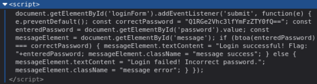

# 侦测


```JS
<script>
        document.getElementById('loginForm').addEventListener('submit', function(e) {
            e.preventDefault();
        
            const correctPassword = "Q1RGe2Vhc3lfYmFzZTY0fQ==";
            const enteredPassword = document.getElementById('password').value;
            const messageElement = document.getElementById('message');
            
            if (btoa(enteredPassword) === correctPassword) {
                messageElement.textContent = "Login successful! Flag: "+enteredPassword;
                messageElement.className = "message success";
            } else {
                messageElement.textContent = "Login failed! Incorrect password.";
                messageElement.className = "message error";
            }
        });
<script>
```

获得密码：
Q1RGe2Vhc3lfYmFzZTY0fQ==

# 解码
```ZSH
┌──(root㉿kali)-[~]
└─# echo "Q1RGe2Vhc3lfYmFzZTY0fQ==" | base64 -d  
CTF{easy_base64}
```