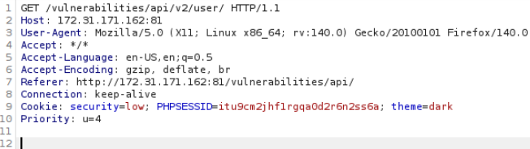
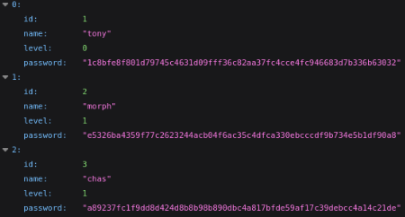
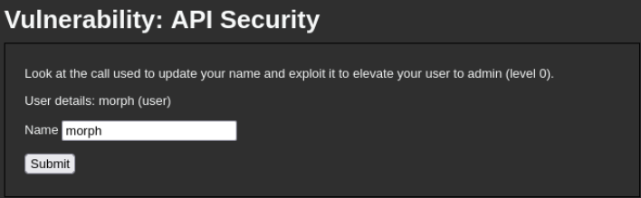
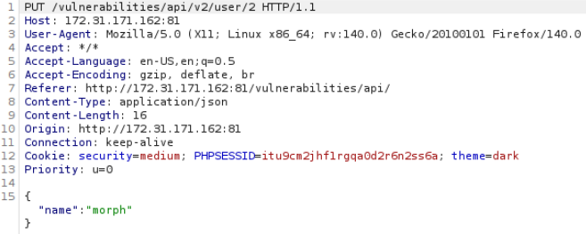
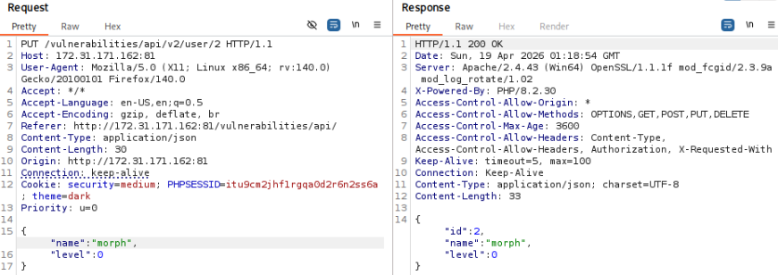
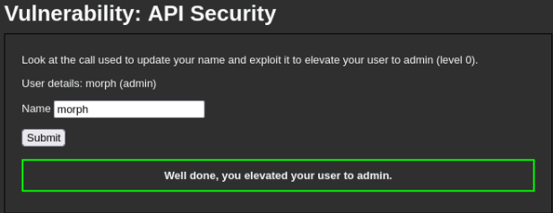
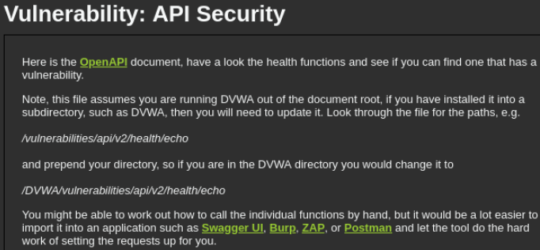
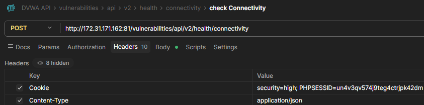
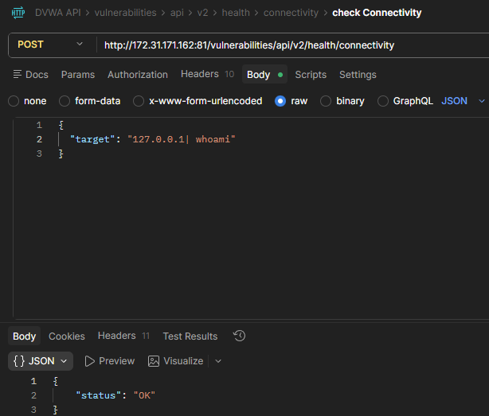
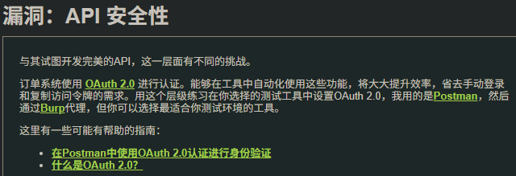

# 一、composer环境配置
见dvwa初始化修复，php修改为8.2.30nts，渗透完毕后切换回php7.3.4nts

# 二、Low
## 2.1 源码审计
```PHP
# low难度漏洞类型是：敏感信息泄露，http请求使用GET，攻击目标是获取旧版本API中的密码哈希
# 第一部分：php后端初始化与路径处理
<?php
$errors = "";
$success = "";
$messages = "";

if ($_SERVER['REQUEST_METHOD'] == "POST") {
}

$request_url = $_SERVER['REQUEST_URI'];
$stripped_url = str_replace ("/vulnerabilities/api/", "", $request_url); # 定位dvwa根目录，方便后续javascript拼接api的完整地址


echo "
<p>
    Versioning is important in APIs, running multiple versions of an API can allow for backward compatibility and can allow new services to be added without affecting existing users. The downside to keeping old versions alive is when those older versions contain vulnerabilities.
</p>
";

# 第二部分：javascript核心功能定义
# update_username(user_json)处理单个用户数据，根据返回的level判断是admin还是user
# get_users()使用fetch发起网络请求，请求的是.../v2/user/
# loadTableData(items)将API返回的JSON数组渲染成HTML表格，如果JSON有password，就显示well done
# if (k == 'password')揭示通关标志
echo "
<script>
    function update_username(user_json) { 
        console.log(user_json);
        var user_info = document.getElementById ('user_info');
        var name_input = document.getElementById ('name');

        if (user_json.name == '') {
            user_info.innerHTML = 'User details: unknown user';
            name_input.value = 'unknown';
        } else {
            if (user_json.level == 0) {
                level = 'admin';
            } else {
                level = 'user';
            }
            user_info.innerHTML = 'User details: ' + user_json.name + ' (' + level + ')';
            name_input.value = user_json.name;
        }

        const message_line = document.getElementById ('message');
        if (user_json.id == 2 && user_json.level == 0) {
            message_line.style.display = 'block';
        } else {
            message_line.style.display = 'none';
        }
    }

    function get_users() {
        const url = '" . $stripped_url . "/vulnerabilities/api/v2/user/';
         
        fetch(url, { 
                method: 'GET',
            }) 
            .then(response => { 
                if (!response.ok) { 
                    throw new Error('Network response was not ok'); 
            } 
            return response.json(); 
            }) 
            .then(data => { 
                loadTableData(data);
            }) 
            .catch(error => { 
                console.error('There was a problem with your fetch operation:', error); 
        }); 
    }

    HTMLTableRowElement.prototype.insert_th_Cell = function(index) {
        let cell = this.insertCell(index)
        , c_th = document.createElement('th');
        cell.replaceWith(c_th);
        return c_th;
    }

    function loadTableData(items) {
        const table = document.getElementById('table');
        const tableHead = table.createTHead();
        const row = tableHead.insertRow(0);

        item = items[0];
        Object.keys(item).forEach(function(k){
            let cell = row.insert_th_Cell(-1);
            cell.innerHTML = k;
            if (k == 'password') {
                successDiv = document.getElementById ('message');
                successDiv.style.display = 'block';
            }
        });

        const tableBody = document.getElementById('tableBody');

        items.forEach( item => {
            let row = tableBody.insertRow();
            for (const [key, value] of Object.entries(item)) {
                let cell = row.insertCell(-1);
                cell.innerHTML = value;
            }
        });
    }
    </script>
";

# 第三部分：HTML结构与触发脚本
# 定义一个空的表格容器和隐藏的成功提示框
# 最后的标签调用了前面定义的get_users()

echo "

<table id='table' class=''>
  <thead>
    <tr id='tableHead'>
    </tr>
  </thead>
  <tbody id='tableBody'></tbody>
</table>


        <p>
            Look at the call used to create this table and see if you can exploit it to return some additional information.
        </p>
        <div class='success' style='display:none' id='message'>Well done, you found the password hashes.</div>
        <script>
            get_users();
        </script>
";

?>
```

## 2.2 攻击
抓包获取如图信息

http://172.31.171.162:81/vulnerabilities/api/v1/user
看到了加密后的密码


# 三、Medium
## 3.1 源码审计
```PHP
# 相比low难度，漏洞类型变为：批量赋值，http请求时PUT，目标时修改自身权限等级为Admin，
<?php

$request_url = $_SERVER['REQUEST_URI'];
$stripped_url = str_replace ("/vulnerabilities/api/", "", $request_url);

# 新增update_name()，将数据包装成JSON格式{}
echo "
    <script>
        function update_username(user_json) {
            console.log(user_json);
            var user_info = document.getElementById ('user_info');
            var name_input = document.getElementById ('name');

            if (user_json.name == '') {
                user_info.innerHTML = 'User details: unknown user';
                name_input.value = 'unknown';
            } else {
                var level = 'unknown';
                if (user_json.level == 0) {
                    level = 'admin';
                    successDiv = document.getElementById ('message');
                    successDiv.style.display = 'block';
                } else {
                    level = 'user';
                }
                user_info.innerHTML = 'User details: ' + user_json.name + ' (' + level + ')';
                name_input.value = user_json.name;
            }
        }

        function get_user() {
            const url = '" . $stripped_url . "/vulnerabilities/api/v2/user/2';
             
            fetch(url, { 
                    method: 'GET',
                }) 
                .then(response => { 
                    if (!response.ok) { 
                        throw new Error('Network response was not ok'); 
                } 
                return response.json(); 
                }) 
                .then(data => { 
                    update_username (data);
                }) 
                .catch(error => { 
                    console.error('There was a problem with your fetch operation:', error); 
            }); 
        }


# ~~~~~~~~~~~~~~~~~~新增内容~~~~~~~~~~~~~~~~~~
        function update_name() {
            const url = '" . $stripped_url . "/vulnerabilities/api/v2/user/2';
            const name = document.getElementById ('name').value;
            const data = JSON.stringify({name: name});
             
            fetch(url, { 
                    method: 'PUT', 
                    headers: { 
                        'Content-Type': 'application/json' 
                    }, 
                    body: data
                }) 
                .then(response => { 
                    if (!response.ok) { 
                        throw new Error('Network response was not ok'); 
                } 
                return response.json(); 
                }) 
                .then(data => { 
                    update_username(data);
                }) 
                .catch(error => { 
                    console.error('There was a problem with your fetch operation:', error); 
            }); 
        }
    </script>
";

echo "
        <p>
            Look at the call used to update your name and exploit it to elevate your user to admin (level 0).
        </p>
        <p id='user_info'></p>
        <form method='post' action=\"" . $_SERVER['PHP_SELF'] . "\">
            <p>
                <label for='name'>Name</label>
                <input type='text' value='' name='name' id='name'>
            </p>
            <p>
                <input type=\"button\" value=\"Submit\" onclick='update_name();'>
            </p>
        </form>
        <div class='success' style='display:none' id='message'>Well done, you elevated your user to admin.</div>
        <script>
            get_user();
        </script>
";

?>
```
## 3.2 攻击



新增`"level":0`请求字段 


# 四、High
## 4.1 源码审计
```PHP
<?php

$message = "";

echo "
    <p>
        Here is the <a href='openapi.yml'>OpenAPI</a> document, have a look the health functions and see if you can find one that has a vulnerability.
    </p>
    <p>
        Note, this file assumes you are running DVWA out of the document root, if you have installed it into a subdirectory, such as DVWA, then you will need to update it. Look through the file for the paths, e.g.<br><br>
        <i>/vulnerabilities/api/v2/health/echo</i><br><br>
        and prepend your directory, so if you are in the DVWA directory you would change it to<br><br>
        <i>/DVWA/vulnerabilities/api/v2/health/echo</i>
    </p>
    <p>
        You might be able to work out how to call the individual functions by hand, but it would be a lot easier to import it into an application such as <a href='https://swagger.io/tools/swagger-ui/'>Swagger UI</a>, <a href='https://portswigger.net/bappstore/6bf7574b632847faaaa4eb5e42f1757c'>Burp</a>, <a href='https://www.zaproxy.org/docs/desktop/addons/openapi-support/'>ZAP</a>, or <a href='https://www.postman.com/'>Postman</a> and let the tool do the hard work of setting the requests up for you.
    </p>
";

?>
```

  - 漏洞不隐藏在javascript里，而是隐藏在API的文档描述中`http://172.31.171.162:81/vulnerabilities/api/openapi.yml`

`openapi.yml`重要接口：
```YML
paths:
  /vulnerabilities/api/v2/health/echo:
    post:
      tags:
        - health
      description: 'Echo, echo, cho, cho, o o ....'
      operationId: echo
      requestBody:
        description: 'Your words.'
        content:
          application/json:
            schema:
              $ref: '#/components/schemas/Words'
      responses:
        '200':
          description: 'Successful operation.'
  /vulnerabilities/api/v2/health/connectivity:
    post:
      tags:
        - health
      description: 'The server occasionally loses connectivity to other systems and so this can be used to check connectivity status.'
      operationId: checkConnectivity
      requestBody:
        description: 'Remote host.'
        content:
          application/json:
            schema:
              $ref: '#/components/schemas/Target'
      responses:
        '200':
          description: 'Successful operation.'
  /vulnerabilities/api/v2/health/status:
    get:
      tags:
        - health
      description: 'Get the health of the system.'
      operationId: getHealthStatus
      responses:
        '200':
          description: 'Successful operation.'
  /vulnerabilities/api/v2/health/ping:
    get:
      tags:
        - health
      description: 'Simple ping/pong to check connectivity.'
      operationId: ping
      responses:
        '200':
          description: 'Successful operation.'
  /vulnerabilities/api/v2/login/login:
    post:
      tags:
        - login
      description: 'Login as user.'
      operationId: login
      requestBody:
        description: 'The login credentials.'
        content:
          application/json:
            schema:
              $ref: '#/components/schemas/Credentials'
      responses:
        '200':
          description: 'Successful operation.'
        '401':
          description: 'Invalid credentials.'
  /vulnerabilities/api/v2/login/check_token:
    post:
      tags:
        - login
      description: 'Check a token is valid.'
      operationId: check_token
      requestBody:
        description: 'The token to test.'
        content:
          application/json:
            schema:
              $ref: '#/components/schemas/Token'
      responses:
        '200':
          description: 'Successful operation.'
        '401':
          description: 'Token is invalid.'
```

## 4.2 攻击
将`http://172.31.171.162:81/vulnerabilities/api/openapi.yml`导入postman，写好Headers中的cookie和content-type，构造body内容



# 五、Impossible
