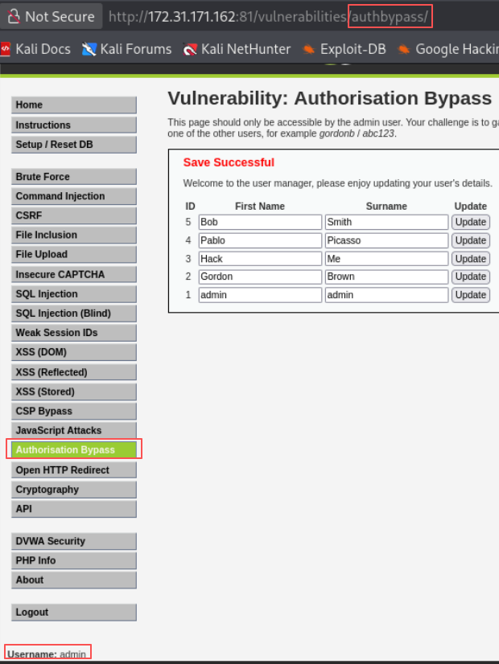
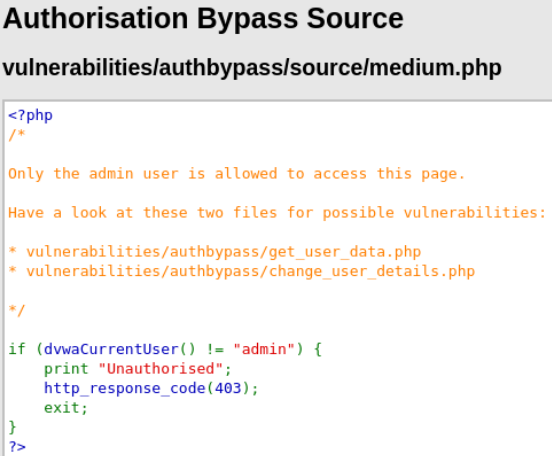
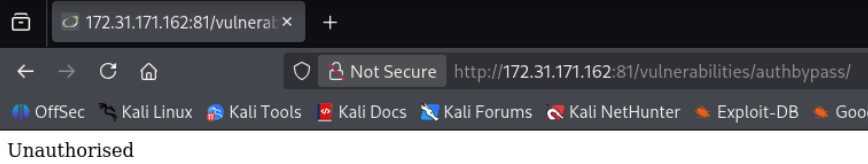
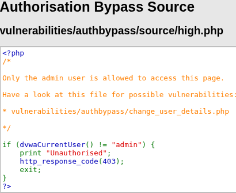
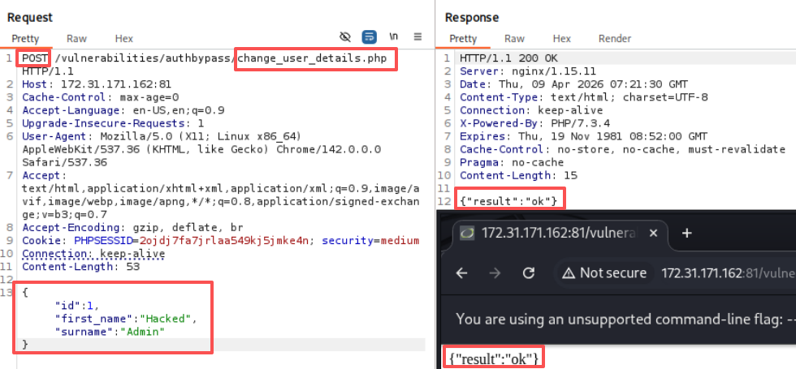
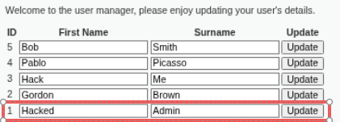
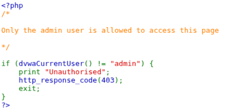

# 一、low
## 1.1 源码审计
`view source`后提示看`dvwa/includes/dvwaPage.inc.php`，这里只是ui隐藏了`Authorisation Bypass`，但没有后端限制访问

```PHP
// ...前面是一堆其他菜单...
	if (dvwaCurrentUser() == "admin") {
		$menuBlocks[ 'vulnerabilities' ][] = array( 'id' => 'authbypass', 'name' => 'Authorisation Bypass', 'url' => 'vulnerabilities/authbypass/' );
	}
// ...后面是生成HTML的代码...
```
## 1.2 攻击：URL访问
描述：只允许admin用户访问Authorisation Bypass，目标是用其他用户尝试访问（gordonb/abc123）


使用gordonb登录后发现Authorisation Bypass栏消失，URL输入`vulnerabilities/authbypass/`重新进入，成功绕过

# 二、Medium
## 2.1 源码审计

新增了规则，如果访问用户不是`admin`就返回403并退出

## 2.2 攻击思路一：修改用户名称为admin发起请求（失败）
low 难度思路再次访问失效


新思路是burp suite修改用户名称为`admin`来进行绕过，但没有成功

## 2.3 攻击思路二：网络中找响应信息
发现low难度中有，`get_user_data.php`中的响应有信息，直接访问这个文件，成功绕过
```
http://172.31.171.162:81/vulnerabilities/authbypass/get_user_data.php
```

# 三、High
## 3.1 源码审计

但看着和medium没什么区别，根据提示去找`change_user_details.php`审计。

最高难度且非`admin`用户，就会终止脚本（四种：1. 最高难度 非admin❌； 2. 最高难度 admin✅； 3. 其他难度，admin✅； 4. 其他难度 非admin✅）
```PHP
if (dvwaSecurityLevelGet() == "impossible" && dvwaCurrentUser() != "admin") {
	print json_encode (array ("result" => "fail", "error" => "Access denied"));
	exit;
}
```

要求POST请求
```PHP
if ($_SERVER['REQUEST_METHOD'] != "POST") {
	$result = array (
						"result" => "fail",
						"error" => "Only POST requests are accepted"
					);
	echo json_encode($result);
	exit;
}
```

保证输入的数据是有效的JSON格式，如果格式错误，就中断
```PHP
try {
	$json = file_get_contents('php://input');
	$data = json_decode($json);
	if (is_null ($data)) {
		$result = array (
							"result" => "fail",
							"error" => 'Invalid format, expecting "{id: {user ID}, first_name: "{first name}", surname: "{surname}"}'

						);
		echo json_encode($result);
		exit;
	}
}
```

## 3.2 攻击
根据审计，需要构造post请求，且携带有效的JSON格式数据，如：
```
{"id": 1, "first_name": "Hacked", "surname": "Admin"}
```
成功更新，重新登录进入admin查看




# 四、Impossible
## 4.1 源码审计
非admin，返回403，表示服务器理解了请求，但拒绝处理

