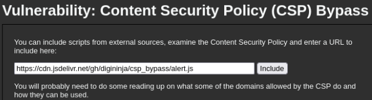
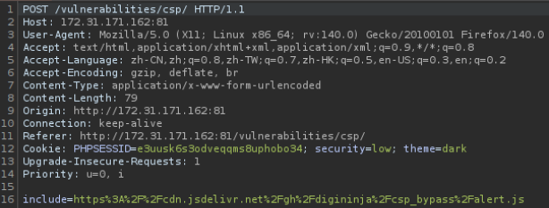
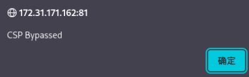
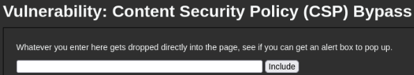
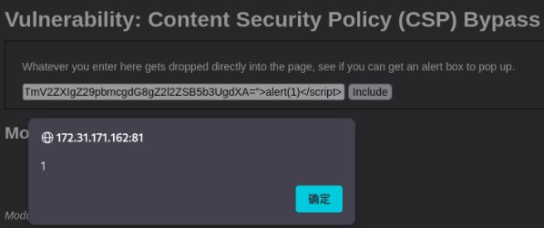
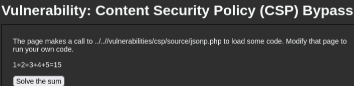
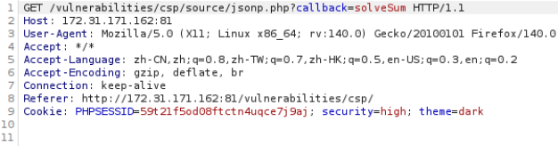
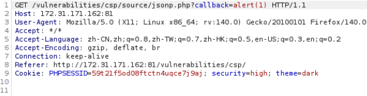
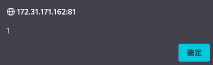
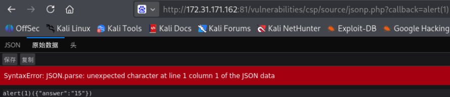

# 一、Low
## 1.1 源码
`low.php`
```PHP
<?php

$headerCSP = "Content-Security-Policy: script-src 'self' https://pastebin.com hastebin.com www.toptal.com example.com code.jquery.com https://ssl.google-analytics.com unpkg.com cdn.jsdelivr.net digi.ninja ;"; // allows js from various trusted locations

header($headerCSP);

# These might work if you can't create your own for some reason
# https://cdn.jsdelivr.net/gh/digininja/csp_bypass/alert.js
# https://unpkg.com/@digininja/csp_bypass@1.0.0/index.js

?>
<?php
if (isset ($_POST['include'])) {
$page[ 'body' ] .= "
    <script src='" . $_POST['include'] . "'></script>
";
}
$page[ 'body' ] .= '
<form name="csp" method="POST">
    <p>You can include scripts from external sources, examine the Content Security Policy and enter a URL to include here:</p>
    <input size="50" type="text" name="include" value="" id="include" />
    <input type="submit" value="Include" />
</form>
<p>
    You will probably need to do some reading up on what some of the domains allowed by the CSP do and how they can be used.
</p>
';
```
  - 第一个部分：CSP策略定义。`script-src`指令告诉浏览器JavaScript脚本白名单。
  - 第二个部分：程序接收一个名为`include`的POST参数，但没有对用户输入进行任何过滤，直接拼接到`<script src='...'`标签中。

## 1.2 攻击
内容安全策略(CSP, Content Security Policy)，用于定义脚本和其他资源从何处加载或执行，即白名单。




# 二、Medium
## 2.1 源码
`medium.php`
```PHP
<?php

$headerCSP = "Content-Security-Policy: script-src 'self' 'unsafe-inline' 'nonce-TmV2ZXIgZ29pbmcgdG8gZ2l2ZSB5b3UgdXA=';";

header($headerCSP);

// Disable XSS protections so that inline alert boxes will work
header ("X-XSS-Protection: 0");

# <script nonce="TmV2ZXIgZ29pbmcgdG8gZ2l2ZSB5b3UgdXA=">alert(1)</script>

?>
<?php
if (isset ($_POST['include'])) {
$page[ 'body' ] .= "
    " . $_POST['include'] . "
";
}
$page[ 'body' ] .= '
<form name="csp" method="POST">
    <p>Whatever you enter here gets dropped directly into the page, see if you can get an alert box to pop up.</p>
    <input size="50" type="text" name="include" value="" id="include" />
    <input type="submit" value="Include" />
</form>
';
```

- 从low的信任外部域名到随即校验值(Number used once, Nonce)机制上
- 但nonce固定为`TmV2ZXIgZ29pbmcgdG8gZ2l2ZSB5b3UgdXA=`，这里有了漏洞

## 2.2攻击

`<script nonce="TmV2ZXIgZ29pbmcgdG8gZ2l2ZSB5b3UgdXA=">alert(1)</script>`


# 三、High
## 3.1 源码
`high.php`
```php
<?php
$headerCSP = "Content-Security-Policy: script-src 'self';";

header($headerCSP);

?>
<?php
if (isset ($_POST['include'])) {
$page[ 'body' ] .= "
    " . $_POST['include'] . "
";
}
$page[ 'body' ] .= '
<form name="csp" method="POST">
    <p>The page makes a call to ' . DVWA_WEB_PAGE_TO_ROOT . '/vulnerabilities/csp/source/jsonp.php to load some code. Modify that page to run your own code.</p>
    <p>1+2+3+4+5=<span id="answer"></span></p>
    <input type="button" id="solve" value="Solve the sum" />
</form>

<script src="source/high.js"></script>
';
```
- 关注点从外部注入，到回调注入(JSON with Padding, JSONP)
- `script-src 'self'`，浏览器只允许执行同源（当前域名/服务器）脚本
- 禁止外部域名(low)
- 禁止内联脚本(meidum)

---

`high.js`
```JS
function clickButton() {
    var s = document.createElement("script");
    s.src = "source/jsonp.php?callback=solveSum";
    document.body.appendChild(s);
}

function solveSum(obj) {
    if ("answer" in obj) {
        document.getElementById("answer").innerHTML = obj['answer'];
    }
}

var solve_button = document.getElementById ("solve");

if (solve_button) {
    solve_button.addEventListener("click", function() {
        clickButton();
    });
}
```
- 点击按钮后，创建`<script>`标签，其`src`指向同服务器下的`jsonp.php`（ps：`jsonp.php`属于self，符合CSP规则）

---

`jsonp.php`（文件夹中的源码）

```PHP
<?php
header("Content-Type: application/json; charset=UTF-8");

if (array_key_exists ("callback", $_GET)) {
	$callback = $_GET['callback'];
} else {
	return "";
}

$outp = array ("answer" => "15");

echo $callback . "(".json_encode($outp).")";
?>
```
- 返回的是`callback({"answer":"15"})`

## 3.2 攻击
抓包，利用`callback`这个注入点攻击





这里修改为了`/jsonp.php?callback=alert(1)`，返回的是`alert(1)({"answer":"15"})`，进行了包裹执行，输入的`alert(1)`被当作函数名，拼成一段完整JS执行。

但当我尝试构造URL攻击，却报错，如下图所示，返回的内容是`alert(1)({"answer":"15"})`，这不是合法JSON没所以报错，而Burp请求中有`Referer:http://.../vulnerabilities/csp/`，这个请求是由`high.js`里的`<script>`发起的，


# 四、Impossible
## 4.1 源码
`impossible.php`
```PHP
<?php

$headerCSP = "Content-Security-Policy: script-src 'self';";

header($headerCSP);

?>
<?php
if (isset ($_POST['include'])) {
$page[ 'body' ] .= "
    " . $_POST['include'] . "
";
}
$page[ 'body' ] .= '
<form name="csp" method="POST">
    <p>Unlike the high level, this does a JSONP call but does not use a callback, instead it hardcodes the function to call.</p><p>The CSP settings only allow external JavaScript on the local server and no inline code.</p>
    <p>1+2+3+4+5=<span id="answer"></span></p>
    <input type="button" id="solve" value="Solve the sum" />
</form>

<script src="source/impossible.js"></script>
';
```

---

`impossible.js`

```JS
 function clickButton() {
    var s = document.createElement("script");
    s.src = "source/jsonp_impossible.php";
    document.body.appendChild(s);
}

function solveSum(obj) {
    if ("answer" in obj) {
        document.getElementById("answer").innerHTML = obj['answer'];
    }
}

var solve_button = document.getElementById ("solve");

if (solve_button) {
    solve_button.addEventListener("click", function() {
        clickButton();
    });
}
```
- 相比`high.js`中的`s.src = "source/jsonp.php?callback=solveSum";`，这里的是`s.src = "source/jsonp_impossible.php";`，没有callback参数了

---

`jsonp_impossible.php`
```PHP
<?php
header("Content-Type: application/json; charset=UTF-8");

$outp = array ("answer" => "15");

echo "solveSum (".json_encode($outp).")";
?>
```
- 没有`callback`参数，因此用户无法控制域名
- 直接`solveSum`函数包裹，返回的是`solveSum({"answer":"15"});`