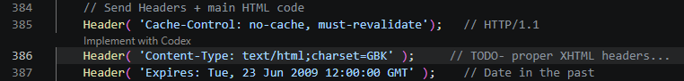
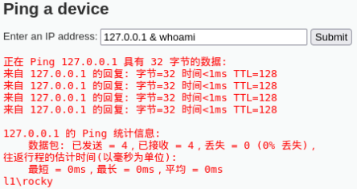
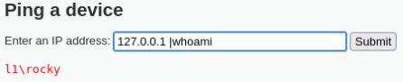

# 一、乱码修复

将`dvwa/includes`目录下的UTF-8改为GBK或者GB2312
# 二、Low
## 2.1 源码
```PHP
<?php
if( isset( $_POST[ 'Submit' ]  ) ) {
    // Get input
    $target = $_REQUEST[ 'ip' ];

    // Determine OS and execute the ping command.
    if( stristr( php_uname( 's' ), 'Windows NT' ) ) {
        // Windows
        $cmd = shell_exec( 'ping  ' . $target );
    }
    else {
        // *nix
        $cmd = shell_exec( 'ping  -c 4 ' . $target );
    }

    // Feedback for the end user
    echo "<pre>{$cmd}</pre>";
}
?> 
```
- `isset()`判断一个变量是否存在，返回true(存在)，返回false(不存在)
- `stristr(原始字符串, 要查找的内容)`，返回从匹配位置开始到结尾的字符串(找到了)，返回false(没找到)
- `<pre>`是HTML标签(preformatted text)(预格式化文本)，换行清晰
- `{$cmd}`，`$cmd`是命令执行后的结果，而`{}`是php的一种写法，让变量写在字符串里
- 对于接收到的`ip`不作任何过滤，且将输入直接拼接到ping后

## 2.2 攻击
| 符号 | 作用说明 | 适用系统 |
| ---- | -------- | -------- |
| `&` | 前面命令执行后，无论成功失败，都执行后面命令 | Windows / Linux |
| `&&` | 前面命令执行成功后，才执行后面命令 | Windows / Linux |
| `|` | 管道符，将前面命令输出作为后面命令输入，注入时可直接执行后一条命令 | Windows / Linux |
| `||` | 前面命令执行失败后，才执行后面命令 | Windows / Linux |
| `;` | 命令分隔符，按顺序依次执行多条命令 | Linux / Unix |



# 三、Medium
## 3.1 源码
```PHP
<?php
if( isset( $_POST[ 'Submit' ]  ) ) {
    // Get input
    $target = $_REQUEST[ 'ip' ];

    // Set blacklist
    $substitutions = array(
        '&&' => '',
        ';'  => '',
    );

    // Remove any of the characters in the array (blacklist).
    $target = str_replace( array_keys( $substitutions ), $substitutions, $target );

    // Determine OS and execute the ping command.
    if( stristr( php_uname( 's' ), 'Windows NT' ) ) {
        // Windows
        $cmd = shell_exec( 'ping  ' . $target );
    }
    else {
        // *nix
        $cmd = shell_exec( 'ping  -c 4 ' . $target );
    }

    // Feedback for the end user
    echo "<pre>{$cmd}</pre>";
}
?> 
```
- 新增过滤，`&&`和`;`替换为空字符串的规则到`$substitutions`
- 新增`str_replace()`函数，在`&target`中寻找`array_keys( $substitutions )`，替换成`$subsitutions`。
- `array_keys($substitutions)`会把数组里的所有键拿出来，变成一个列表

## 3.2 攻击
用`&`或者`|`

# 四、High
## 4.1 源码
```php
<?php

if( isset( $_POST[ 'Submit' ]  ) ) {
    // Get input
    $target = trim($_REQUEST[ 'ip' ]);

    // Set blacklist
    $substitutions = array(
        '||' => '',
        '&'  => '',
        ';'  => '',
        '| ' => '',
        '-'  => '',
        '$'  => '',
        '('  => '',
        ')'  => '',
        '`'  => '',
    );

    // Remove any of the characters in the array (blacklist).
    $target = str_replace( array_keys( $substitutions ), $substitutions, $target );

    // Determine OS and execute the ping command.
    if( stristr( php_uname( 's' ), 'Windows NT' ) ) {
        // Windows
        $cmd = shell_exec( 'ping  ' . $target );
    }
    else {
        // *nix
        $cmd = shell_exec( 'ping  -c 4 ' . $target );
    }

    // Feedback for the end user
    echo "<pre>{$cmd}</pre>";
}

?>
```
- 新增过滤
- 仔细观察，`| `里面有个空格

## 4.2 攻击


# 五、Impossible
```PHP
<?php

if( isset( $_POST[ 'Submit' ]  ) ) {
    // Check Anti-CSRF token
    checkToken( $_REQUEST[ 'user_token' ], $_SESSION[ 'session_token' ], 'index.php' );

    // Get input
    $target = $_REQUEST[ 'ip' ];
    $target = stripslashes( $target );

    // Split the IP into 4 octects
    $octet = explode( ".", $target );

    // Check IF each octet is an integer
    if( ( is_numeric( $octet[0] ) ) && ( is_numeric( $octet[1] ) ) && ( is_numeric( $octet[2] ) ) && ( is_numeric( $octet[3] ) ) && ( sizeof( $octet ) == 4 ) ) {
        // If all 4 octets are int's put the IP back together.
        $target = $octet[0] . '.' . $octet[1] . '.' . $octet[2] . '.' . $octet[3];

        // Determine OS and execute the ping command.
        if( stristr( php_uname( 's' ), 'Windows NT' ) ) {
            // Windows
            $cmd = shell_exec( 'ping  ' . $target );
        }
        else {
            // *nix
            $cmd = shell_exec( 'ping  -c 4 ' . $target );
        }

        // Feedback for the end user
        echo "<pre>{$cmd}</pre>";
    }
    else {
        // Ops. Let the user name theres a mistake
        echo '<pre>ERROR: You have entered an invalid IP.</pre>';
    }
}

// Generate Anti-CSRF token
generateSessionToken();

?> 
```
- 改用白名单+IP格式强验证
- 新增Anti-CSRF令牌验证，防止跨站请求伪造
- 将IP按照`.`分成4段，接着检查每一段都是纯数字，且必须是4段
- 重新拼接，每一段重新加上`.`成合法IP