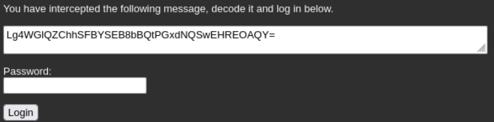
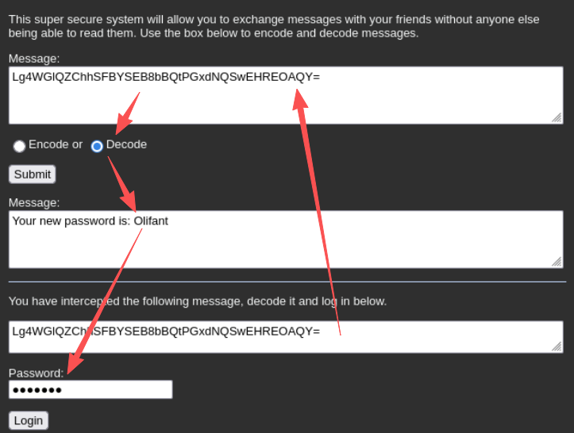
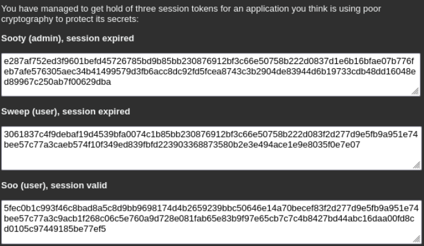
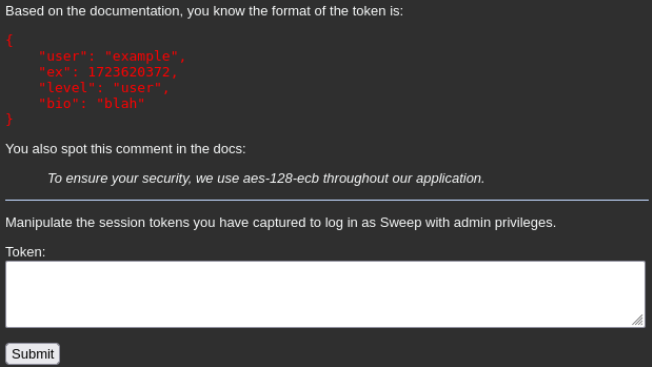
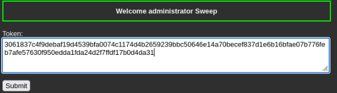

# 一、low
## 1.1 源码
A.核心算法模块
```PHP
function xor_this($cleartext, $key) {
    $outText = '';
    for($i=0; $i<strlen($cleartext);) {
        for($j=0; ($j<strlen($key) && $i<strlen($cleartext)); $j++,$i++) {
            // 使用位运算符 ^ (XOR) 对字符进行处理
            $outText .= $cleartext[$i] ^ $key[$j];
        }
    }
    return $outText;
}
```
- XOR加密有自反性：$A \oplus B = C$，则$C \oplus B = A$，加密和解密是相同的逻辑。
- 外层循环遍历整个文本，内层循环遍历密钥。如果明文比密钥长，密钥会不断重复。

---

B.配置模块
```PHP
$key = "wachtwoord";
$errors = "";
$success = "";
$messages = "";
$encoded = null;
$encode_radio_selected = " checked='checked' ";
$decode_radio_selected = " ";
$message = "";
```
- 密钥直接写源码里，攻击者只要看到源码就能获得密钥
- 预定义一些UI状态变量

---

C.业务模块：处理用户发送的POST请求
消息加密解密功能：
```PHP
if (array_key_exists ('message', $_POST)) {
    $message = $_POST['message'];
    if (array_key_exists ('direction', $_POST) && $_POST['direction'] == "decode") {
        // 解密流程：先 Base64 解码，再 XOR 
        $encoded = xor_this (base64_decode ($message), $key);
    } else {
        // 加密流程：先 XOR，再 Base64 编码（为了方便在网页显示）
        $encoded = base64_encode(xor_this ($message, $key));
    }
}
```
- base64作用：XOR后的字符可能是二进制乱码，base64将其转化为标准文本字符，方便在文本框显示

登录验证功能：
```PHP
if (array_key_exists ('password', $_POST)) {
    $password = $_POST['password'];
    // ... 
    if ($password == "Olifant") { // 注意这里：虽然代码写了 xor 操作，但判断逻辑却是硬编码
        $success = "Welcome back user";
    }
}
```

## 1.2 攻击



# 二、Medium
## 2.1 源码
A.核心解密模块
```PHP
function decrypt ($ciphertext, $key) {
    // 使用 openssl 库进行 AES-128-ECB 解密
    $e = openssl_decrypt($ciphertext, 'aes-128-ecb', $key, OPENSSL_PKCS1_PADDING);
    if ($e === false) {
        throw new Exception ("Decryption failed");
    }
    return $e;
}
```
- 128位意味着加密是以16字节（128bits）为一组进行的
- ECB模式：是最简单的模式，每组数据独立加密，组与组之间互不干扰

---

B.预定义密钥
```PHP
$key = "ik ben een aardbei"; // 硬编码密钥
```

---

C.输入校验与格式转化模块
```PHP
if (array_key_exists ('token', $_POST)) {
    $token = $_POST['token'];
    // 关键校验：长度必须是 32 的倍数（对应 16 字节的倍数）
    if (strlen($token) % 32 != 0) {
        throw new Exception ("Token is in wrong format");
    } else {
        // 将十六进制字符串转为二进制字节流再解密
        $decrypted = decrypt(hex2bin ($token), $key);
        // ...
    }
}
```
- 输入十六进制(Hex)，1字节＝2个字符。那么32个Hex字符=16字节=1个AES块
- 只要拼接出的密文总长度是32、64、96...位的Hex字符串，就能通过第一道关卡

---

D.业务模块
```PHP
$user = json_decode ($decrypted);
// 判定条件：
if ($user->user == "sweep" && $user->ex > time() && $user->level == "admin") {
    $success = "Welcome administrator Sweep";
}
```
- 解密后，程序将字符串解析为JSON对象，并进行逻辑判定

## 2.2 攻击

三段密文，每段有192个字符，能分成6块，而目标是凑齐`user=sweep`+`ex(过期时间)>当前时间`+`level=admin`

根据提示，token的格式如红色的块状所示，因此尝试解码第一个`sooty(admin),session expired`。
现在手头上已知的密钥是`ik ben een aardbei`

解密脚本：
```PHP
<?php
// 密文（示例：hex 编码的 token）
$hex_token = "e287af752ed3f9601befd45726785bd9b85bb230876912bf3c66e50758b222d0837d1e6b16bfae07b776feb7afe576305aec34b41499579d3fb6acc8dc92fd5fcea8743c3b2904de83944d6b19733cdb48dd16048ed89967c250ab7f00629dba";

// 解密密钥
$key = "ik ben een aardbei";

// 将 HEX 编码的 token 转换为二进制
$encrypted_token = hex2bin($hex_token);

// 解密
$decrypted_json = openssl_decrypt($encrypted_token, 'aes-128-ecb', $key, OPENSSL_PKCS1_PADDING);

// 输出解密后的 JSON 字符串
echo "解密后的内容: \n" . $decrypted_json . "\n";

// 解析 JSON
$decoded_object = json_decode($decrypted_json, true);
print_r($decoded_object);
?>
```

Sooty：
```
解密后的内容: 
{"user":"sooty","ex":1723620672,"level":"admin","bio":"Izzy wizzy let's get busy"}
Array
(
    [user] => sooty
    [ex] => 1723620672
    [level] => admin
    [bio] => Izzy wizzy let's get busy
)
```

Sweep：
```
解密后的内容: 
{"user":"sweep","ex":1723620672,"level": "user","bio": "Squeeeeek"}
Array
(
    [user] => sweep
    [ex] => 1723620672
    [level] => user
    [bio] => Squeeeeek
)
```

Soo：
```
解密后的内容: 
{"user" : "soo","ex":1823620672,"level": "user","bio": "I won The Weakest Link"}
Array
(
    [user] => soo
    [ex] => 1823620672
    [level] => user
    [bio] => I won The Weakest Link
)
```

  - 第一块user，用sweep
  - 第二块expiration，用soo，因为soo的token是valid，这块解密后包含未来的时间戳
  - 第三块level，用从sooty

加密脚本：
```PHP
<?php
function encrypt($plaintext, $key) {
    return bin2hex(openssl_encrypt($plaintext, 'aes-128-ecb', $key, OPENSSL_RAW_DATA));
}

$key = "ik ben een aardbei"; // 这是密钥
$new_payload = json_encode([
    "user" => "sweep",
    "ex" => 1823620672,
    "level" => "admin",
    "bio" => "hacked"
]);

$encrypted_token = encrypt($new_payload, $key);
echo "New Token: " . $encrypted_token . "\n";
?>
```

```
New Token: 3061837c4f9debaf19d4539bfa0074c1174d4b2659239bbc50646e14a70becef837d1e6b16bfae07b776feb7afe57630f950edda1fda24d2f7ffdf17b0d4da31
```



# 三、High（头秃，先放一放）