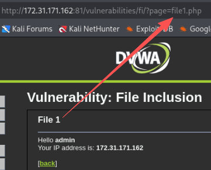
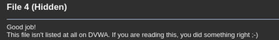
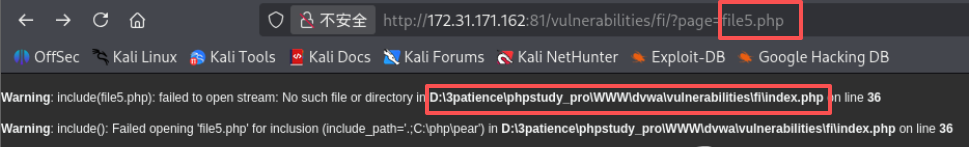
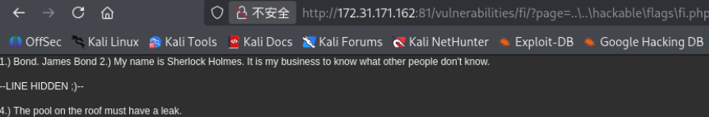
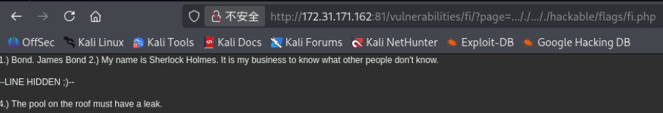
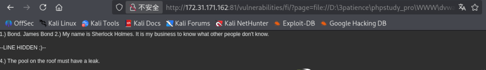

# 一、Low
## 1.1 源码
```PHP
<?php

// The page we wish to display
$file = $_GET[ 'page' ];

?>
```
- 没任何过滤，用GET方式传参

## 1.2 攻击
本地文件包含(LFI)


输入不存在的文件，暴露出文件位置

用相对路径访问`fi.php`为，位置为`D:\3patience\phpstudy_pro\WWW\dvwa\vulnerabilities\fi\index.php `
构造相对路径为`..\..\hackable\flags\fi.php`


远程文件包含(RFI)

# 二、Medium
## 2.1 源码
```PHP
<?php

// The page we wish to display
$file = $_GET[ 'page' ];

// Input validation
$file = str_replace( array( "http://", "https://" ), "", $file );
$file = str_replace( array( "../", "..\\" ), "", $file );

?> 
```
- 新增过滤，将`http://`、`https://`、`../`、`..\\`替换为空

## 2.2 攻击
本地文件包含(LFI)
构造`..././..././hackable/flags/fi.php`

远程文件包含(RFI)
双写绕过：
构造`hhttp://ttp://www.baidu.com`
构造`hhttps://ttps://www.baidu.com`

注意：`hhttp://ttps://www.baidu.com`、`hhttp://ttps://www.baidu.com`会导致二次过滤

# 三、High
## 3.1 源码
```PHP
<?php

// The page we wish to display
$file = $_GET[ 'page' ];

// Input validation
if( !fnmatch( "file*", $file ) && $file != "include.php" ) {
    // This isn't the page we want!
    echo "ERROR: File not found!";
    exit;
}

?> 
```
- 新增限制，限制开头是`file`
- `fnmatch("file*", $file)`检查变量`$file`是否以字符串`file`开头，后面的`*`代表后面可以是任何字符
- 额外放行`include.php`这个文件

## 3.2 攻击
利用`file://`协议，用绝对路径。
构造`http://172.31.171.162:81/vulnerabilities/fi/?page=file://D:\3patience\phpstudy_pro\WWW\dvwa\hackable\flags\fi.php`



# 四、Impossible
## 4.1 源码
```PHP
 <?php

// The page we wish to display
$file = $_GET[ 'page' ];

// Only allow include.php or file{1..3}.php
$configFileNames = [
    'include.php',
    'file1.php',
    'file2.php',
    'file3.php',
];

if( !in_array($file, $configFileNames) ) {
    // This isn't the page we want!
    echo "ERROR: File not found!";
    exit;
}

?>

```
- 写死白名单