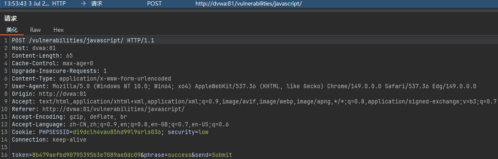
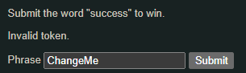
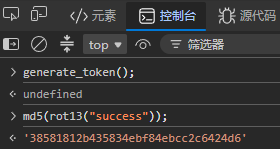
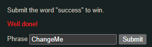
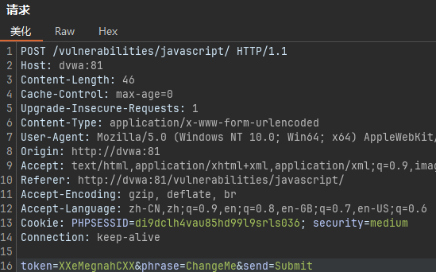
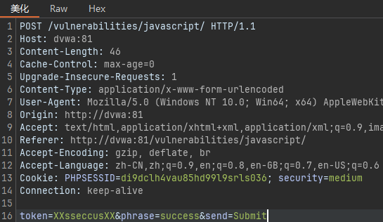
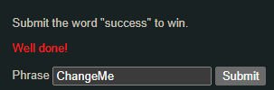

# 一、Low
## 1.1 源码
```JS
<?php
$page[ 'body' ] .= <<<EOF
<script>

/*
MD5 code from here
https://github.com/blueimp/JavaScript-MD5
*/

!function(n){"use strict";function t(n,t){var r=(65535&n)+(65535&t);return(n>>16)+(t>>16)+(r>>16)<<16|65535&r}function r(n,t){return n<<t|n>>>32-t}function e(n,e,o,u,c,f){return t(r(t(t(e,n),t(u,f)),c),o)}function o(n,t,r,o,u,c,f){return e(t&r|~t&o,n,t,u,c,f)}function u(n,t,r,o,u,c,f){return e(t&o|r&~o,n,t,u,c,f)}function c(n,t,r,o,u,c,f){return e(t^r^o,n,t,u,c,f)}function f(n,t,r,o,u,c,f){return e(r^(t|~o),n,t,u,c,f)}function i(n,r){n[r>>5]|=128<<r%32,n[14+(r+64>>>9<<4)]=r;var e,i,a,d,h,l=1732584193,g=-271733879,v=-1732584194,m=271733878;for(e=0;e<n.length;e+=16)i=l,a=g,d=v,h=m,g=f(g=f(g=f(g=f(g=c(g=c(g=c(g=c(g=u(g=u(g=u(g=u(g=o(g=o(g=o(g=o(g,v=o(v,m=o(m,l=o(l,g,v,m,n[e],7,-680876936),g,v,n[e+1],12,-389564586),l,g,n[e+2],17,606105819),m,l,n[e+3],22,-1044525330),v=o(v,m=o(m,l=o(l,g,v,m,n[e+4],7,-176418897),g,v,n[e+5],12,1200080426),l,g,n[e+6],17,-1473231341),m,l,n[e+7],22,-45705983),v=o(v,m=o(m,l=o(l,g,v,m,n[e+8],7,1770035416),g,v,n[e+9],12,-1958414417),l,g,n[e+10],17,-42063),m,l,n[e+11],22,-1990404162),v=o(v,m=o(m,l=o(l,g,v,m,n[e+12],7,1804603682),g,v,n[e+13],12,-40341101),l,g,n[e+14],17,-1502002290),m,l,n[e+15],22,1236535329),v=u(v,m=u(m,l=u(l,g,v,m,n[e+1],5,-165796510),g,v,n[e+6],9,-1069501632),l,g,n[e+11],14,643717713),m,l,n[e],20,-373897302),v=u(v,m=u(m,l=u(l,g,v,m,n[e+5],5,-701558691),g,v,n[e+10],9,38016083),l,g,n[e+15],14,-660478335),m,l,n[e+4],20,-405537848),v=u(v,m=u(m,l=u(l,g,v,m,n[e+9],5,568446438),g,v,n[e+14],9,-1019803690),l,g,n[e+3],14,-187363961),m,l,n[e+8],20,1163531501),v=u(v,m=u(m,l=u(l,g,v,m,n[e+13],5,-1444681467),g,v,n[e+2],9,-51403784),l,g,n[e+7],14,1735328473),m,l,n[e+12],20,-1926607734),v=c(v,m=c(m,l=c(l,g,v,m,n[e+5],4,-378558),g,v,n[e+8],11,-2022574463),l,g,n[e+11],16,1839030562),m,l,n[e+14],23,-35309556),v=c(v,m=c(m,l=c(l,g,v,m,n[e+1],4,-1530992060),g,v,n[e+4],11,1272893353),l,g,n[e+7],16,-155497632),m,l,n[e+10],23,-1094730640),v=c(v,m=c(m,l=c(l,g,v,m,n[e+13],4,681279174),g,v,n[e],11,-358537222),l,g,n[e+3],16,-722521979),m,l,n[e+6],23,76029189),v=c(v,m=c(m,l=c(l,g,v,m,n[e+9],4,-640364487),g,v,n[e+12],11,-421815835),l,g,n[e+15],16,530742520),m,l,n[e+2],23,-995338651),v=f(v,m=f(m,l=f(l,g,v,m,n[e],6,-198630844),g,v,n[e+7],10,1126891415),l,g,n[e+14],15,-1416354905),m,l,n[e+5],21,-57434055),v=f(v,m=f(m,l=f(l,g,v,m,n[e+12],6,1700485571),g,v,n[e+3],10,-1894986606),l,g,n[e+10],15,-1051523),m,l,n[e+1],21,-2054922799),v=f(v,m=f(m,l=f(l,g,v,m,n[e+8],6,1873313359),g,v,n[e+15],10,-30611744),l,g,n[e+6],15,-1560198380),m,l,n[e+13],21,1309151649),v=f(v,m=f(m,l=f(l,g,v,m,n[e+4],6,-145523070),g,v,n[e+11],10,-1120210379),l,g,n[e+2],15,718787259),m,l,n[e+9],21,-343485551),l=t(l,i),g=t(g,a),v=t(v,d),m=t(m,h);return[l,g,v,m]}function a(n){var t,r="",e=32*n.length;for(t=0;t<e;t+=8)r+=String.fromCharCode(n[t>>5]>>>t%32&255);return r}function d(n){var t,r=[];for(r[(n.length>>2)-1]=void 0,t=0;t<r.length;t+=1)r[t]=0;var e=8*n.length;for(t=0;t<e;t+=8)r[t>>5]|=(255&n.charCodeAt(t/8))<<t%32;return r}function h(n){return a(i(d(n),8*n.length))}function l(n,t){var r,e,o=d(n),u=[],c=[];for(u[15]=c[15]=void 0,o.length>16&&(o=i(o,8*n.length)),r=0;r<16;r+=1)u[r]=909522486^o[r],c[r]=1549556828^o[r];return e=i(u.concat(d(t)),512+8*t.length),a(i(c.concat(e),640))}function g(n){var t,r,e="";for(r=0;r<n.length;r+=1)t=n.charCodeAt(r),e+="0123456789abcdef".charAt(t>>>4&15)+"0123456789abcdef".charAt(15&t);return e}function v(n){return unescape(encodeURIComponent(n))}function m(n){return h(v(n))}function p(n){return g(m(n))}function s(n,t){return l(v(n),v(t))}function C(n,t){return g(s(n,t))}function A(n,t,r){return t?r?s(t,n):C(t,n):r?m(n):p(n)}"function"==typeof define&&define.amd?define(function(){return A}):"object"==typeof module&&module.exports?module.exports=A:n.md5=A}(this);

	function rot13(inp) {
		return inp.replace(/[a-zA-Z]/g,function(c){return String.fromCharCode((c<="Z"?90:122)>=(c=c.charCodeAt(0)+13)?c:c-26);});
	}

	function generate_token() {
		var phrase = document.getElementById("phrase").value;
		document.getElementById("token").value = md5(rot13(phrase));
	}

	generate_token();
</script>
EOF;
?>
```

- `!function(n){"use strict"; ... }(this);`是一个被压缩混淆过的开源MD5算法库。在前端提供了一个`md5()`函数，可以把任何字符串变成一串32位的十六进制密文。不用研究
- `rot13(inp)`是一个经典的弱加密算法。把英文字母在字母表里向后移动13位
- `generate_token()`获取页面上用户输入的短语，将短语进行`rot13`变换，把变换后的字符串再计算一次`md5`，最终得到的哈希值填入页面上隐藏的`token`输入框中，随着表单提交给后端
- 本质：在前端通过加密来保证数据的安全，服务器执行php，把上面那段`<script>...</script>`拼接进网络，服务器把生成的html页面发送给用户的浏览器，用户浏览器收到代码，执行里面的js

## 1.2 攻击


token永不改变，而根据源码，token是根据phrase参数生成的，因此需要web控制台运行generate_token()函数，或者`md5(rot13("success"))`计算出success的token，然后再次提交success




# 二、Medium
## 2.1 源码
vulnerabilities/javascript/source/medium.php
```PHP
<?php
$page[ 'body' ] .= '<script src="' . DVWA_WEB_PAGE_TO_ROOT . 'vulnerabilities/javascript/source/medium.js"></script>';
?>
```

vulnerabilities/javascript/source/medium.js
```JS
function do_something(e) {
    for (var t = "", n = e.length - 1; n >= 0; n--)
        t += e[n];
    return t
}

setTimeout(function() {
    do_elsesomething("XX")
}, 300);

function do_elsesomething(e) {
    document.getElementById("token").value = do_something(e + document.getElementById("phrase").value + "XX")
}
```
- 放弃md5和rot13
- 页面加载300ms后，自动调用`do_elsesomething("XX")`，传进去的参数为`e`
- 进行字符串拼接：`XX`+输入框填写内容+`XX`，假设输入`ChangeMe`，拼接后变成`XXChangeMeXX`
- 调用`do_something()`将字符串反转，为`XXeMegnahCXX`
- 将反转后的字符串当作token填入表单
## 2.2 攻击
输入框改为`success`，控制台输入`do_elsesomething("XX")`，提交，或者抓包自己修改token为XXsseccusXX





# 三、High
## 3.1 源码
vulnerabilities/javascript/source/high.php
```PHP
<?php
$page[ 'body' ] .= '<script src="' . DVWA_WEB_PAGE_TO_ROOT . 'vulnerabilities/javascript/source/high.js"></script>';
?>
```

vulnerabilities/javascript/source/high.js：**优化版*
```JS
// 1. 字符串反转函数
function do_something(e) {
    for (var t = "", n = e.length - 1; n >= 0; n--) t += e[n];
    return t;
}

// 2. 第一阶段Token处理
function token_part_1(a, b) {
    document.getElementById("token").value = do_something(
        document.getElementById("phrase").value
    );
}

// 3. 第二阶段Token处理（300ms后执行）
function token_part_2(e = "XX") {
    document.getElementById("token").value = sha256(
        e + document.getElementById("token").value
    );
}

// 4. 第三阶段Token处理（点击提交时执行）
function token_part_3(t, y = "ZZ") {
    document.getElementById("token").value = sha256(
        document.getElementById("token").value + y
    );
}

// 初始化流程
document.getElementById("phrase").value = "";
token_part_1("ABCD", 44); // 立即执行
setTimeout(() => token_part_2("XX"), 300); // 300ms后执行
document.getElementById("send").addEventListener("click", token_part_3); // 点击时执行

```

- 代码逻辑：前面是标准的开源加密库`js-sha256`（前端生成sha256哈希），后面是dvwa的token生成与拦截逻辑
- token生成路径：
  1. 用户输入短语（如"success"）
  2. token_part_1执行：反转字符串（“success” → “sseccus”）
  3. token_part_2执行（300ms后）：添加"XX"前缀并SHA256哈希（“XXsseccus” → SHA256）
  4. 点击提交时token_part_3执行：添加"ZZ"后缀并再次SHA256哈希（SHA256结果 + “ZZ” → 最终Token）


## 3.2 攻击
方法一：控制台手动执行
```JS
// 1. 设置短语
document.getElementById("phrase").value = "success";

// 2. 执行第一阶段：反转字符串
token_part_1("ABCD", 44); // 此时token变为"sseccus"

// 3. 执行第二阶段：添加"XX"前缀并SHA256
token_part_2("XX"); // 生成中间哈希值

// 4. 执行第三阶段：添加"ZZ"后缀并SHA256
token_part_3("", "ZZ"); // 生成最终Token

// 5. 提交表单
document.forms[0].submit();
```

方法二：算token
```JS
// 1. 填入你要提交的原始短语
var phrase = "success";

// 2. 第一步：反转字符串 -> "sseccus"
var step1 = phrase.split("").reverse().join("");

// 3. 第二步：加 "XX" 前缀并 SHA256
var step2 = sha256("XX" + step1);

// 4. 第三步：加 "ZZ" 后缀并 SHA256，得到最终死值
var finalToken = sha256(step2 + "ZZ");

console.log("================ 复制下方的值 ================");
console.log("phrase : " + phrase);
console.log("token  : " + finalToken);
console.log("=============================================");

phrase : success
ec7ef8687050b6fe803867ea696734c67b541dfafb286a0b1239f42ac5b0aa84
```