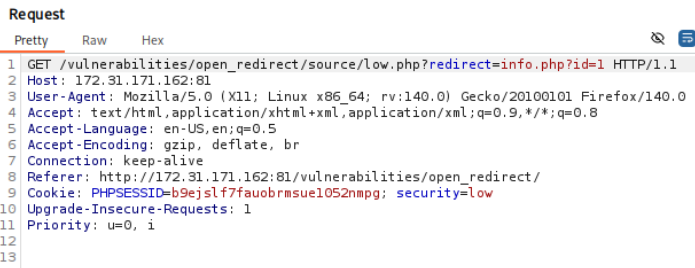

# 一、Low
## 1.1 源码审计
```PHP
<?php

if (array_key_exists ("redirect", $_GET) && $_GET['redirect'] != "") {
    header ("location: " . $_GET['redirect']);
    exit;
}

http_response_code (500);
?>
<p>Missing redirect target.</p>
<?php
exit;
?>
```
   - 先检查URL参数中是否存在`redirect`这个键，且它的值不为空
   - 通过php的`header()`函数发送一个`location`响应头，浏览器收到这个头后，会自动跳转到后面的那个url，但`$_GET['redirect']`是完全由用户控制的输入，没有其余检查
   - `exit;`发送重定向指令后，脚本停止
   - 如果没提供`redirect`参数则返回`500`服务器错误码


## 1.2 攻击
点击`Quote 1`后，http请求如图，有用到`low.php`中的重定向`redirect`参数，重定向到`info.php`的`id1`


创建一个`niko.txt`在`phpstudy_pro\WWW\DVWA-master\vulnerabilities\open_redirect`

利用low.php的重定向功能代码
```
http://172.31.171.162:81/vulnerabilities/open_redirect/source/low.php?redirect=../niko.txt

http://172.31.171.162:81/vulnerabilities/open_redirect/source/low.php?redirect=https://www.baidu.com
```

其意义在于，欺骗受害者，当受害者看到熟悉的域名，后面跳转的参数就不会很在意。

# 二、Medium
## 2.1 源码审计
```PHP
<?php

if (array_key_exists ("redirect", $_GET) && $_GET['redirect'] != "") {
    if (preg_match ("/http:\/\/|https:\/\//i", $_GET['redirect'])) {
        http_response_code (500);
        ?>
        <p>Absolute URLs not allowed.</p>
        <?php
        exit;
    } else {
        header ("location: " . $_GET['redirect']);
        exit;
    }
}

http_response_code (500);
?>
<p>Missing redirect target.</p>
<?php
exit;
?>
```
  - 新增判断语句，`preg_match`是php的正则匹配函数，如果`redirect`参数中包含`http://`或者`https://`，则被拦截，`i`代表不区分大小写
  - 关于`/http:\/\/|https:\/\//`：正则表达式模式被包裹在**定界符**中，即斜杠`/`，而`http://`中的`//`要区别于定界符，因此用反斜杠`/`作为转义符

## 2.2 攻击
访问网页修改为`//`，默认和本站采用相同的协议进行访问
```
http://172.31.171.162:81/vulnerabilities/open_redirect/source/medium.php?redirect=../niko.txt

http://172.31.171.162:81/vulnerabilities/open_redirect/source/medium.php?redirect=//www.baidu.com
```

# 三、High
## 3.1 源码审计
```PHP
<?php

if (array_key_exists ("redirect", $_GET) && $_GET['redirect'] != "") {
    if (strpos($_GET['redirect'], "info.php") !== false) {
        header ("location: " . $_GET['redirect']);
        exit;
    } else {
        http_response_code (500);
        ?>
        <p>You can only redirect to the info page.</p>
        <?php
        exit;
    }
}

http_response_code (500);
?>
<p>Missing redirect target.</p>
<?php
exit;
?> 
```
  - 新增if语句，`strpos($_GET['redirect'], "info.php")`在用户输入的url中寻找字符串`info.php`，只要存在则跳转。
  - 取消了对`http://`的检查

## 3.2 攻击
完整URL结构：
`协议://域名:端口/路径/文件名` + `?查询参数`
对于静态文件，无视`?`后的内容
对于浏览器请求，百度首页没有`id`的功能，自动忽略不认识的参数
```
http://172.31.171.162:81/vulnerabilities/open_redirect/source/high.php?redirect=../niko.txt?id=info.php

http://172.31.171.162:81/vulnerabilities/open_redirect/source/high.php?redirect=https://www.baidu.com?id=info.php
```

# 四、Impossible
## 4.1 源码审计
```PHP
 <?php

$target = "";

if (array_key_exists ("redirect", $_GET) && is_numeric($_GET['redirect'])) {
    switch (intval ($_GET['redirect'])) {
        case 1:
            $target = "info.php?id=1";
            break;
        case 2:
            $target = "info.php?id=2";
            break;
        case 99:
            $target = "https://digi.ninja";
            break;
    }
    if ($target != "") {
        header ("location: " . $target);
        exit;
    } else {
        ?>
        Unknown redirect target.
        <?php
        exit;
    }
}

?>
Missing redirect target.

```
  - `is_numeric()`要求用户只能`redirect`后输入数字跳转，如`?redirect=1`
  - `intval ($_GET['redirect'])`参数强制转换为整数
  - 查表法，严格白名单（不信任用户的输入）