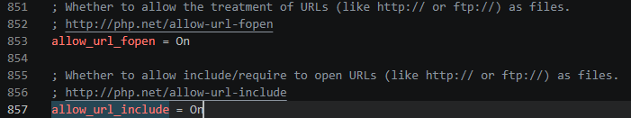
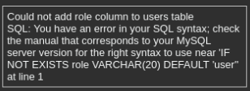
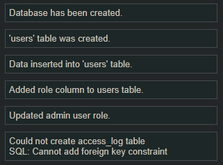

# 一、修复数据库
## 1.1 allow_参数修改
将`phpstudy_pro\Extensions\php\php7.4.3nts\php.ini`的`allow_`参数修改为On


## 1.2 recaptcha_key修改
```PHP
$_DVWA[ 'recaptcha_public_key' ]  = '6LdK7xITAAzzAAJQTfL7fu6I-0aPl8KHHieAT_yJg';  
$_DVWA[ 'recaptcha_private_key' ] = '6LdK7xITAzzAAL_uw9YXVUOPoIHPZLfw2K1n5NVQ';  
```
## 1.3 mysql.php修改(SQL语法错误)
setup/reset DB的时候报错如图，不支持在添加列中使用`IF NOT EXISTS`这个语法（更新mysql版本也没用）：


找到`dvwa/includes/DBMS/MySQL.php`文件，第67行的代码
```PHP
$alter_users = "ALTER TABLE users ADD COLUMN IF NOT EXISTS role VARCHAR(20) DEFAULT 'user';";
```
修改为：
```PHP
$alter_users = "ALTER TABLE users ADD COLUMN VARCHAR(20) DEFAULT 'user';";
```

145行代码：

```PHP
$alter_users_dept = "ALTER TABLE users 
    ADD COLUMN IF NOT EXISTS account_enabled TINYINT(1) DEFAULT 1;";
```
修改为：
```PHP
$alter_users_dept = "ALTER TABLE users 
    ADD COLUMN account_enabled TINYINT(1) DEFAULT 1;";
```

# 二、mysql8.0.12问题（建议把文件丢给ai修复）

https://blog.csdn.net/2401_89711774/article/details/157619808

问题原因：
  1. users表未指定innoDB引擎 → 可能默认MyISAM（不支持外键）。
  2. 字段类型不严格匹配：`users.user_id = INT(6)  access_log.user_id = INT`。
  3. 字符集不统一导致隐式转换失败。

## 2.1 修复1：users表显式指定InnoDB引擎 + 字符集
打开`phpstudy_pro\WWW\DVWA-master\dvwa\includes\DBMS\MySQL.php`

第42行左右：
```php
$create_tb = "CREATE TABLE users (user_id int(6),..., PRIMARY KEY (user_id));";
```

修改为强制InnoDB+统一字符集：
```PHP
$create_tb = "CREATE TABLE users (
user_id INT(6) NOT NULL,
first_name VARCHAR(15),
last_name VARCHAR(15),
user VARCHAR(15),
password VARCHAR(32),
avatar VARCHAR(70),
last_login TIMESTAMP,
failed_login INT(3),
PRIMARY KEY (user_id)
) ENGINE=InnoDB DEFAULT CHARSET=utf8mb4 COLLATE=utf8mb4_unicode_ci;";
```

## 2.2 修复2：安全添加role列（绕过IF NOT EXISTS语法）
```PHP
$alter_users = "ALTER TABLE users ADD COLUMN IF NOT EXISTS role VARCHAR(20) DEFAULT 'user';";
```

替换为

```PHP
// 1. 构建查询语句，检查 information_schema 中是否存在该列
$check_role = "SELECT COUNT(*) AS cnt FROM information_schema.COLUMNS 
               WHERE TABLE_SCHEMA = '{$_DVWA['db_database']}' 
               AND TABLE_NAME = 'users' 
               AND COLUMN_NAME = 'role'";

// 2. 执行查询
$result = mysqli_query($GLOBALS["___mysqli_ston"], $check_role);
$row = mysqli_fetch_assoc($result);

// 3. 如果不存在（cnt == 0），则执行添加列的操作
if ($row['cnt'] == 0) {
    $alter_query = "ALTER TABLE users ADD COLUMN role VARCHAR(20) DEFAULT 'user';";
    if (mysqli_query($GLOBALS["___mysqli_ston"], $alter_query)) {
        dvwaMessagePush("已成功向 users 表添加 role 列。");
    } else {
        dvwaMessagePush("添加 role 列失败: " . mysqli_error($GLOBALS["___mysqli_ston"]));
    }
} else {
    dvwaMessagePush("users 表中已存在 role 列，跳过操作。");
}
```

## 2.3 修复3：account_enabled列安全添加（逻辑同role列）
```PHP
$alter_users_dept = "ALTER TABLE users ADD COLUMN account_enabled TINYINT(1) DEFAULT 1;";
```

修改为如下信息

```PHP
// 1. 定义检查语句（检查 account_enabled 列是否存在）
$check_enabled = "SELECT COUNT(*) AS cnt FROM information_schema.COLUMNS 
                  WHERE TABLE_SCHEMA = '{$_DVWA['db_database']}' 
                  AND TABLE_NAME = 'users' 
                  AND COLUMN_NAME = 'account_enabled'";

// 2. 执行查询并获取结果
$result_enabled = mysqli_query($GLOBALS["___mysqli_ston"], $check_enabled);
$row_enabled = mysqli_fetch_assoc($result_enabled);

// 3. 判断：如果列不存在（cnt == 0），则执行添加操作
if ($row_enabled['cnt'] == 0) {
    $alter_enabled_query = "ALTER TABLE users ADD COLUMN account_enabled TINYINT(1) DEFAULT 1;";
    if (mysqli_query($GLOBALS["___mysqli_ston"], $alter_enabled_query)) {
        dvwaMessagePush("已成功向 users 表添加 account_enabled 列。");
    } else {
        dvwaMessagePush("添加 account_enabled 列失败: " . mysqli_error($GLOBALS["___mysqli_ston"]));
    }
} else {
    // 如果列已存在，可以选择静默跳过或提示
    dvwaMessagePush("account_enabled 列已存在，跳过。");
}
```

## 2.4 修复4：access_log表字段类型严格对齐
```PHP
// 原代码（第98行附近）
user_id INT NOT NULL,
target_id INT NOT NULL,

// 修改为
user_id INT(6) NOT NULL,
target_id INT(6) NOT NULL,
```

## 2.5 修复5：security_log表同样修改
```PHP
// 原代码
user_id INT NOT NULL,
target_id INT NOT NULL,

// 修改为
user_id INT(6) NOT NULL,
target_id INT(6) NOT NULL,
```