# 一、基础src挖掘
## 1.1 URL跳转/重定向漏洞
利用页面跳转功能存在的缺陷，篡改目标地址为外部链接，绕过安全校验后验证能否成功跳转。

`xxx.com?url=yyy.com`
参数名不一定yyy，也可能jump、go、forward、link

## 1.2 四位数验证码爆破
0000-9999共1万种组合（若不限制尝试次数）

burp suite抓取登录数据包，利用Intruder，分析响应长度
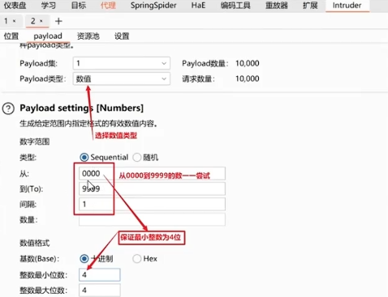

## 1.3 平行越权
系统未对访问者身份进行严格校验，通过修改请求参数，可越权访问其他同级别用户的个人数据

高危：通常指可越权访问多维度敏感信息(如身份证、手机号、姓名、银行卡、住址等任意三项组合)
中危:普通越权行为，例如修改他人资料、删除他人地址等。
低位：影响有限的越权

第一种：GET请求下的平行越权（不用抓包，直接改URL）
`http://192.168.110.198/auth_bypass/profile.php?user_id=1`

第二种：POST 请求下的平行越权（抓包改参数）

## 1.4 垂直越权
利用系统仅依赖前端参数校验权限、后端缺乏严格验证的漏洞，实现了从普通用户到管理员的垂直越权

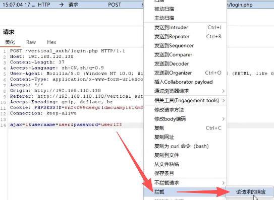
拦截请求的响应，放行后获得来自服务器的响应包，而该响应包会被浏览器处理

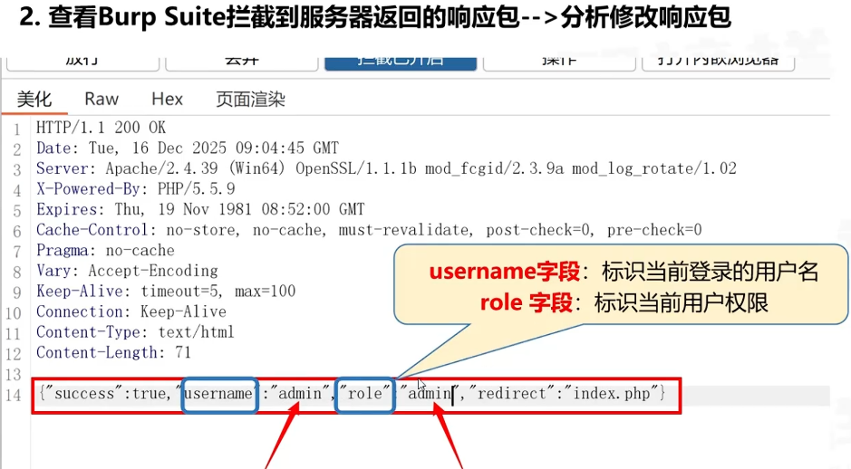

## 1.5 逻辑漏洞：“0元购”
burpsuite抓包，修改价格数字为0，修改数量为0或-1

## 1.6 逻辑漏洞：优惠券叠加
面对只能买一张优惠券，抓包，修改优惠券

## 1.7 高价值漏洞：API接口信息泄露
网站的后端 API 接口没有做权限校验，同时它的访问地址又直接暴露在 JS 文件中，攻击者一旦发现这些暴露的接口，就能绕过所有验证环节，直接窃取大量用户敏感数据。

使用浏览器幻影插件 -> 扫描 -> 深度扫描

检查`.js`文件里面的 API 接口，访问

## 1.8 存储型XSS
攻击者能够将恶意JavaScript脚本提交到网站的输入功能，比如评论、留言板等地方，提交后，服务器会把这串脚本永久存储起来，当其他用户访问包含这个恶意脚本的页面比如打开评论列表时，脚本就会自动在用户的浏览器中执行，实现攻击效果

1. 基本弹窗XSS
`<script>alert('XSS')</script>`

2. 获取cookies
`<script>alert(document.cookie)</script>`

3. 页面重定向
`<script>window.location.href='http://example.com'</script>`

4. 事件型XSS
``
``是图片标签，`src=x`指向一个不存在的图片地址
浏览器尝试加载这个不存在的图片-->触发 `onerror`(加载失败)事件-->执行我们嵌入的`alert`函数

`<div onmouseover=alert(鼠标悬停XSS')>悬停这里</div>`
`<a href="#" onclick=alert('点击XSS')>点击这里</a>`

5. 伪协议XSS
`<a href="javascript:alert('伪协议XSS')">点击这里</a>`

`<iframe src="javascript:alert('iframe XSS')" width=0 height=0></iframe>`

## 1.9 反射型XSS
攻击者会精心构造一个含有恶意脚本的URL链接，想方设法诱导用户去点击

当用户点击这个链接时，嵌在里面的恶意脚本就会被浏览器执行

与存储型区别：反射型XSS的恶意脚本并不会被存储在目标网站的服务器上，它只是通过URL的参数来传递。每次只有当用户访问那个带着恶意参数的特定URL时，攻击才会触发一次，可以理解为是"一次性”的。

这里需要配合URL解码https://www.toolhelper.cn/EncodeDecode/Url

## 1.10 文件上传型XSS
攻击者会把含有恶意JavaScript代码的文件(HTML/SVG格式)上传到目标服务器。
如果服务器没有对文件进行严格的安全校验，就直接保存。
这个文件后续又可以被其他用户进行访问，当其他用户访问这个文件
他们浏览器就会直接执行里面的恶意脚本，从而达到攻击目的

HTML：
```HTML
<!DOCTYPE html>
<html>
    <head>
        <title>文件上传XSS测试</title>
    </head>
    <body>
        <script>alert('文件上传XSS攻击成功!');</script>
    </body>
</html>
```

SVG：
```svg
<svg xmlns="http://www.w3.org/2000/svg" width="300" height="200">
  <rect width="300" height="200" fill="#f00"/>
  <text x="50%" y="50%" font-size="20" fill="white" text-anchor="middle">SVG XSS</text>
  <script type="text/javascript">alert('SVG文件XSS攻击成功！');</script>
</svg>
```

HTML文件修改为网站允许上传的格式，再burp suite修改
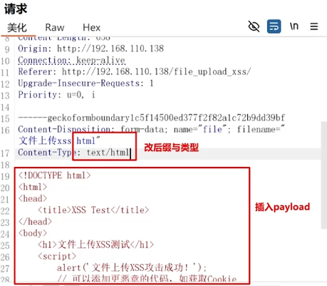

## 1.11 谷歌语法挖洞
操作符:搜索词
`site:` -> 把搜索结果严格限定在某个指定的网站或域名内。比如site:example.com，就只会搜索这个网站下的内容。
`intext:` -> 要求搜索词必须出现在**网页的正文内容**里。比如intext:后台管理，就会搜索网页内容中含有“后台管理”的页面
`intitle:` -> 要求搜索词必须出现在**网页的标题**中。比如intitle:登录，就会搜索标题中包含“登录”的页面

`site:pan.baidu.com 优惠|新人|vip`
`site:pan.baidu.com intext:优惠|新人|vip`
`site:pan.baidu.com intitle:优惠|新人|vip`

## 1.12 真实场景下的CSRF
攻击者利用受害者已登录的身份状态，诱使受害者访问恶意链接或页面，导致受害者不知情时以自己身份执行非自愿操作（改密码/转账）

前提两个：
1. 受害者当前已登录目标网站
2. 目标网站未对敏感操作进行有效的二次验证

## 1.13 逻辑漏洞：领取隐藏优惠券
领取优惠券请求 burp suite 截取，对比请求，intruder爆破领取的数字

## 1.14 逻辑漏洞：任意用户登录
正常登录：填写手机号，收验证码
假设：知道别人id信息，且id没有和手机号码绑定
接着：将接收验证码的手机修改成自己的

## 1.15 逻辑漏洞：任意用户密码重置
正常流程：输入用户名、手机号码验证重置密码
抓包：发送验证码抓包，修改手机号

## 1.16 基于越权：任意用户密码重置
抓包修改用户身份标识参数

## 1.17 思路总结
场景一：看到URL带有跳转参数，先试URL跳转漏洞
场景二：看到优惠券领取功能，试试遍历隐藏优惠券
场景三：遇到文件上传功能，别只测木马，试试文件上传XSS
场景四：碰到支付结算场景，优先测价格篡改和优惠券叠加
场景五：遇到登录、修改密码功能，紧盯“参数分离”漏洞

# 二、JS 在SRC中作用
- 技术角度：
  - 后端：JAVA、PHP、ASP、Node.js...，带有数据库（负责增删改查）
  - 前端：HTML、CSS、JS
- 业务角度：
  - 后台：公司内部管理员操作的业务，如后台管理系统
  - 前台：用户角度操作的一切，如手机app、开放式网站

## 2.1 HTML速览
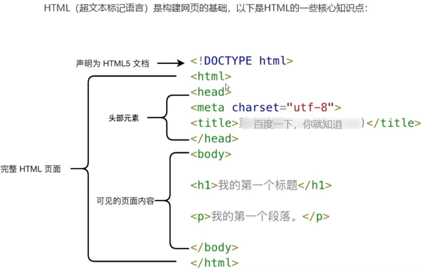
```HTML
<a></a>：跳转
<div></div>：分部门
<form></form>：表单
<br>：换行
```

## 2.2 CSS速览
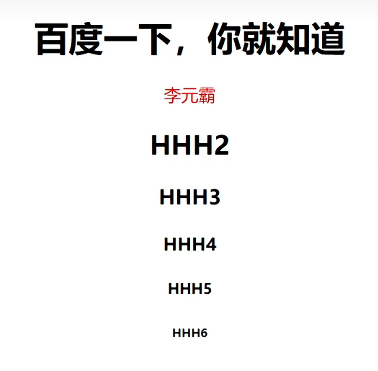
```HTML
<!DOCTYPE html>
<html lang="en">
<head>
    <meta charset="UTF-8">
    <title>学习css2</title>
    <style>
        .derryABCDEFGFFF
        {
            text-align:center;
        }

        /* 需求：p标签 既要居中，也要变颜色 */
        .derryColor {
            color: red;
        }

        /* 需求：只准你把 p标签居中，但是不准动 body里面的代码 */
        /*
        p.derryABCDEFGFFF
        {
            text-align:center;
        }
        */
    </style>
</head>
<body>
    <h1 class="derryABCDEFGFFF">百度一下，你就知道</h1>
    <p class="derryColor derryABCDEFGFFF">李元霸</p>
    <h2 class="derryABCDEFGFFF">HHH2</h2>
    <h3 class="derryABCDEFGFFF">HHH3</h3>
    <h4 class="derryABCDEFGFFF">HHH4</h4>
    <h5 class="derryABCDEFGFFF">HHH5</h5>
    <h6 class="derryABCDEFGFFF">HHH6</h6>
    <!-- ... 省略 ... -->
</body>
</html>
```

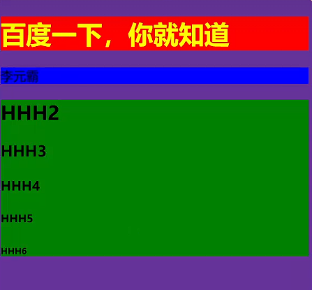
```HTML
<!DOCTYPE html>
<html lang="en">
<head>
    <meta charset="UTF-8">
    <title>学习css3</title>
    <style>
        body{
            background-color: rebeccapurple;
        }
        h1 {
            background-color: red;
            color: yellow;
        }
        p{
            background-color:blue;
        }
        div{
            background-color: green;
        }
    </style>
</head>
<body>
    <h1>百度一下，你就知道</h1>
    <p>李元霸</p>

    <div>
        <h2 class="derryABCDEFG">HHH2</h2>
        <h3 class="derryABCDEFG">HHH3</h3>
        <h4 class="derryABCDEFG">HHH4</h4>
        <h5 class="derryABCDEFG">HHH5</h5>
        <h6 class="derryABCDEFG">HHH6</h6>
        </div>

    </body>
</html>
```

## 2.3 JS 速览
JS包含逻辑运算，SRC的漏洞挖掘其实就是检测JS有没有关键信息暴漏
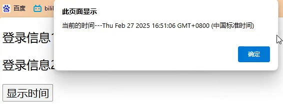


```HTML
<!DOCTYPE html>
<html lang="en">
<head>
    <meta charset="UTF-8">
    <title>学习JS</title>

    <script>
        // 是一个函数，函数名 showDataABCDEFG
        function showDataABCDEFG() {
            alert('当前的时间---' + Date())
            document.getElementById("aaa").innerHTML = Date()
        }
    </script>
</head>
<body>
    <p>登录信息1</p>
    <p id="aaa">当前时间</p>

    <button type="button" onclick="showDataABCDEFG()">显示时间</button>
</body>
</html>
```

## 2.4 主域名与子域名
域名（技术角度）：包含前端+后端，如下：

`https://www.zhibangyang.cn/`是前台，开放式的，安全系数高
`https://www.zhibangyang.cn/hnxx/register`是后台，封闭的，私密的，安全系数低

网站通常一个主域名+多个子域名
主域名`main.derry.com`开放的
子域名`test.derry.com`私密的
子域名`person.derry.com`

## 2.5 阅读JS查询漏洞
1. JS中存在插件名字，根据插件找到相应的漏洞直接利用
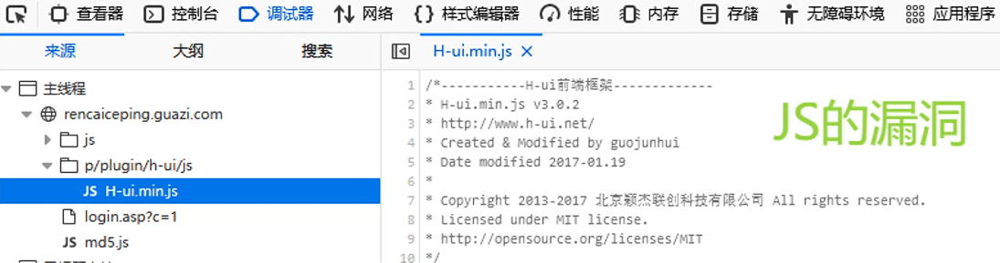

最简单的例子：
```HTML
<!DOCTYPE html>
<html lang="en">
<head>
    <meta charset="UTF-8">
    <title>使用人家的js框架</title>
    
    <script src="https://code.jquery.com/jquery-3.6.0.min.js">
        // 使用人家的 老外写的 【JS框架】
    </script>
</head>
<body>
    <h2>使用 人家的 js框架</h2>
</body>
</html>
```

2. JS中存在一些URL链接
3. JS中存在一个子域名，可以直接访问
4. JS中的一些注释，可能泄露账户密码

## 2.6 JSFinder脚本爬取
`https://github.com/Threezh1/JSFinder`
python JSFinder.py -u http://www.mi.com

## 2.7 js断点调试网站步骤
默认是没有调试的，例如:网站一下子就执行了一万个步骤，就全部执行完成了；
而调试的目的，是为了把一万个步骤给分解。

源代码中打断点

## 2.8 利用漏洞解决加密/解密
不知道用户名与密码，如何破解？找漏洞。
F12分析JavaScript 的`<script>`标签，其中可能会被注释打乱，将线索列举出来：
线索一：
线索二：
线索三：

## 2.9 FUZZ思维破解网站
FUZZ字典合集通常用于安全测试、漏洞挖掘或模糊测试(Fuzzing)
burp suite中利用字典.txt
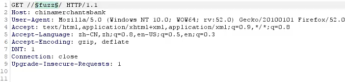
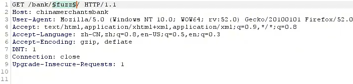
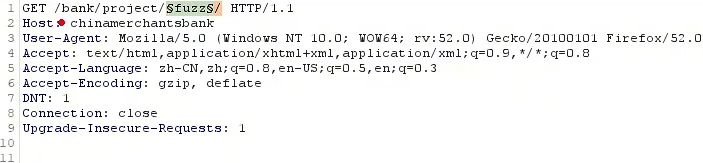

## 2.10 FUZZ找xss漏洞
`http://chinamerchantsbank/bank/project/personal/property/core/index.php?fuzz=自己的漏洞利用脚本`
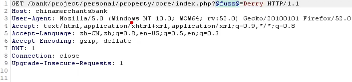

漏洞利用脚本比如：`<script>alert(""已入侵"")</script>`

## 2.11 FUZZ未知页面探索
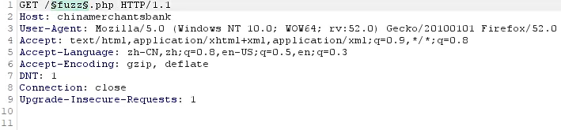

## 2.12 FUZZ利用前台找私密后台漏洞
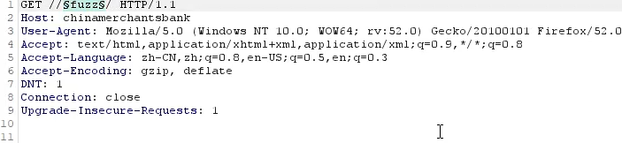

# 三、撰写漏洞报告
简要描述：xx在xx因为xx产生了xx漏洞
详细描述：
1. 漏洞产生的点
2. 怎么做漏洞测试的
3. 漏洞产生的危害