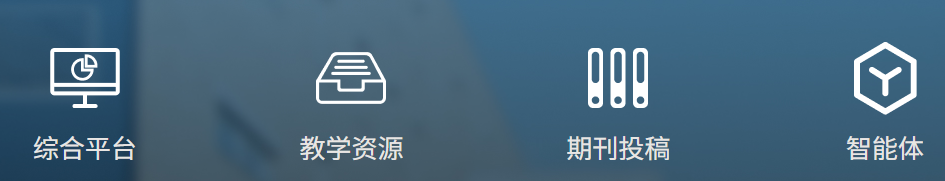
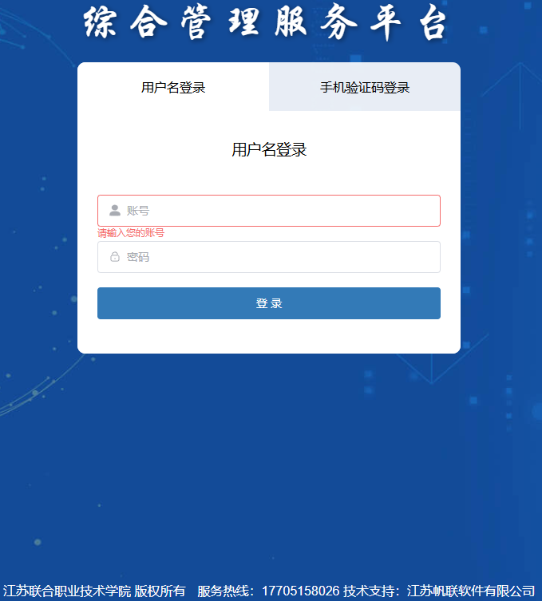
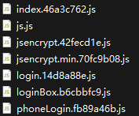

# 一、检索
fofa：``body="xxx大学" && domain!="edu.cn"``
江苏联合职业技术学院(http://www.juti.cn/)

综合平台、智能体都需要账户密码


两种登录方式、江苏帆联软件有限公司


# 二、综合平台

F12下载到 7 个 JS 文件，交给 agent(deepseek) 查找重要信息

## 2.1 硬编码 RSA 公钥
`jsencrypt.42fecd1e.js`:1 
发现 512 位 RSA 公钥：
```
MFwwDQYJKoZIhvcNAQEBBQADSwAwSAJBAKoR8mX0rGKLqzcWmOzbfj64K8ZIgOdHnzkXSOVOZbFu/TJhZ7rFAN+eaGkl3C4buccQd/EjEsj9ir7ijT7h96MCAwEAAQ==
```
该密钥用于加密 Cookie 中的用户名和密码

## 2.2 登录流程分析
`login.14d8a88e.js`
`/config/login` → 获取 `key`, `iv`, `uuid`, `captcha` → `AES-CBC` 加密账号密码 → `/auth/login`

- 加密方式: `CryptoJS AES-CBC` + `PKCS7 padding`，`key` 和 `iv（Initialization Vector，初始化向量）` 从服务端 `/config/login` 动态获取
- 加密后的凭证存储在 `localStorage` 的 `loginUser` 键中，格式：`{u, p, key, iv}`（`key/iv` 和密文存在一起）
- Cookie 中使用 JSEncrypt(RSA) 加密记住的用户名密码，有效期 30 天

## 2.3 完整 API 路由清单
认证：/auth/login, /auth/autoLogin, /auth/smsLogin, /auth/register, /auth/logout
SSO：/simpleSsoToken/token
短信：/sms/code
用户：/user/getInfo, /user/profile
系统：/system/user, /system/role, /system/dict, /system/org, /system/oss, /system/config
平台：/platform/nationalMajor, /platform/schoolMajor, /platform/major, /platform/guide, /platform/grade, /platform/teacher, /platform/term, /platform/course, /platform/class, /platform/student
思政：/politicTheory/home, /politicTheory/plan, /politicTheory/declare, /politicTheory/check, /politicTheory/veto, /politicTheory/collect
工作流：/workflow/flow, /workflow/dynamicForm
报表：/intelligentReport/dataReport, /intelligentReport/dataReview, /intelligentReport/dataQuery
移动端：/mobile/mlogin
配置：/config/login, /config/shortcuts
文件：/oss/uploadSpeedTest, /oss/batchUpload, /oss/office

## 2.4 前端技术栈
前端框架：Vue 3 + Element Plus
AES 前端加密：CryptoJS
RSA 前端加密：JSEncrypt
PDF 导出：jsPDF + html2canvas
富文本编辑器：Quill
压缩：JSZip 

## 2.5 localStorage 键名
- Admin-Token — 认证 Token
- Admin-User — 用户信息
- loginUser — 加密登录凭证 {u, p, key, iv}
- menu / routeInfo / activeMenu — 菜单路由
- layout-setting / needUpdatePass / speedMbps

## 2.6 密码复杂度要求
至少 1 数字 + 1 小写字母 + 1 大写字母 + 1 特殊字符，长度 8-20 位
Regex: `/^(?=(.*\d){1,})(?=(.*[a-z]){1,})(?=(.*[A-Z]){1,})(?=(.*[\W_]){1,})[a-zA-Z0-9\W_]{8,20}$/`

## 2.7 思路
目前：有7个JS文件，文件名hash，加密逻辑、API路由、RSA公钥，
接下来：
1. 在目标URL跑未授权接口：`https://ptly.jse.edu.cn/login?redirect=/home`
2. 不用登录就能测：
  /config/login     → 直接拿 key/iv/uuid/验证码图片
  /auth/register    → 是否开放注册
  /screen/home      → 大屏常无鉴权
  /mobile/mlogin    → 移动端可能鉴权更弱
  /user/getInfo     → 未授权拿用户信息
3. 其他攻击
  RSA-512 公钥因子分解 → 解 cookie 拿明文密码
  /sms/code 短信轰炸
  /oss/batchUpload 文件上传绕过
  /simpleSsoToken/token SSO token 逻辑
  
## 2.8 下一步尝试
https://ptly.jse.edu.cn/mobile/mlogin

https://ptly.jse.edu.cn/politicTheory/home

https://ptly.jse.edu.cn/actuator

尝试失败，防护比较严