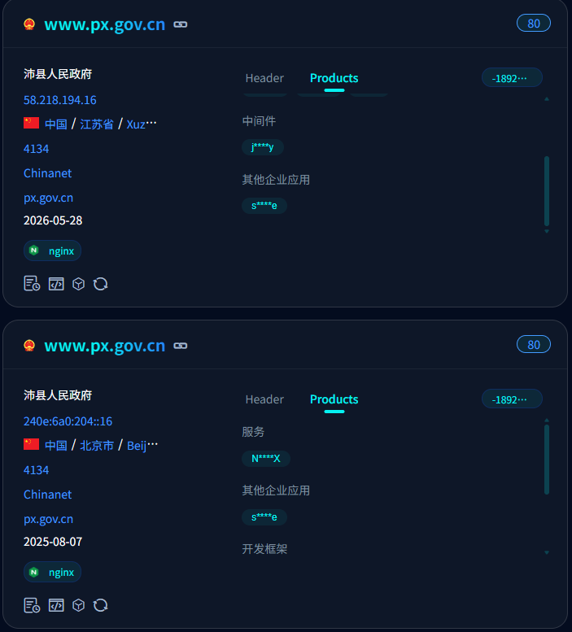
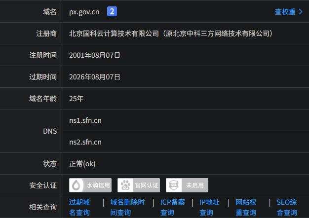
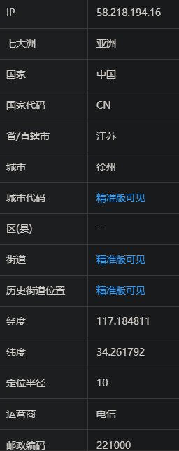

# 一、资产收集
## 1.1 子域名挖掘
`python oneforall.py --target px.gov.cn run`

fk.px.gov.cn
fk.px.gov.cn
px.gov.cn
px.gov.cn
www.px.gov.cn
www.px.gov.cn

domain="px.gov.cn" && status_code="200"


## 1.2 IP段与服务器探测
https://whois.chinaz.com/px.gov.cn



`nmap -sS -sV -sC 58.218.194.16`

```bash
PS C:\Users\Rocky> nmap -sS -sV -sC 58.218.194.16
Starting Nmap 7.99 ( https://nmap.org ) at 2026-06-30 14:47 +0800
Nmap scan report for 58.218.194.16
Host is up (0.042s latency).
Not shown: 996 filtered tcp ports (no-response)
PORT    STATE SERVICE VERSION
25/tcp  open  smtp?
|_smtp-commands: Couldn't establish connection on port 25
80/tcp  open  http    epoint-httpserver
|_http-server-header: epoint-httpserver
| fingerprint-strings:
|   GetRequest:
|     HTTP/1.1 200 OK
|     Server: epoint-httpserver
|     Date: Tue, 30 Jun 2026 06:35:51 GMT
|     Content-Type: text/html; charset=utf-8
|     Content-Length: 43063
|     Connection: close
|     Last-Modified: Tue, 30 Jun 2026 00:49:49 GMT
|     ETag: "6a4312ad-a837"
|     Accept-Ranges: bytes
|     <!DOCTYPE html>
|     <html lang="zh-CN">
|     <head>
|     <meta charset="UTF-8">
|     <meta http-equiv="X-UA-Compatible" content="IE=Edge">
|     <meta name="renderer" content="webkit">
|     <!--
|     <meta content="width=device-width, initial-scale=1.0, maximum-scale=1.0, user-scalable=0" name="viewport" />
|     <meta name="SiteName" content="
|     <meta name="SiteDomain" content="gaj.xz.gov.cn" >
|     <meta name="SiteIDCode" content="3203000040">
|     <meta name="Description" content="
|     <meta name="Keywords" content="
|     <link rel="stylesheet" href="/css/boo
|   HTTPOptions:
|     HTTP/1.1 404 Not Found
|     Content-Type: text/html
|     Expires: 0
|     Cache-control: private
|     Content-Length: 214
|_    Sorry, Page Not Found
110/tcp open  pop3?
143/tcp open  imap?
1 service unrecognized despite returning data. If you know the service/version, please submit the following fingerprint at https://nmap.org/cgi-bin/submit.cgi?new-service :
SF-Port80-TCP:V=7.99%I=7%D=6/30%Time=6A436680%P=i686-pc-windows-windows%r(
SF:GetRequest,35DB,"HTTP/1\.1\x20200\x20OK\r\nServer:\x20epoint-httpserver
SF:\r\nDate:\x20Tue,\x2030\x20Jun\x202026\x2006:35:51\x20GMT\r\nContent-Ty
SF:pe:\x20text/html;\x20charset=utf-8\r\nContent-Length:\x2043063\r\nConne
SF:ction:\x20close\r\nLast-Modified:\x20Tue,\x2030\x20Jun\x202026\x2000:49
SF::49\x20GMT\r\nETag:\x20\"6a4312ad-a837\"\r\nAccept-Ranges:\x20bytes\r\n
SF:\r\n<!DOCTYPE\x20html>\r\n<html\x20lang=\"zh-CN\">\r\n\r\n<head>\r\n\x2
SF:0\x20\x20\x20<meta\x20charset=\"UTF-8\">\r\n\x20\x20\x20\x20<meta\x20ht
SF:tp-equiv=\"X-UA-Compatible\"\x20content=\"IE=Edge\">\r\n\x20\x20\x20\x2
SF:0<meta\x20name=\"renderer\"\x20content=\"webkit\">\r\n\x20\x20\x20\x20<
SF:!--\x20\xe5\x93\x8d\xe5\xba\x94\xe5\xbc\x8f\xe8\xae\xbe\xe7\xbd\xae\x20
SF:-->\r\n\x20\x20\x20\x20<meta\x20content=\"width=device-width,\x20initia
SF:l-scale=1\.0,\x20maximum-scale=1\.0,\x20user-scalable=0\"\x20name=\"vie
SF:wport\"\x20/>\r\n\x20\x20\x20\x20<meta\x20name=\"SiteName\"\x20content=
SF:\"\xe5\xbe\x90\xe5\xb7\x9e\xe5\xb8\x82\xe5\x85\xac\xe5\xae\x89\xe5\xb1\
SF:x80\">\r\n\x20\x20\x20<meta\x20name=\"SiteDomain\"\x20content=\"gaj\.xz
SF:\.gov\.cn\"\x20>\r\n\x20\x20\x20\x20<meta\x20name=\"SiteIDCode\"\x20con
SF:tent=\"3203000040\">\r\n\x20\x20\x20\x20<meta\x20name=\"Description\"\x
SF:20content=\"\xe5\xbe\x90\xe5\xb7\x9e\xe5\xb8\x82\xe5\x85\xac\xe5\xae\x8
SF:9\xe5\xb1\x80\">\r\n\x20\x20\x20\x20<meta\x20name=\"Keywords\"\x20conte
SF:nt=\"\xe5\xbe\x90\xe5\xb7\x9e\xe5\xb8\x82\xe5\x85\xac\xe5\xae\x89\xe5\x
SF:b1\x80\">\r\n\x20\x20\x20\x20<link\x20rel=\"stylesheet\"\x20href=\"/css
SF:/boo")%r(HTTPOptions,142,"HTTP/1\.1\x20404\x20Not\x20Found\r\nContent-T
SF:ype:\x20text/html\r\nExpires:\x200\r\nCache-control:\x20private\r\nCont
SF:ent-Length:\x20214\r\n\r\nSorry,\x20Page\x20Not\x20Found\0\0\0\0\0\0\0\
SF:0\0\0\0\0\0\0\0\0\0\0\0\0\0\0\0\0\0\0\0\0\0\0\0\0\0\0\0\0\0\0\0\0\0\0\0
SF:\0\0\0\0\0\0\0\0\0\0\0\0\0\0\0\0\0\0\0\0\0\0\0\0\0\0\0\0\0\0\0\0\0\0\0\
SF:0\0\0\0\0\0\0\0\0\0\0\0\0\0\0\0\0\0\0\0\0\0\0\0\0\0\0\0\0\0\0\0\0\0\0\0
SF:\0\0\0\0\0\0\0\0\0\0\0\0\0\0\0\0\0\0\0\0\0\0\0\0\0\0\0\0\0\0\0\0\0\0\0\
SF:0\0\0\0\0\0\0\0\0\0\0\0\0\0\0\0\0\0\0\0\0\0\0\0\0\0\0\0\0\0\0\0\0\0\0\0
SF:\0\0\0\0\0\0\0\0");
```