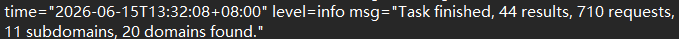
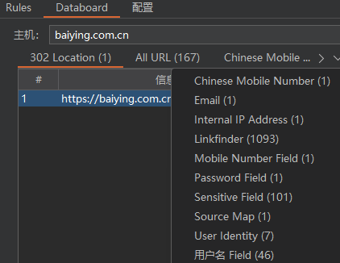
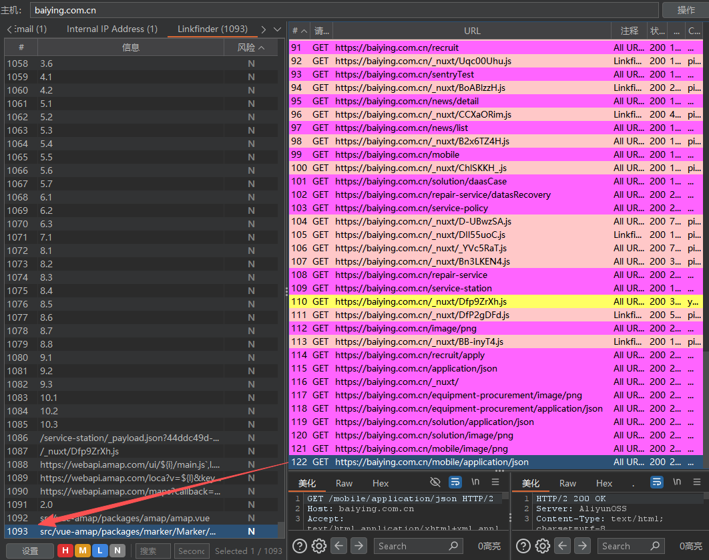
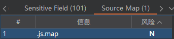
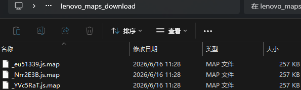
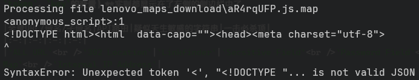
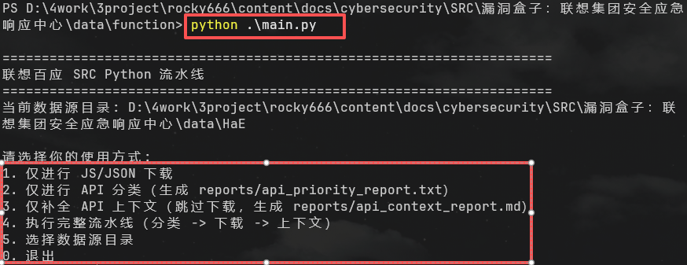
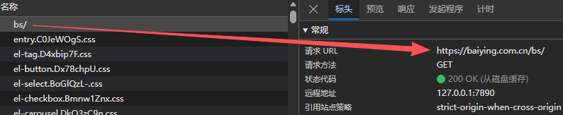

# 一、资产范围
```
特别注意，以下事项请认真查看并留意。
1）漏洞报告需认真填写，标题如“某系统某漏洞”等需写明具体系统与漏洞。
举例：
a）联想商城搜索处存在反射型xss（正确）
b）某系统反射型xss（错误）

2）报告中需提供涉及到风险点的链接（文字版可复制）
举例：
a）漏洞报告提供了可复制的漏洞链接，与相应的证明截图，外加条理清晰的描述文字。（正确）
b）漏洞报告中只提供了截图和过少的文字描述，并未提供实际的风险点链接。（错误）

PS：联想全资子公司、联想投资、联想控股的公司的漏洞，以及与联想完全无关的漏洞，不予审核通过。
如：阳光雨露资产下漏洞暂不收录：*.sunits.com

安想、智慧医疗相关资产暂不收录，域名接管问题内部整改中暂不收录
```

```
*.lenovo.com
*.lenovo.com.cn
*.lenovomm.com
*.lenovo.cn
*.lenovo.net
*.motorola.com
*.motorola.com.cn
*.baiying.cn
*.baiying.com.cn
```

# 二、爬虫
## 2.1 crawlergo + Burp suite
> [点击学习crawlergo](/docs/cybersecurity/SRC/crawlergo使用/#crawlergo)

添加参数，让流量走burp suite
```BASH
.\crawlergo_win_amd64.exe -c D:\3patience\chromium\chrome.exe -t 10 --request-proxy http://127.0.0.1:8080 https://baiying.com.cn/

# -t 3慢速、10中速、20快速
```

结果流量一走burp suite，只能扫描出两个网站，后面才发现，是**上游代理没删除**，流量被转发到`7897`和`7890`端口，直接断流，修复后，将 powershell 内容保存到 `2026-06-15.txt` 文档


**获得44个结果、710个请求、11个子域名、20个关联域名**


## 2.2 HaE + Burp suite
### 2.2.1 hae 不同标签内容
>安装hae插件https://github.com/gh0stkey/HaE



1. 资产与路径提取类（重要）：
`ALL URL(167)`：匹配到的所有完整URL链接。
`Linkfinder (1093)`：专门从 JS 文件中提取出的相对路径、API路由、未公开的URL片段。
`Source Map (1)`：现代前端压缩包会压缩混淆，如果开启了source map，就能通过它还原未压缩的前端 Vue/Nuxt.js 源码。直接去下载这个URL，配合逆向工具能看到前端代码逻辑。
`302 Location (1)`：排查URL跳转漏洞，或查看未授权访问被拦截后，重定向到的SSO地址。

2. 凭证、密钥与敏感变量类（重要）
`Sensitive Field (101)`：代码或响应体中包含类似`secret`、`apikey`等高危硬编码字符串。
`Password Field (1) `/ `用户名 Field (46)`：表单、JSON传参或代码注释中带有`password`、`pwd`、`admin`的字段或赋值。
`Mobile Number Field (1)`：匹配到代码中定义的手机号字段或硬编码的手机号变量名。

3. 数据与身份信息泄露类（合规与信息收集）
`Chinese Mobile Number (1)`：符合中国大陆手机号格式的具体数据
`Email (1)`：匹配到了具体的邮箱地址
`Internal IP Address (1)`：匹配到了内网IP地址
`User Identity (7)`：匹配到了身份证号、护照、或系统内部定义的特定UserID身份标识。

> 接下来思路见[自动化收集的接口、指纹提取](/docs/cybersecurity/SRC/SRC挖掘思路/#frontend)

|全量URL/域名/子域名|API路由|疑似天生敏感的字符串|一击必杀项|
|:-:|:-:|:-:|:-:|
|`ALL URL`<br />`302 Location`|`Linkfinder`|`Secsitive Field`<br />`Password Field`<br />`用户名 Field`|`Source Map`<br />`Internal IP Address`|

### 2.2.2 信息梳理


**右侧：**完整的 HTTP 请求
**左侧：**使用`Linkfinder`的正则规则，从右边网页的源代码里，抠出来的各种相对路径、JS 文件名、CSS 文件名和图片地址
**两侧的关系：**右侧的某个 JS 流量包 -> 蕴含了左侧的 N 个 API 字符串


# 三、不同标签端点测试
## 3.1 Source Map（1）（死胡同）

如图某JS文件存在对应的`.map`文件，我们需要下载到。

```BASH
# 创建虚拟环境
python -m venv venv
.\venv\Scripts\Activate.ps1

# 安装并发工具
pip install aiohttp
```


编写`download_maps.py`文件，爬取到的`.js.map`下载到本地

```BASH
# 安装工具
npm install -g reverse-sourcemap

# 目录递归恢复源码
reverse-sourcemap -v -r -o lenovo_all_src .
```


结果发现，文件内容本来就是HTML，根本不需要再工具恢复源码，因此编写`smart_rename.py`文件，将`.js.map`文件重命名为`.html`。

同时还发现，这80个文件内容一样，这可能代表：线上环境的Source Map已经被安全团队拦截或清空，目前返回的是`Nuxt.js`调用统一的错误处理器，将通用的前端主页外壳渲染出来，作为404错误页面返回的。

简单查看HTML文件中，包含了大量后端接口地址

这里我选择构造一个`extract_url_api.py`文件，提取URL和API，但结果好像不太全：
```
--- 发现的独立域名/URL ---
https://baiying.lenovo.com
https://baiyingmalladmin.lenovo.com
https://baiyingmalladmintest.lenovo.com
https://baiyingmalladminuat.lenovo.com
https://bot-test.baiying.com.cn
https://bot-uat.baiying.com.cn
https://dawei.lenovo.com
https://official-test.baiying.com.cn
https://official-uat.baiying.com.cn
https://paas.lenovo.com.cn
https://paastest.baiying.com.cn
https://paasuat.baiying.com.cn
https://shop-pub-gateway.baiying.com.cn
https://shop-pub-gateway.baiying.com.cn/api/activity/jump/692
https://test-shop-pub-gateway.baiying.com.cn
https://test-shop-pub-gateway.baiying.com.cn/api/activity/jump/642
https://uat-shop-pub-gateway.baiying.com.cn

--- 发现的 API 路由 ---
```

结果发现，我这里搜集到的URL，在`Linkfinder`中全都有，所以我挑选这里的`HTML`文件进行信息搜集的思路❌
因为：这些`HTML`文件是`Nuxt.js`的`SSR`（服务器端渲染）页面渲染好的页面内容，不是未编译的源码。真正的 API 路由、环境配置、前后端接口都打包在 `JS bundle`里（`/_nuxt/sTj8Gxax.js`这样的文件）。

所以接下来思路要转换：利用构造的`download_js.py`脚本，将`js.map`的`js`文件下载下来，接着用更新的`extract_url_api.py`处理所有的`JS`和`HTML`文件，去重后按分类输出

但结果我又发现，我在**走弯路**❌，目前我的操作链如下：
HaE `Source Map` 标签 → `download_maps.py` 下载 `.js.map` → `smart_rename.py` 改名 `.html` → `extract_url_api.py` 提取 → 发现不够 → `download_js.py` 下载 `.js` 再分析

但实际上 HaE 在抓流量的时候，已经把想要的都提取好的，`Linkfinder`、`ALL URL`、`Sensitive Field`这三个标签覆盖的东西，比我从 80 个一样的 `404 HTML` + 80 个 `JS bundle`里手动提取的要全。

`Source Map`标签只有 1 个命中。下载的 80 个`.js.map`全是 `Nuxt` 返回的统一 `404 HTML`，说明目标站根本没开启 `Source Map`.


## 3.2 Linkfinder（1095） + ALL URL（167） + Sensitive Field（101）

agent开发脚本：一键完成 API 分类、JS/JSON 下载、API 上下文补全
最终获得信息在`api_context_report.md`中

# 四、API 测试（失败.......）
## 4.1 `/bs/#/merchant/ES/settle`



# 五、工作流
1. 输入 HaE 导出的 TXT 文件：`HaE/Linkfinder.txt`、`HaE/ALL URL.txt`、`HaE/Sensitive Field.txt`
2. `python main.py`进行js下载 -> API 优先级分类生成`api_priority_report.txt` -> 补全 API 上下文生成`api_context_report.md` -> 校验接口是否为伪 200/SPA 兜底
3. 对照`api_runtime_validation_report.md`打开 `api_runtime_validation_report.md` -> 按梯队逐个 Burp 测试

# 六、本地文件
[function/main.py]：统一主入口
[function/classify_apis.py]：分类入口
[function/download_js.py]：下载入口
[function/api_context.py]：上下文入口
[function/src_pipeline]：内部实现
[reports/api_priority_report.txt]：分类报告
[reports/api_context_report.md]：上下文报告
[downloads/lenovo_js_download]：下载的 JS/JSON

下载的原理：读取数据源`HaE/`中的`txt`文件，提取：`/_nuxt/*.js`、`/_nuxt/builds/meta/*.json`、`*_payload.json`，接着在`crawlergo_4次.txt`中寻找`/_nuxt/xxx.js`并补全为完整 URL，接着提取到的 URL 去重后，用`aiohttp`并发下载，保存到`lenovo_js_download`，如果文件存在，跳过，不重复下载。

# 七、疑惑
1. 为什么下载环节，只下载 JS 和 JSON 文件？
    - 为什么下载 JS：因为baiying目标框架是 Nuxt（Vue SSR 框架），在现代SPA（Single Page Application）中，所有前端调用的 API 端点、请求方法（GET/POST/PUT/DELETE）、鉴权方式、参数名，都硬编码在这些客户端 JS 文件里。
    - 为什么下载 JSON：`/_nuxt/builds/meta/*.json`是 Nuxt 构建元数据，包含路由信息；`_payload.json`是 Nuxt 页面载荷数据，会泄露路由结构。
    - 为什么不下载 CSS、HTML、图片、文字、视频：这些不承载 API 端点信息，目的不是寻找资源存档，而是 API 发现。只有在 JS/JSON 里能找到 `fetch('/api/user/delete')`或 `axios.post('/admin/config')`这类调用代码。
    - 因此，鉴于针对的是从`webpack/Nuxt budle`中逆向 API 接口，这个特定攻击面，没有其他文件值得下载。

2. SRC 挖掘都是这个思路吗？
    - 不是，当前思路是针对 Nuxt/现代 SPA 架构的方案，不同技术栈的挖掘重点完全不同。
    - 适用：Vue / React / Nuxt / Next.js 等 SPA 站点
    - 原理：前端 bundle 暴露了 API 路由、鉴权逻辑、参数结构
    - 工具：Linkfinder + 爬虫 + 手工审计 source map
    - 局限性：对传统 SSR（服务端渲染，如 JSP、PHP）或后端 API 网关没用，因为路由信息不在前端

# 零、当前已做内容下一步要做的内容
- 按 api_context_report.md 优先级，用 Burp 逐个测 API
- 验证 9da6acb... key 的用途
- 对 11 个关联子域名也做 crawlergo + HaE 分析
- 子域名泄露打包提交
