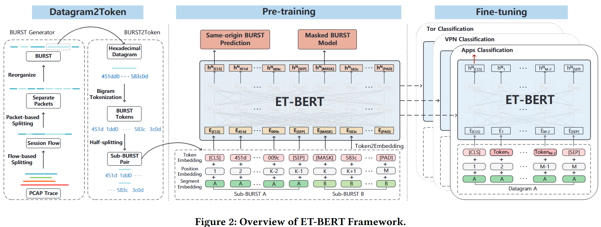
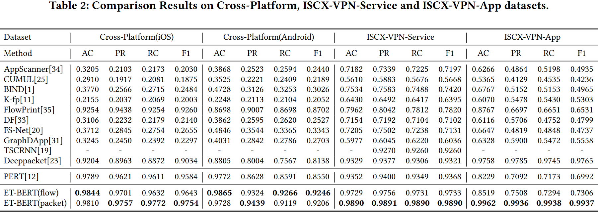
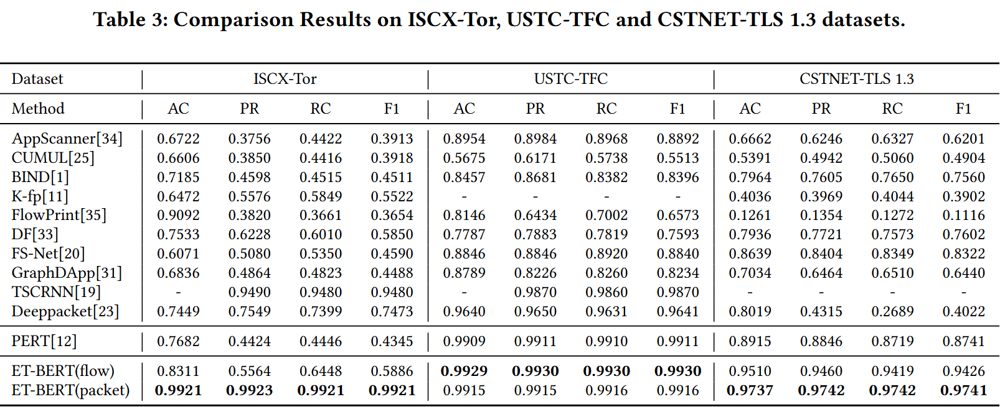
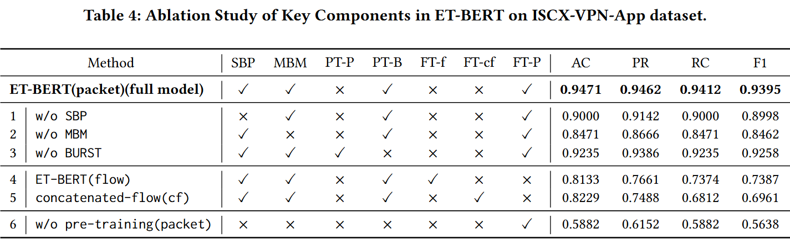
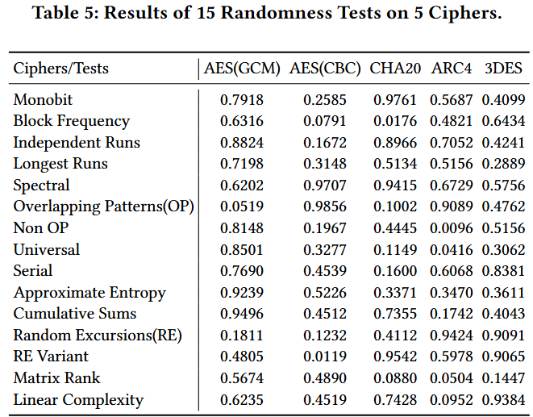
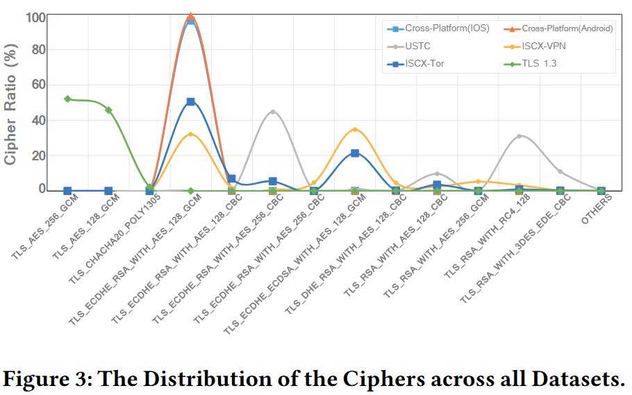
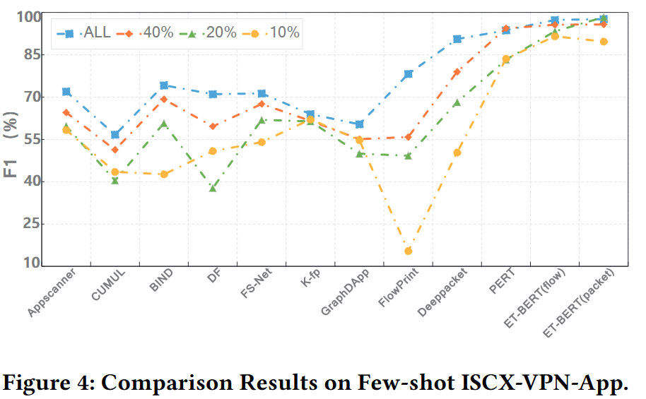

# 一、背景
```
1 INTRODUCTION
2 RELATED WORK
  2.1 Encrypted Traffic Classification
  2.2 Pre-training Models
```

## 1.1 挑战点
恶意软件流量和网络犯罪分子可以通过隐私增强加密技术(如Tor，VPN等)来逃避监控系统。传统的深层数据包检测（Deep Packet Inspection, DPI）方法通过捕获数据包有效载荷中的模式和关键词来工作，不适用于加密流量。此外，由于加密技术的快速发展，针对特定加密流量的流量分类方法不能很好地适应新的环境或看不见的加密策略。

## 1.2 加密流量分类发展
加密流量分类的发展如下：
  - 利用加密流量（如TLS1.3）中的剩余明文构造**指纹**，并进行指纹匹配进行分类，但不适用于新的加密技术，因为明文变得更稀疏或模糊。（2020. FlowPrint: Semi-Supervised Mobile-App Fingerprinting on Encrypted Network Traffic.）
  - 经典**机器学习**算法处理没有明文的加密流量，但高度依赖专家设计的特征，泛化能力有限。(2016. Website Fingerprinting at Internet Scale. In Annual Network and Distributed System Security Symposium.)(2018. Robust Smartphone App Identification via Encrypted Network Traffic Analysis.)
  - **深度学习**方法从原始流量中自动学习复杂的模式，取得显著性能提升，但高度依赖于带标签的训练数据的数量和分布，容易造成模型偏差，难以适应新出现的加密。(2021. TSCRNN: A Novel Classification Scheme of Encrypted Traffic Based on Flow Spatiotemporal Features for Efficient Management of IIoT.)(2019. FS-Net: A Flow Sequence Network For Encrypted Traffic Classification.)
  - 应用**预训练技术**，在VPN流量分类上有明显改进，但缺乏针对流量设计的预训练任何和合理的输入表示来展示预训练模型的结果。（2020. PERT: Payload Encoding Representation from Transformer for Encrypted Traffic Classification）
  - 本文提出了一种用于加密流量分类的预训练模型，称为**加密流量双向编码表示Transformer **(Encrypted Traffic Bidirectional Encoder Representations from Transformer, **ET-BERT**)，旨在从大规模无标签加密流量中学习通用流量表示。

## 1.3 研究目标
加密流量分类

# 二、特征提取
```
3.2 Datagram2Token Traffic Representation
  3.2.1 BURST Generator
  3.2.2 BURST2Token
  3.2.3 Token2Embedding
```

Datagram2Token（数据报文转标记）模块，包含三个过程：
  - BURST生成器：提取一个会话流中连续的“服务器到客户端”or“客户端到服务器”的数据包，称为BURST，表示会话的部分完整信息。
  - BURST2Token：通过Bi-gram模型将每个BURST中的数据报文转换为标记嵌入，将一个BURST切分为两个段，为预训练任务做准备。
  - Token2Embedding：将每个标记的标记嵌入、位置嵌入和分段嵌入相加，作为预训练的输入表示。

## 2.1 BURST生成器
$$
BURST = \begin{cases} B^{src} = \{p_m^{src}, m \in \mathbb{N}^+\} \\ B^{dst} = \{p_n^{dst}, n \in \mathbb{N}^+\} \end{cases}
$$
其中$m, n$分别表示**源到目的地**和**目的地到源**的最大单向数据包数量

## 2.2 BURST2Token
为将BURST表示转换为预训练所需的标记表示，将十六进制的BURST分解为一些列单元。
为此，使用Bi-gram对十六进制序列进行编码，其中每个单元由两个相邻字节组成。

使用字节对编码（Byte-Pair Encoding, BPE）进行标记表示，每个标记单元的范围从0到65535(2的16次方)，词典大小$|V|_{max}$表示为65536。

此外还添加特殊标记：
  - [CLS]：序列的第一个标记，其对应的最终隐藏层状态用于表示整个序列，供分类任务使用。
  - [SEP]：用于分隔一个BURST中的两个子BURST（Sub-BURST）。
  - [PAD]：填充符号，用以满足最小长度要求。
  - [MASK]：在预训练期间出现，用于学习流量的上下文。

## 2.3 Token2Embedding
通过三种嵌入的叠加来表示每个标记：
1. 标记嵌入(Token Embedding, $E_{token}$)：从文中提及的查找表中获取，维度H=768
2. 位置嵌入 (Position Embedding, $E_{pos}$)：流量数据的传输与顺序强相关，通过位置嵌入确保模型能够学习关注标记之间的时序关系
3. 分段嵌入(Segment Embedding, $E_{seg}$)：用于区分Sub-BURST A和Sub-BURST B。在微调阶段，一个数据包or一个流视为一个分段

# 三、模型架构
```
3.1 Model Architecture
3.3 Pre-training ET-BERT
  Masked BURST Model (MBM)
  Same-origin BURST Prediction (SBP)
3.4 Fine-tuning ET-BERT
```

## 3.1 模型类型
ET-BERT

## 3.2 创新点
首先，提出一个原始流量表示模型，将数据报文（Datagram）转换为类似语言的标记（Tokens）以进行预训练。每个流量流由一种称为BURST的传输引导结构表示，并作为模型输入

所提出的框架包含两个阶段：预训练、微调（Fine-tuning）
  - 预训练阶段：采用Transformer结构的预训练网络，通过在大规模无标签加密流量上进行自监督学习，获取数据报文级的通用流量表示。为此提出**两项新型预训练任务**来学习流量特有模式：
    - 掩码BURST模型(Masked token, MBM)：任务通过上下文捕获同一BURST内不同数据报文字节之间的相关性
    - 同源BURST预测(Same-origin BURST, SBP)：任务对前后BURST之间的传输关系进行建模
  - 微调阶段：ET-BERT与特定的分类任务相结合，利用少量的任务特定标注数据（Labeled data）对参数进行微调

ET-BERT的三个核心组件：
  - Datagram2Token方法：将加密流量转换为**保留模式的标记单元**进行预训练。
  - 两项预训练任务：掩码BURST模型（MNM）和同源BURST预测（SBP），旨在从**传输上下文**而非语义上下文中学习特征化的数据报文表示。
  - 两种微调策略：为适应不同流量分类场景，提出**包级微调**（Packet-level fine-tuning）用于**单包分类**，**流级微调**（Flow-level fine-tuning）用于**单流分类**。

## 3.3 ET-BERT架构
主网络架构由多层双向Transformer块组成，每个块由多头自注意力层构成，用于捕捉数据报文中已编码流量单元之间的隐含关系。

本研究中，网络架构包含12个Transformer块，自注意力层有12个注意力头，每个输入标记（Token）的维度 $H$ 设置为768，输入标记的数量为512。



提出的**两项新型预训练任务**通过预测掩码标记来捕获流量字节之间的上下文关系，并通过预测同源BURST来捕获正确的传输顺序，过程如**图ET-BERT架构**中间部分所示。

### 3.3.1 掩码BURST模型
掩码BURST模型，类似于BERT所使用的掩码语言模型(MLM)，但区别在于，ET-BERT纳入了没有明显语义的流量标记，旨在捕获数据报文字节之间的依赖关系。

预训练期间，输入序列中的每个标记以15%的概率被随即遮掩。对于被选中的标记，处理规则：
  - 80%概率被替换为特殊标记[MASK]；
  - 10%概率被替换为一个随机标记；
  - 10%概率保持不变。

对于被替换为[MASK]的标记，ET-BERT被训练为根据上下文预测这些位置的原始标记。得益于该任务带来的深度双向表示(Deep bi-directional representation)，为输入序列$X$随机遮掩了$k$个标记。使用负对数似然(Negative log likelihood, NLL)作为损失函数，其正式定义如下(2)：
$$
L_{MBM} = -\sum_{i=1}^{k} \log(P(MASK_i = token_i \mid \bar{X}; \theta)) \quad (2)
$$

其中$\theta$表示ET-BERT的可训练参数集。概率$P$由带有参数$\theta$的Transormer编码器建模，$\bar{X}$是遮掩后的序列表示，$MASK_i$表示序列中第$i$个位置的掩码标记。
接下来是后续内容。

### 3.3.2 同源BURST预测
前一节中，阐明了BURST在网络流量中的重要性。目标是通过捕获BURST内数据包的相关性来更好地学习流量表示。此外，考虑了BURST结构与Web内容间的紧密关系，能传达不同类别流量产生的BURST之间的差异。
如，不同DOM结构社交网站加载内容有差异：有的顺序是“文本、图像、视频”，有的是“图像、文本、视频”。

通过同源BURST预测任务来学习BURST内容数据包之间的依赖关系。对于该任务，使用一个二分类器(Binary classifier)来预测两个子BURST(sub-BURST)是否源于同一个BURST。具体说，在为每个子BURST对选择$sub\text{-}BURST^A$和$sub\text{-}BURST^B$时：
  - 50%情况下，$sub\text{-}BURST^B$是紧跟$sub\text{-}BURST^A$之后的实际下一个子块；
  - 50%情况下，它是来自其他BURST的随机子块。

对于给定的包含子BURST对$B_j = (sub\text{-}B_j^A, sub\text{-}B_j^B)$的输入及其真值标签$y_j \in [0, 1]$（0表示配对的子BURST，1表示未配对的），其损失函数定义为：
$$
L_{SBP} = - \sum_{j=1}^{n} \log(P(y_j|B_j; \theta))
$$

### 3.3.3 总体目标函数
综合而言，最终的预训练目标是上述两个损失函数的总和，定义为：
$$
L = L_{MBM} + L_{SBP}
$$

### 3.3.4 预训练数据集
本研究中，约30GB的无标签流量数据被用于预训练。该数据集包含两个部分：
  - 约15GB来自公共数据集[9, 30];
  - 约15GB来自在中国科技网(CSTNET)下被动采集的流量。
此数据集包含丰富网络协议，如：基于UDP传输的QUIC、TLS(传输层安全)、FPT(文件传输协议)、HTTP、SSH等常见的网络协议

## 3.4 ET-BERT微调
微调能很好服务于下游分类任务，原因：
  - 预训练表示与流量类型无关，可以应用于任何类型的流量表示任务；
  - 由于预训练模型的输入是数据报文字节级(Datagram bytes level)，需要对数据包和流进行分类的下游任务可以转换为相应的数据报文字节标记，由模型进行分类；
  - 预训练模型输出的特殊[CLS]标记对整个输入流量的表示进行了建模，可以直接用于分类。

由于微调和预训练的结构基本一致，将特定任务的数据报or流表示输入到预训练好的ET-BERT中，并在端到端模型中微调所有参数。在输出层，[CLS]表示被送入多分类器（Multi-class classifier）进行预测。

两种微调策略适应不同场景的分类：
  - ET-BERT(packet)：以数据包级作为输入，旨在实验ET-BERT能否适应更细粒度的流量数据；
  - ET-BERT(flow)：以流级作为输入，旨在公平、客观地将ET-BERT与其他方法进行比较。

这两种微调模型的主要区别在于输入流量的信息量。将流中$M$个连续的数据包拼接成数据报文作为输入数据，其中$M$设置为5。

相比预训练，微调成本低，单块GPU即可满足微调任务需求。

# 四、实验
```
4 EXPERIMENTS
  4.1 Experiment Setup
  4.2 Comparison with State-of-the-Art Methods
  4.3 Ablation Study (消融实验)
  4.4 Interpretability (可解释性)
  4.5 Few-shot Analysis (少样本分析)
```

进行5个实验，五项加密流量分类任务、11种方法对比、消融分析、可解释性分析、少样本学习；
目的分别是：验证多场景实用性、确立SOTA地位、验证组件必要性、消除黑盒疑虑、验证泛化能力

## 4.1 实验设置
### 4.1.1 数据集与下游任务
为评估ET-BERT有效性和泛化能力，在6个公开数据集和一个新提出的数据集上进行了5项加密流量分类任务。
  - 任务1：通用加密应用分类(GEAC)：旨在分类标准加密协议下的应用流量。
  - 任务2：加密恶意软件分类(EMC)：收集了由恶意软件和良性应用组成的加密流量。
  - 任务3：VPN加密流量分类(ETCV)：对使用 VPN 进行通信的加密流量进行分类。并细分为服务分类、应用分类。
  - 任务 4：Tor 加密应用分类(EACT)：旨在分类使用 洋葱路由(Tor) 进行隐私增强的加密流量。
  - 任务 5：TLS1.3加密应用分类(EAC-1.3)：旨在分类新加密协议TLS1.3下的流量。（首个TLS1.3数据集）

| 任务缩写    | 数据集名称                                               | 流数量(Flow) |数据包数量(Packet)|类别数(Label)|
|--|--|--|--|--|
|GEAC|Cross-Platform (iOS/Android)|~4.8万|~136万|196 / 215|
|EMC|USTC-TFC|9,853|97,115|20|
|ETCV|ISCX-VPN (Service/App)|~6千|~13.7万|12 / 17|
|EACT|ISCX-Tor|3,021|80,000|16|
|EAC-1.3|(本文提出)CSTNET-TLS1.3|46,372|581,709|120|

### 4.1.2 数据预处理
移除了ARP和DHCP数据包，因为与传输内容无关。为避免报文头中强标识信息（如IP和端口）带来的偏差，移除了以太网头、IP头和TCP端口号。微调阶段，每个类别随机抽取最多500个流和5000个包。数据集按8:1:1的比例划分为训练集、验证集和测试集。

### 4.1.3 评估指标与实现细节
准确率(AC)、精确率(PR)、召回率(RC)、F1值作为指标。采用宏平均以避免数据不平衡导致的偏差。
  - 预训练配置： Batch size 32，总步数 50万步，学习率 $2 \times 10^{-5}$，Warmup 比例 0.1。
  - 微调配置： 使用 AdamW 优化器，训练 10 个 Epoch。流级学习率为 $6 \times 10^{-5}$，包级为 $2 \times 10^{-5}$。
  - 硬件环境： NVIDIA Tesla V100S GPU。

## 4.2 与最先进方法(SOTA)的对比




  - GEAC:不依赖明文字段情况下，直接从密文中学习上下文关系，此外还掌握了流量传输结构的模式
  - EMC:F1分数达到了99.3%
  - ETCV:面对混淆流量和数据不平衡时具有强大的识别能力
  - EACT:能利用数据包的内在关系实现更好的分类
  - EAC-1.3:证明TLS1.3下的加密流量数据报文仍有隐含模式，且能被ET-BERT更好利用


## 4.3 消融实验

  - PT-P、PT-B:预训练(PT)阶段输入的是"随机选择的相邻数据包"和"我们提出的BURST数据包"
  - FT-f、FT-cf和FT-P:在微调(FT)阶段使用"流"、"拼接流"和"单个数据包"
  - 在ISCX-VPN-App数据集中，每个类别随机选择最多100个数据包和流作为训练数据集

### 4.3.1 预训练与输入的影响(模型1-3)
模型“1”和“2”在F1分数上分别下降了3.97%和9.33%，这表明两项自监督任务（SBP和MBM）都有利于为分类提供互补模式。
在模型“3”中输入数据包而非BURST，F1分数下降了1.37%。这证明了BURST结构能够学习数据包之间的关系，从而实现更好的流量分类。

### 4.3.2 流微调形式的影响(模型4-5)
模型“4”使用连续数据包作为输入，而模型“5”则分别输入数据包并在最终编码层拼接输出（类似于PERT）。当从流切换到拼接流时，模型“5”的结果下降了4.26%。
同一流中的不同数据包是相互依赖的，流分类微调方法更具优势。

### 4.3.3 预训练的整体影响(模型6)
移除了预训练模型以评估预训练的影响。根据模型“6”，通过直接训练Transformer模型在有标签数据上进行有监督学习，其F1分数较 ET-BERT大幅下降了37.57%。

## 4.4 可解释性
### 4.4.1 随机性分析
前述实验结果证明了 ET-BERT 的有效性和泛化能力，这归功于加密有效载荷的密文具有非完美随机性。

理想的加密方案应使生成的报文具有最大可能的熵（Entropy）。然而，这一假设在实践中并不成立，因为不同的密文实现具有不同程度的随机性。在本文中通过15套统计测试评估了5种密码算法的强度，其中 $p\text{-value} = 1$ 表示序列具有完美的随机性。如表所示，这些密码算法确实未能达到完美的随机性。



### 4.4.2 密码算法的影响

图中，横坐标是占比前13类的密码算法及其他类型，纵坐标是每种密码算法的百分比
  - ISCX-VPN、ISCX-Tor 和 USTC-TFC 包含至少 3 种密码算法，其中包括随机性较弱的 RC4 和 3DES；
  - 其他数据集则主要由一种密码算法组成。

在密码算法随机性较弱且存在较大波动的数据集上，ET-BERT 取得了接近 100% 的 F1 分数，例如：ETCV (99.14%)、EACT (99.21%) 和 EMC (99.30%)
## 4.5 少样本分析


为了验证 ET-BERT 在少样本设置（Few-shot settings）下的有效性和鲁棒性，我们在 ISCX-VPN-Service 数据集上设计了不同数据比例的对比实验。我们将每个类别的总数据量设为 500，并随机选择 40%、20% 和 10% 的样本进行少样本实验。

对比结果表明，预训练方法受数据量缩减的影响最小。在数据规模分别为 40%、20% 和 10% 时，ET-BERT(packet) 的 F1 分数分别为 95.78%、98.33% 和 91.55%。我们的模型在所有方法中取得了最佳结果。

相比之下，传统的有监督方法（如 BIND、DF、FS-Net）在样本量减少时表现出严重的 F1 性能退化。例如，当样本量从全量缩减至 10% 时，Deeppacket 的性能下降了 40.22%。这表明，预训练方法能更有效地解决少样本加密流量的分类问题。

# 五、局限
```
5 DISCUSSION
  Generalizability (泛化能力)
  Pre-training Security (预训练安全性)
6 CONCLUSION
```

泛化能力（Generalizability）：随着时间的推移，互联网服务内容的变化导致加密流量具有多变性，这将挑战基于固定数据学习且保持不变的固定模式方法的泛化能力。随着 TLS 1.3 的应用和兴起，通过 SNI（服务器名称指示）对加密流量进行标注将变得不再可能。我们通过两种方式来应对 ECH（加密客户端问候）机制以保证泛化性测试，包括主动访问和使用唯一的进程标识符进行标注。

预训练安全（Pre-training Security）：尽管 ET-BERT 在多种加密流量场景下具有良好的鲁棒性和泛化性，但它依赖于干净的预训练数据。当攻击者故意添加低频子词作为“毒性”嵌入时，可能会生成带有“后门”的污染预训练模型，强制模型预测目标类别，并最终愚弄在特定分类任务上正常微调后的模型。然而，如何构建加密流量的“毒性”标记（Toxic tokens）目前尚未得到研究。

未来，我们希望研究 ET-BERT 预测新类别样本的能力以及抵御样本攻击的能力
# 六、思考
## 6.1 新型预训练任务
MBM是在学“单词和语法”（字节层面的规律）；
SBP是在学“段落逻辑”（包与包之间的顺序）。