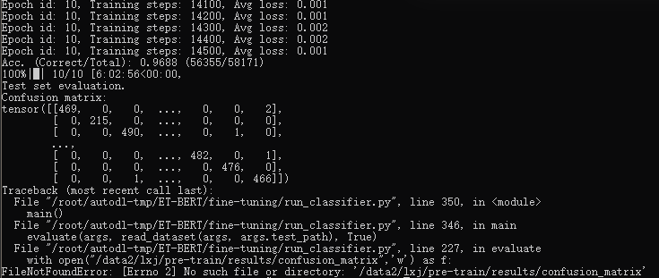

https://github.com/linwhitehat/ET-BERT

# 一、环境
## 1.1 本机跑（没用到）
```powershell
conda create -n BERT python=3.11
conda activate BERT
pip install -r requirements.txt
pip install numpy
pip install tqdm

# 先卸载可能存在的旧版或CPU版 torch
pip uninstall torch torchvision torchaudio -y

# 安装支持 CUDA 12.1 的版本（最适合 40 系显卡）
pip install torch --index-url https://download.pytorch.org/whl/cu121

# 验证显卡是否被激活
python -c "import torch; print(torch.cuda.is_available())"
```

  - 由于`requirements.txt`文件中的`torch>=1.0`太笼统，默认安装不带显卡驱动的通用版
    修改`models/`中的`encryptd`为`encrypted`


## 1.2 AutoDL:screen

1. 先创建并进入screen会话`screen -S train`
   jupyter终端里，创建名为`train`的新窗口，执行后屏幕清空

2. 启动训练+保存日志
```bash
cd /root/autodl-tmp/ET-BERT/
python3 -u fine-tuning/run_classifier.py --各种参数... 2>&1 | tee train_log.txt
```
  - 启动训练，把日志显示在屏幕上，`-u`代表（unbuffered无缓冲的），并实时同步写入到`train_log.txt`

3. 安全剥离
当屏幕开始滚动`Epoch 1/20...`或`Loss...`时候
  - 按组合键`ctrl + A`
  - 松开后，按`D`
  - 能看到`[detached from train]`

4. 查看进度：
  - 进入现场`screen -r train`
  - 只看日志文件最后50行`tail -fn 50 train_log.txt`

5. 强行切断并重连命令`screen -d -r train`

6. 彻底杀死这个窗口：窗口内输入`exit`或按下`ctrl+D`

## 1.3 检查是否在干活
检查GPU`nvidia-smi`，看GPU-Util和Memory-Usage
检查CPU`top`

## 1.4 启动命令
```python
# 1. 设置环境变量，让程序找到 uer 文件夹
export PYTHONPATH=$PYTHONPATH:/root/autodl-tmp/ET-BERT
# 2. 脚本
python3 fine-tuning/run_classifier.py --pretrained_model_path models/pre-trained_model.bin \
                                   --vocab_path models/encryptd_vocab.txt \
                                   --train_path datasets/cstnet-tls1.3/packet/train_dataset.tsv \
                                   --dev_path datasets/cstnet-tls1.3/packet/valid_dataset.tsv \
                                   --test_path datasets/cstnet-tls1.3/packet/test_dataset.tsv \
                                   --epochs_num 10 --batch_size 32 --embedding word_pos_seg \
                                   --encoder transformer --mask fully_visible \
                                   --seq_length 128 --learning_rate 2e-5
```

# 二、网络流量训练

## 2.1 第一次尝试（爆了）


代码运行到`run_classifier.py`的225行时，试图将混淆矩阵把偶从你到`/data2/lxj/pre-train/results/confusion_matrix`，但是这个路径很可能是原作者在服务器上的**硬编码**绝对路径，而我的环境是AutoDL，并没有这个路径。

因此，讲25行修改为如下：

```python
# 修改前
with open("/data2/lxj/pre-train/results/confusion_matrix", 'w') as f:

# 修改后（建议先在终端执行 mkdir -p results）
with open("./results/confusion_matrix", 'w') as f:
```

只从日志上来看，模型已经跑完了10个Epoch并且给出了混淆矩阵的Tensor输出：

- 58171个样本中对了56355个
- 混淆矩阵结果就是`tensor([[469,0,...]])`这一段

**教训**：先设置参数跑一个Epoch，or用小点的数据集跑

## 2.2 第二次尝试（Epoch 1）
```python
export PYTHONPATH=$PYTHONPATH:/root/autodl-tmp/ET-BERT

python3 fine-tuning/run_classifier.py \
    --pretrained_model_path models/pre-trained_model.bin \
    --vocab_path models/encryptd_vocab.txt \
    --train_path datasets/cstnet-tls1.3/packet/train_dataset.tsv \
    --dev_path datasets/cstnet-tls1.3/packet/valid_dataset.tsv \
    --test_path datasets/cstnet-tls1.3/packet/test_dataset.tsv \
    --epochs_num 1 \
    --batch_size 32 \
    --embedding word_pos_seg \
    --encoder transformer \
    --mask fully_visible \
    --seq_length 128 \
    --learning_rate 2e-5 \
    2>&1 | tee train_log_training.txt
```

但等了10分钟，一直没有结果，很奇怪，经过查阅，和`python3 ... 2>&1 | tee train_log.txt`有关，linux中，当python的输出被管道(即`|`)传递给另一个命令(`tee`)时，为了节省效率，默认开启缓冲区，因此等日志攒够了，才一次性吐给`tee`显示，所以等待，我随时随地在等待。

经过`nvidia-smi`检查发现，显存占用才7G，而显存总共有32G，`batch_size`可调大，调为128，显存占用大约22G~25G，但训练出来的模型泛化能力可能略差，且需要调大LR配合

## 2.3 第三次尝试
```python
export PYTHONPATH=$PYTHONPATH:/root/autodl-tmp/ET-BERT

python3 -u fine-tuning/run_classifier.py \
    --pretrained_model_path models/pre-trained_model.bin \
    --vocab_path models/encryptd_vocab.txt \
    --train_path datasets/cstnet-tls1.3/packet/train_dataset.tsv \
    --dev_path datasets/cstnet-tls1.3/packet/valid_dataset.tsv \
    --test_path datasets/cstnet-tls1.3/packet/test_dataset.tsv \
    --epochs_num 10 \
    --batch_size 128 \
    --embedding word_pos_seg \
    --encoder transformer \
    --mask fully_visible \
    --seq_length 128 \
    --learning_rate 5e-5 \
    2>&1 | tee train_log_fine-tuning.txt
```

获得结果`train_log.txt`、`confusion_matrix`、`finetuned_model.bin`

# 三、网络流量推理
```python
export PYTHONPATH=$PYTHONPATH:/root/autodl-tmp/ET-BERT:/root/autodl-tmp/ET-BERT/fine-tuning; \
python3 -u inference/run_classifier_infer.py --load_model_path models/finetuned_model.bin \
                                          --vocab_path models/encryptd_vocab.txt \
                                          --test_path datasets/cstnet-tls1.3/packet/nolabel_test_dataset.tsv \
                                          --prediction_path datasets/cstnet-tls1.3/packet/prediction.tsv \
                                          --labels_num 120 \
                                          --embedding word_pos_seg --encoder transformer --mask fully_visible \
                                          2>&1 | tee train_log.txt
```

  - `$PYTHONPATH`是系统原本就有的路径
  - `/root/.../ET-BERT`是要添加的项目根目录
  - `/root/.../fine-tuning`是要添加的代码子目录
  - 三部分用`:`作为分隔符

获得`prediction.tsv`