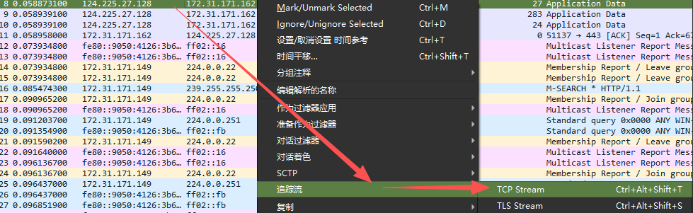
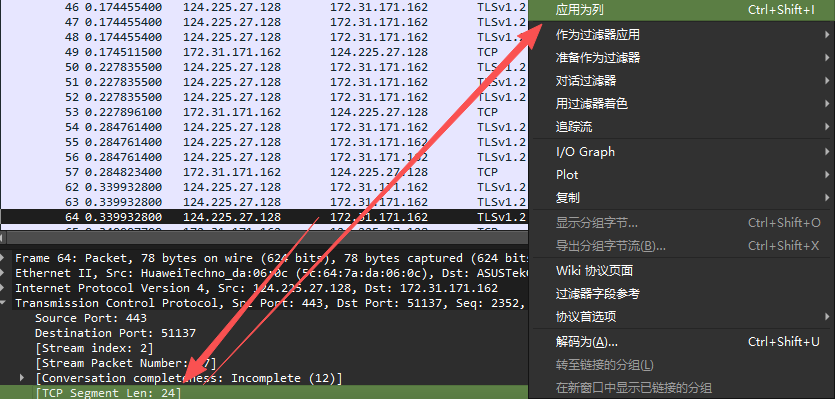
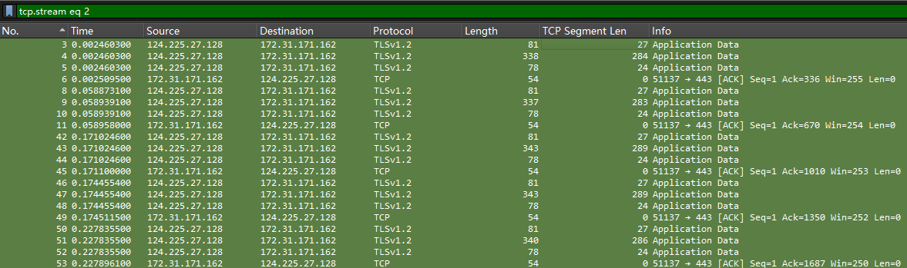
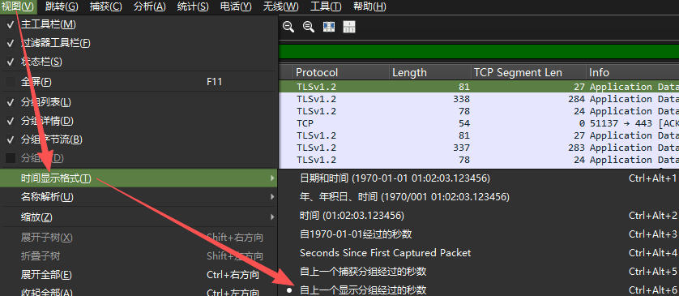

# 一、不同维特征
## 1.1 JA4 指纹特征(6维)
|维度|查看(`Transport Layer Security`)|
|:-:|:-:|
|TLS 版本|`TLSv1.3 Record Layer`→`Version`|
|SNI 指示符|`Handshake Protocol`→`Extension: server_name` 指出客户端想访问的域名|
|密码套件计数|`Cipher Suites Length`，其下的列表项数量|
|扩展计数|`Extensions Length`，其下的扩展插件数量|
|ALPN 首字符|若存在，在`Extension: application_layer_protocol_negotiation`|
|哈希值|无法直接看到。是对上述字段排序后生成的SHA256指纹|

过滤器：`tls.handshake.type == 1`
过滤掉所有心跳包、应用数据包和其他握手包（Server Hello），只显示客户端发起的初始握手包

## 1.2 SPL (Size Profile List) 序列特征(20维)
比如针对`124.255.27.128`和`172.31.171.162`间的流量，选择追踪 TCP 流，因为TCP 流包含从开始到结束的所有数据包，而 wireshark 的 TLS 追踪通常只关注握手成功后的应用层记录。

将 TCP Segment Len 加入列

由流中前 20 个数据包的载荷长度组成的序列，如图提取到的 SPL 为：`[27, 284, 24, 0, 27, 283, 24, 0, 27, 289, 24, 0, 27, 289, 24, 0, 27, 286, 24, 0]`
`[27, 大数据, 24, 0]`不断重复，对应一次加密请求的交互过程（客户端请求 -> 服务器响应 -> 确认接收 -> 空 ACK）

## 1.3 IAT (Inter-Arrival Time) 统计特征(4维)
为什么使用这个4维？：人类操作产生的 IAT 通常是随机不规则的，而恶意软件为了维持控制，经常发出固定频率的“心跳包”，其 IAT 的标准差会很小（很规律）

基于时间间隔（同一个流内部，连续两个数据包到达的时间差）的数学统计量：
>均值 (Mean)
>标准差 (Stddev)
>最小值 (Min)
>最大值 (Max)

设置好时间单位为基于时间间隔

$IAT_1 = Time(P_2) - Time(P_1)$
$IAT_2 = Time(P_3) - Time(P_2)$

如图所示，前 20 个数据包的 IAT 数值，然后计算出均值、标准差、最小值、最大值，形成4维特征

# 二、5 元组的流
5 元组：
源 IP 地址、源端口、目的 IP 地址、目的端口、协议

作用举例：
同时在浏览器打开了淘宝额百度，它们的源端口不同，5元组能将它们识别为两个独立的“流”，从而分别计算各自的 SPL 和 IAT

# 三、eBPF
linux内核中的小沙盒，允许在不修改内核源码、不需要重启内核的情况下，安全地在内核中运行自定义的代码。

传统：如 wireshark 看流量，数据包必须从内核拷贝到用户态，有额外性能开销
eBPF：编写的`probe_tcp.py`把BPF程序注入到内核中，当有 TCP 事件发生，这段代码直接在内核里处理数据，只把提取好的“5 元组”和“长度”等关键结果传回用户态，效率高。