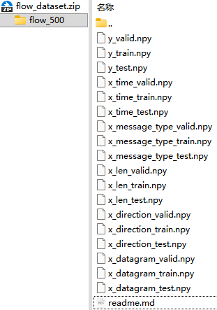
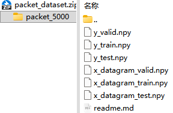
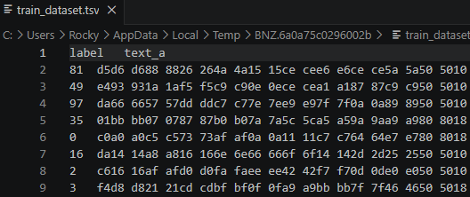
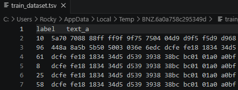

# 一、CSTNET-TLS1.3-2021
## 1.1 标准版 cstnet-tls 1.3 dataset
都有120个类别（120个不同的网站/服务）

### 1.1.1 `flow_dataset.zip`流级别特征

>文件名公式如下：
>$$\text{数据角色 (x/y)} + \text{特征类型} + \text{数据集划分 (train/valid/test)} .npy$$

`x_len_...`数据包大小。连续 500 个包的字节大小
`x_time_...`包到达时间。连续 500 个包的时间戳or时间间隔
`x_direction_...`传输方向。连续 500 个包的方向（如1、-1）
`x_message_type_...`TLS消息类型。连续 500 个包的 TLS 记录层类型
`x_datagram_...`应用层载荷抽象。

### 1.1.2 `packet_dataset.zip`包级别特征

特征没有拆那么细致，直接把每个数据包前 5000byte 的原始

## 1.2 微调版 fine-tuning cstnet-tls 1.3
对比 *标准版数据*，从多模态矩阵`.npy`，到文本表格`.tsv`，将样本的所有特征标签压缩。

### 1.2.1 `cstnet-tls1.3_flow.zip`

### 1.2.2 `cstnet-tls1.3_packet.zip`

