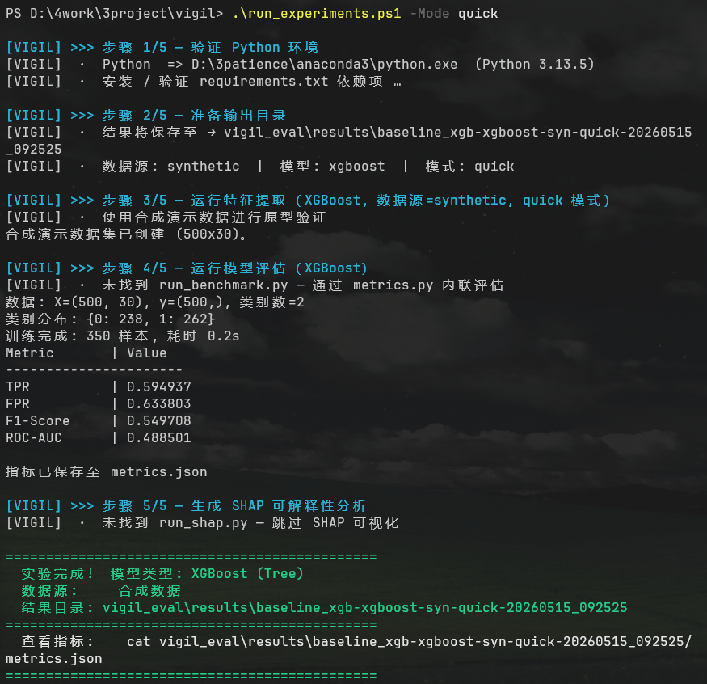
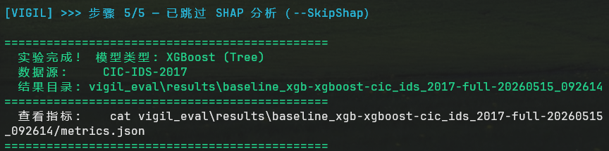
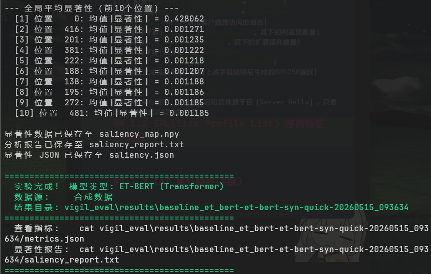
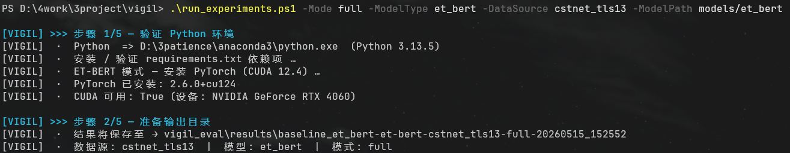
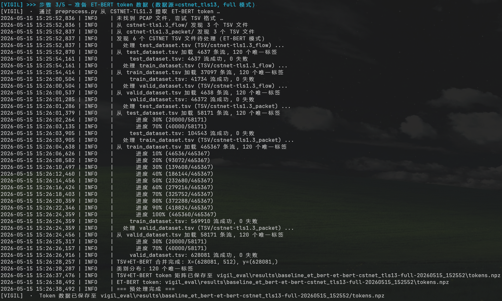
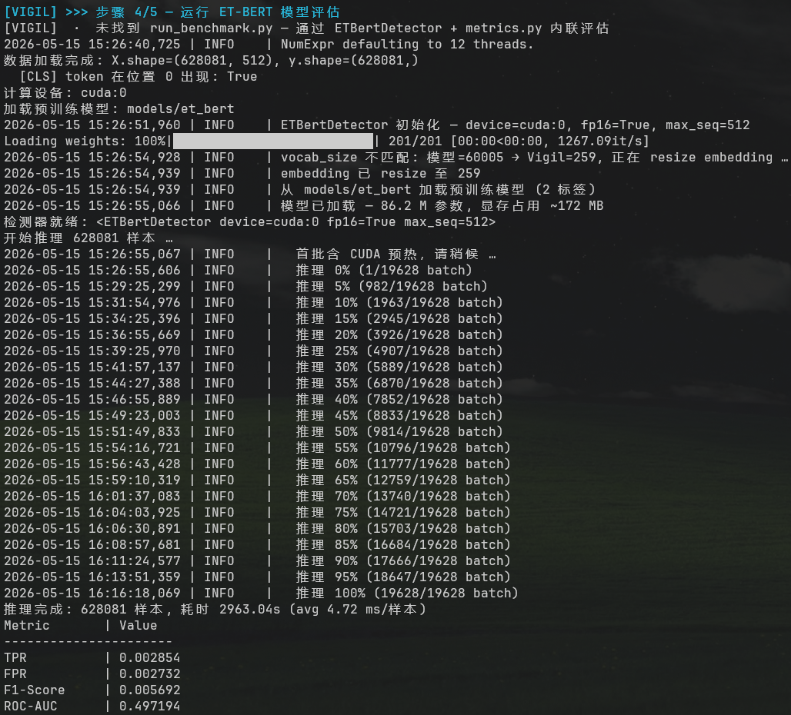
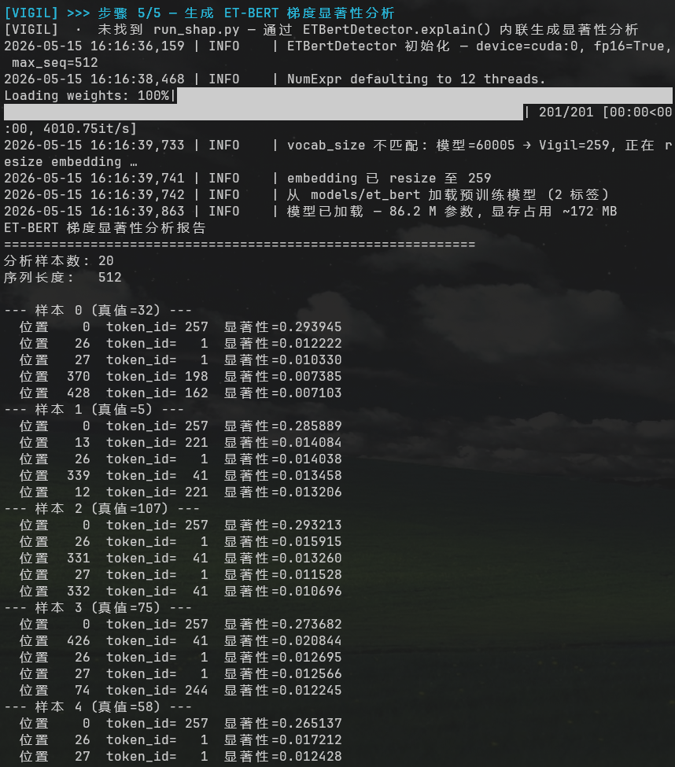
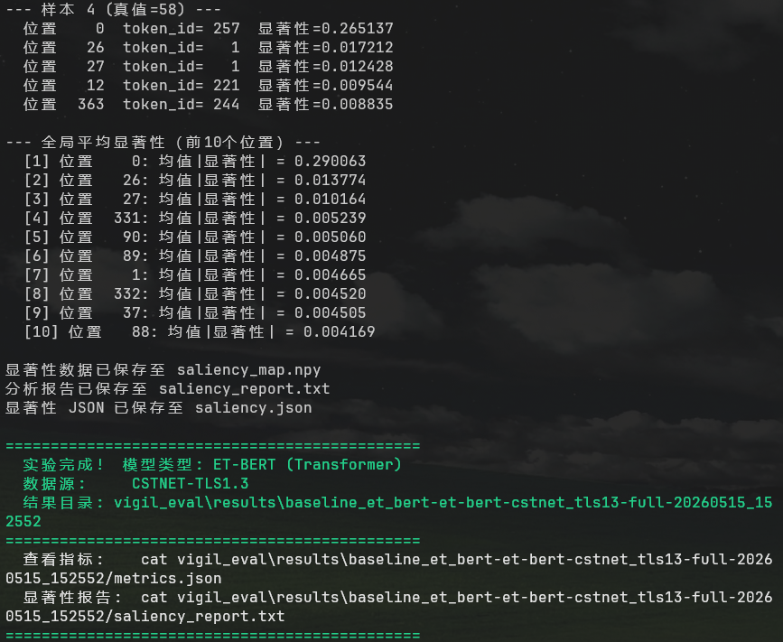

- # 一、项目介绍

  **Vigil** 是一个面向加密恶意流量检测的产学研一体化平台，兼顾**高并发商业 SaaS 部署**与**研究生学位论文实验验证**。

  核心命题：可解释的加密流量分类。支持两条检测路线在相同数据上的公平对比：

  | 路线     | 输入                                | 模型                  | 可解释性              |
  | -------- | ----------------------------------- | --------------------- | --------------------- |
  | 经典 ML  | 30 维特征（JA4+SPL+IAT 或字节统计） | XGBoost               | SHAP TreeExplainer    |
  | 深度学习 | 512 维 byte-level token 序列        | ET-BERT (Transformer) | Input×Gradient 显著性 |

  已在两个学术数据集上验证：**CIC-IDS-2017**（CSV，6 类，167 万流）和 **CSTNET-TLS1.3-2021**（TSV/NPY，120 类，63 万流）。

  ---

  # 二、环境与执行约束

  - **OS**: Windows 11 + PowerShell 7 (pwsh)。eBPF 探针依赖 WSL2（`/mnt/d/4work/3project/vigil/`）。
  - **Python**: Anaconda Python 3.13。CUDA 版 PyTorch 安装命令：
    ```
    pip install torch torchvision torchaudio --index-url https://download.pytorch.org/whl/cu124
    ```
  - **安全**: 根目录已加入 Windows Defender 排除项。恶意样本仅限 `vigil_agents/malware_vault/`。
  - **语言**: 所有 Plan、Task、交互对话使用简体中文。代码注释和 docstring 使用中文。

  ---

  # 三、项目架构

  ```
  vigil/
  ├── CLAUDE.md                      # 本文件
  ├── requirements.txt               # 统一依赖管理
  ├── _import_helper.py              # 跨包导入辅助
  ├── run_experiments.ps1            # 一键实验脚本（5 步）
  ├── test_pipeline.ps1              # 烟雾测试（11 步）
  │
  ├── models/                        # 预训练模型存放
  │   └── et_bert/                   #   ET-BERT 模型 (config.json + pytorch_model.bin)
  │
  ├── scripts/                       # 工具脚本
  │   └── convert_et_bert.py         #   原版 ET-BERT → HuggingFace 格式转换
  │
  ├── vigil_agents/                  # 数据生成层
  │   ├── agents/hunter.py           #   MalwareBazaar 样本下载
  │   ├── agents/sandbox.py          #   Docker 沙箱抓包
  │   └── malware_vault/             #   样本归档
  │
  ├── vigil_data/                    # 数据解析层
  │   ├── dataset_parser.py          #   适配器工厂 (Pcap/CIC-IDS/TSV/NPY)
  │   ├── preprocess.py              #   数据集 → .npz 标准化
  │   └── datasets/                  #   原始数据集
  │       ├── CIC-IDS-2017/          #     CSV (≈80 维流特征)
  │       └── CSTNET-TLS1.3-2021/    #     TSV + NPY (hex 编码流/包数据)
  │
  ├── vigil_engine/                  # 核心引擎
  │   ├── interfaces.py              #   BaseFeatureExtractor / BaseDetector
  │   ├── feature_extractor.py       #   30 维特征 (JA4+SPL+IAT)
  │   ├── explainability.py          #   SHAP 解释器
  │   └── et_bert_detector.py        #   ET-BERT 推理管线 (vocab=259, fp16)
  │
  ├── vigil_eval/                    # 评估基准
  │   ├── metrics.py                 #   二分类 + 多分类折叠评估
  │   ├── api_benchmark.py           #   并发压测
  │   └── results/                   #   实验结果存档
  │
  ├── vigil_gateway/main.py          # FastAPI REST API
  └── vigil_probes/                  # eBPF 探针 (WSL2 only)
      ├── probe_tcp.py
      └── evaluate_overhead.py
  ```

  ---

  # 四、数据流水线

  ## 4.1 数据来源

  ```
  MalwareBazaar ──► hunter.py ──► sandbox.py ──► .pcap
  CIC-IDS-2017 ──► preprocess.py ──► features.npz (77 维原始特征)
  CSTNET-TLS1.3 ──► preprocess.py ──► features.npz (30 维) 或 tokens.npz (512 维)
  合成数据 ──► run_experiments.ps1 内联生成
  ```

  ## 4.2 预处理脚本 (`preprocess.py`)

  核心 CLI：

  ```bash
  # XGBoost
  python preprocess.py --dataset cic_ids_2017
  python preprocess.py --dataset cstnet_tls13 --model-type xgboost
  
  # ET-BERT
  python preprocess.py --dataset cstnet_tls13 --model-type et_bert
  
  # 双输出
  python preprocess.py --dataset cstnet_tls13 --model-type both
  
  # 参数: --max-files N --output-dir ./out --label-file labels.json
  ```

  CSTNET 数据集自动按 PCAP → TSV → NPY 优先级回退扫描。TSV 格式为 `label<TAB>hex_text`（hex 编码字节流），NPY 格式为预 token 化的 fine-tuning 分片。

  ## 4.3 数据集 × 模型兼容矩阵

  | 数据集              | XGBoost           | ET-BERT           | 备注                       |
  | ------------------- | ----------------- | ----------------- | -------------------------- |
  | CIC-IDS-2017 (CSV)  | 77 维原始特征     | 不支持            | 无原始载荷字节             |
  | CSTNET-TLS1.3 (TSV) | 30 维字节统计特征 | 512 维 byte token | flow + packet 双级别       |
  | Sandbox (.pcap)     | 30 维 JA4+SPL+IAT | 512 维 byte token | VigilFeatureExtractor 提取 |
  | 合成数据            | 30 维随机         | 512 维随机 token  | 仅验证流水线               |

  ## 4.4 ET-BERT Token 规范

  - 词表: `[PAD]=0`, `byte→id=byte+1` (0x00→1, 0xFF→256), `[CLS]=257`, `[SEP]=258`, `vocab=259`
  - 序列: `[CLS] + pkt1[0:60] + [SEP] + pkt2[0:60] + [SEP] + ... + [PAD]*N`
  - 最大长度: 512（恰好填满 8 包 × 61 字节 + 1 CLS + 23 PAD）

  ---

  # 五、技术栈

  | 层级     | 技术                       | 用途                      |
  | -------- | -------------------------- | ------------------------- |
  | API      | FastAPI + Uvicorn          | REST 网关                 |
  | 限流     | Redis / 内存               | 滑动窗口                  |
  | 流量解析 | Scapy                      | .pcap → 流聚合            |
  | 经典 ML  | XGBoost + scikit-learn     | 基线分类器                |
  | 深度学习 | PyTorch 2.6 + Transformers | ET-BERT (fp16, CUDA 12.4) |
  | 可解释性 | SHAP / Input×Gradient      | 双叙事输出                |
  | eBPF     | BCC                        | TCP 流监控 (Linux)        |
  | 沙箱     | Docker SDK                 | 隔离执行                  |
  | 评估     | NumPy + asyncio + aiohttp  | 指标 + 压测               |

  ---

  # 六、实验脚本

  ## 6.1 `run_experiments.ps1` — 一键实验

  ```
  # XGBoost
  .\run_experiments.ps1 -Mode quick
  .\run_experiments.ps1 -Mode full -DataSource cic_ids_2017 -SkipShap
  .\run_experiments.ps1 -Mode full -DataSource cstnet_tls13
  
  # ET-BERT
  .\run_experiments.ps1 -Mode quick -ModelType et_bert
  .\run_experiments.ps1 -Mode full -ModelType et_bert -DataSource cstnet_tls13
  
  # 指定 ET-BERT 模型路径
  .\run_experiments.ps1 -Mode full -ModelType et_bert -DataSource cstnet_tls13 -ModelPath models/et_bert
  ```

  | 参数          | 默认值             | 说明                                                         |
  | ------------- | ------------------ | ------------------------------------------------------------ |
  | `-Mode`       | quick              | quick=限制文件数, full=全量                                  |
  | `-ModelType`  | xgboost            | xgboost / et_bert                                            |
  | `-DataSource` | synthetic          | synthetic / cic_ids_2017 / cstnet_tls13                      |
  | `-SkipShap`   | false              | 跳过 XAI 分析                                                |
  | `-ModelPath`  | ""                 | ET-BERT 模型路径（优先级: 命令行 > 环境变量 > models/et_bert/） |
  | `-ModelName`  | baseline_xgb       | 模型标识名                                                   |
  | `-OutputDir`  | vigil_eval/results | 输出根目录                                                   |

  **5 步流水线**: 环境 → 目录 → 特征/Token → 评估 → XAI

  CPU 模式下 ET-BERT 推理自动限制为 2000 样本（随机采样），并打印警告。

  ## 6.2 CIC-IDS-2017 基线

  | 指标    | 值                 |
  | ------- | ------------------ |
  | 数据量  | 1,668,530 流，6 类 |
  | TPR     | 0.9996             |
  | FPR     | 0.00008            |
  | F1      | 0.9996             |
  | ROC-AUC | 0.999997           |

  （XGBoost, 77 维原始特征, 70/30 split, 100 estimators）

  ## 6.3 ET-BERT 预训练模型

  三级搜索优先级: `-ModelPath 参数` → `$env:VIGIL_ET_BERT_MODEL_PATH` → `models/et_bert/`

# 七、脚本运行结果
## 8.1 XGBoost
`.\run_experiments.ps1 -Mode quick `


`.\run_experiments.ps1 -Mode full -DataSource cic_ids_2017 -SkipShap`



`.\run_experiments.ps1 -Mode full -DataSource cstnet_tls13`




## 8.2 ET-BERT
`.\run_experiments.ps1 -Mode full -ModelType et_bert -DataSource cstnet_tls13`






# 八、git 上传
```BASH
echo "# Vigil" >> README.md
git init
git add README.md
git commit -m "first commit"
git branch -M main
git remote add origin https://github.com/vnccer/Vigil.git
git push -u origin main
```