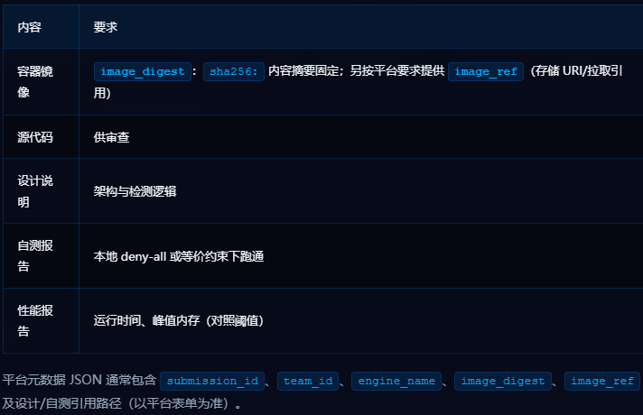
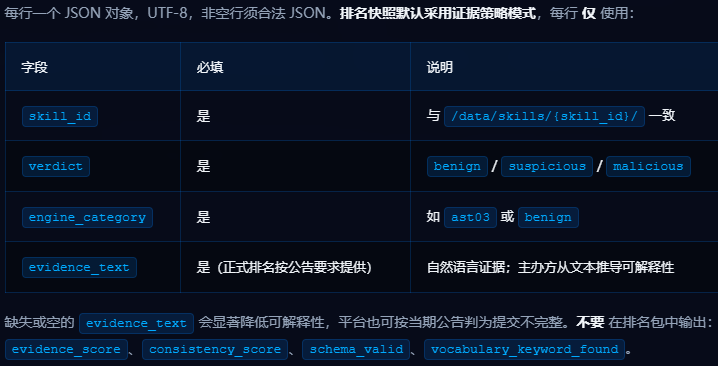
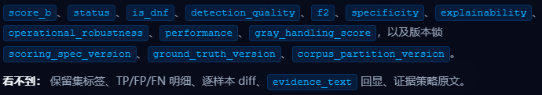

# 一、项目介绍
针对**首届火山引擎AI安全攻防挑战赛**，将**vigil**项目重构，参加乙赛道（Track B-蓝队检测引擎），提交 Skill 扫描检测引擎（Docker 镜像），由主办方使用黑、白、灰三类标注样本集进行统一评测。

# 二、参赛须知
## 2.1 目标
构建可对 Skill 样本分类并输出结构化判定（verdict）、类别与证据的检测引擎。

## 2.2 平台操作
赛前准备：乙赛道：准备可构建 digest 固定镜像的环境

仓库中的合成示例路径：乙赛道：`examples/submissions/track-b-synthetic-engine/`

记录平台返回的 `submission_id`、`attempt_id`、`idempotency_key` 便于申诉与重试。

## 2.3 引擎与输出
### 2.3.1 提交清单


### 2.3.2 运行接口
```
输入：/data/skills/{skill_id}/
输出：/output/results.jsonl
```

排名运行在 无出网 环境；本地自测请模拟禁止出网（deny-all network）。

### 2.3.3 `results.jsonl`（排名/证据策略模式）

合成演示实例：
```
{"skill_id":"skill-demo-001","verdict":"benign","engine_category":"benign","evidence_text":"合成示例中未发现可疑文件访问或外联行为。"}
```
  - 空行忽略；尽量对每个分配的 `skill_id` 输出一行。
  - 获取 `digest：docker inspect --format='{{index .RepoDigests 0}}'` ，将 `sha256:…` 写入提交表单。

### 2.3.4 公开反馈，能看到的内容


### 2.3.5 性能自测
对照 比赛规则 中 `t_ref`/`t_max`/`m_ref`/`m_max`。超出 `t_max` 或 `m_max` 将使 performance 维度得分为零。

## 2.4 提交与配额
Track B：3 次排名提交/队/天；同 digest + 同快照重跑不重复扣次。
上传前自检：文件齐全、内容摘要正确、复现可运行、JSONL 可解析、排名 JSONL 未携带兼容模式历史分数字段。

# 三、工作日志 2026-06-03

## 一、已完成工作

### 1. 项目清理

- 删除旧流量检测系统残留文件 17 个（`app/`、`data/`、`src/vigil/utils/`、`notebooks/` 等）
- 删除 7 个无用目录（`__pycache__`、`.pytest_cache`、`anaconda_projects/` 等）
- `requirements.txt` 从十余个依赖精简为仅 `pyyaml>=6.0`
- `.gitignore` 移除过时条目

### 2. OWASP AST Top 10 全覆盖

- 补充 4 个缺失类别的规则（ast02 不安全依赖、ast04 输出注入、ast08 不安全文件操作、ast09 生命周期劫持）
- 当前：**26 条 YAML 规则**，**292 个预编译正则模式**，覆盖全部 10 个威胁类别

### 3. 核心代码修复

- `DetectionResult.to_dict()`：修复字段泄露问题，输出严格限定为 4 个合规字段
- `scripts/run_tests.py`：重写，8 项测试全部中文输出，修复 Windows GBK 编码崩溃 bug
- `scripts/scan_skills.py`：新增 `tracemalloc` 峰值内存追踪、`--benchmark` / `--benchmark-output` 性能基准报告

### 4. 新增文件

| 文件 | 用途 |
|------|------|
| `Dockerfile` | 容器化构建，非 root 用户运行 |
| `.dockerignore` | 排除 venv、.claude、tests 等无关文件 |
| `DESIGN.md` | 架构设计说明（数据流水线、模块职责、威胁覆盖表） |
| `scripts/validate_output.py` | 提交前 JSONL 合规性验证（4 必填字段 + 4 禁止字段检查） |
| `CLAUDE.md` | 项目上下文与开发指南，含使用方法 |

### 5. 自测结果

8 项测试全部通过：模块导入 → 规则加载 → DetectionResult → SkillParser → 端到端扫描（9 样本） → JSONL 验证 → CLI → validate_output

---

## 二、开赛后待完成

### 1. Layer 2：统计特征检测（优先级：高）

拿到真实数据后需要做的事：
- 计算正常 Skill 的统计基线（代码复杂度、API 调用频率、文件结构分布、字符串熵值等）
- 设定各指标的偏差阈值
- 实现异常评分模块，作为 Layer 1 的置信度增强

### 2. Layer 3：文本特征分类（优先级：中）

- 用比赛标测数据训练 TF-IDF + 传统分类器（朴素贝叶斯 / 逻辑回归）
- 针对 Layer 1/2 的盲区样本进行针对性标注和训练
- 模型需控制在 10MB 以内，推理毫秒级

### 3. 规则调优（优先级：高）

- 在比赛真实数据上跑基线，统计每条规则的命中率、误报率
- 调整 pattern 精度和 verdict_on_match 降级策略
- 补高频漏报样本的正则模式

### 4. 性能校准（优先级：中）

- 在比赛标的数据集上运行 `--benchmark`，对照 `t_ref=600s` / `m_ref=4096MB` 阈值
- 如接近或超过满分线，针对性优化

### 5. 提交前检查清单

- `python scripts/validate_output.py /output/results.jsonl --check-skills /data/skills` 全量验证
- `docker build -t vigil . && docker inspect` 确认镜像 digest
- 确认 denary-all 网络环境下可正常运行
