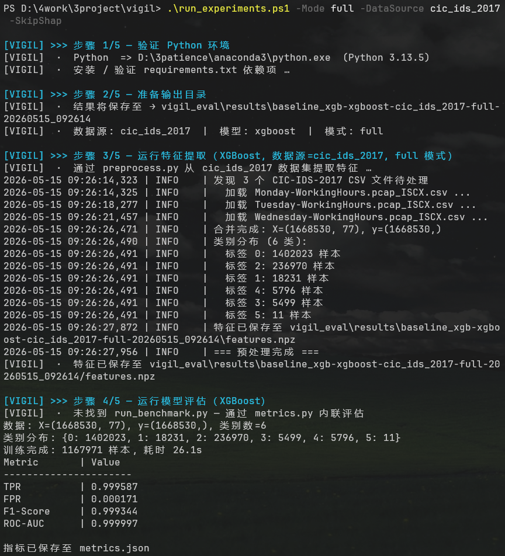
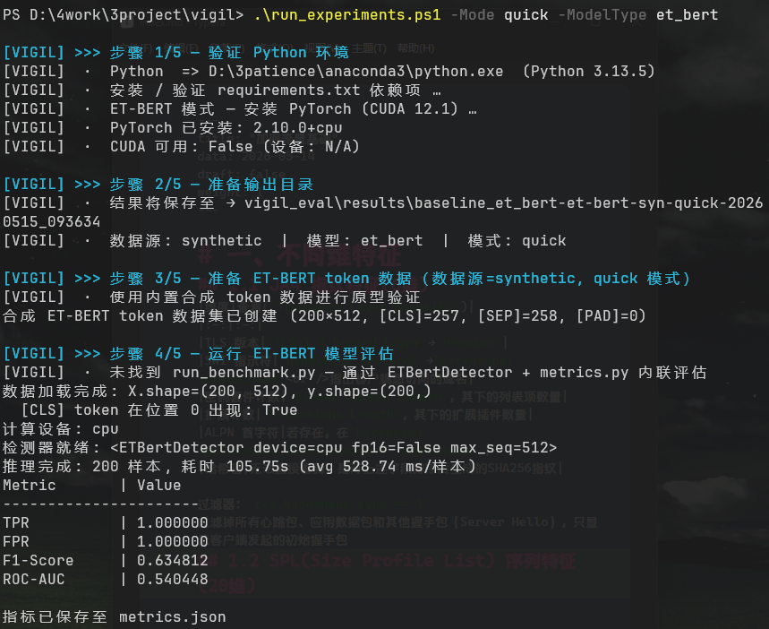
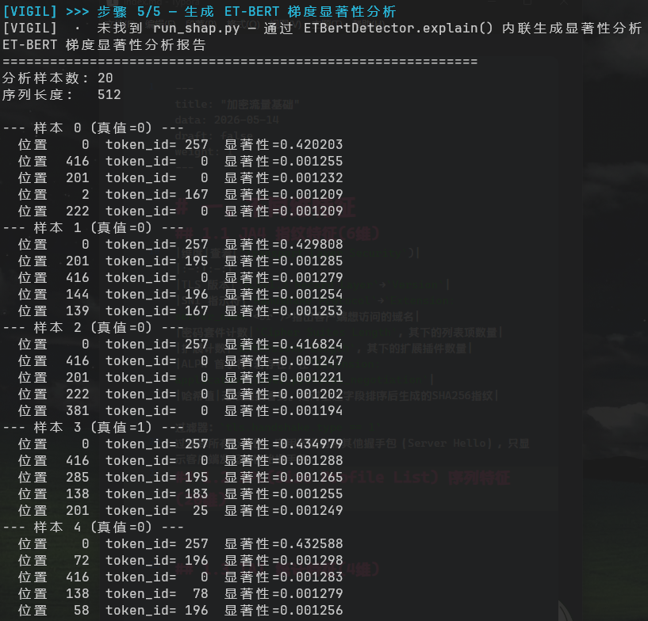

# 一、Vigil 介绍
Vigil 是一个面向加密恶意流量检测的产学研一体化平台。系统以 **可解释的加密流量分类** 为核心命题，构建了从数据生成、特征提取、模型推理到 API 服务的完整流水线，兼顾高并发商业 SaaS 部署与研究生学位论文实验验证的双重目标。

## 1.1 核心架构
| 模块 | 职责 |
| :--- | :--- |
| `vigil_agents/` | 数据生成层：MalwareBazaar 自动下载样本 (Hunter)；Docker 沙箱隔离执行并抓包 (Sandbox) |
| `vigil_data/` | 数据解析层：适配器模式接入 PCAP/CSV，内置 CIC-IDS-2017、CSTNET-TLS1.3 等学术集 |
| `vigil_engine/` | 核心引擎：30维特征提取 (JA4/SPL/IAT)，XGBoost 分类器，SHAP 解释及 ET-BERT 推理管线 |
| `vigil_gateway/` | API 网关：FastAPI REST 服务，含 Redis 限流、模型推理、SHAP 解释输出 |
| `vigil_eval/` | 评估基准：学术指标 (TPR/FPR/F1/AUC) + asyncio 并发压测 (P50/P95/P99/QPS) |
| `vigil_probes/` | eBPF 边缘探针：基于 BCC/kprobe 的内核级监控，含 A/B 对照开销评估框架 |

## 1.2 双模型路线对比
系统支持两条检测路线的公平对比，这是论文实验章节的核心设计：

| 维度 | XGBoost 经典路线 | ET-BERT 深度学习路线 |
| :--- | :--- | :--- |
| 输入 | 30 维手工特征 (JA4+SPL+IAT) | 512 维字节级 token 序列 |
| 模型 | XGBoost 梯度提升树 | BERT Transformer (vocab=259) |
| 可解释性 | SHAP TreeExplainer | 梯度显著性 Input×Gradient |
| 加速 | CPU | CUDA + FP16 (~220MB 显存) |

## 1.3 技术栈
`FastAPI` / `Uvicorn` / `XGBoost` / `PyTorch` / `Transformers` / `SHAP` / `Scapy` / `BCC` / `eBPF` / `Docker SDK` / `Redis`

## 1.4 端到端实验
一条命令即可复现全流程实验（环境验证 → 数据预处理 → 特征提取 → 模型评估 → XAI 分析）：

```powershell
.\run_experiments.ps1 -Mode full -DataSource cstnet_tls13 -ModelType et_bert
```

## 1.5 应用场景
- 学术论文：严格 A/B 对照实验设计，适配器模式保证数据源公平对比，所有指标可复现。
- 商业 SOC：低延迟 REST API (<100ms P99)，SHAP Top-3 特征解释叙事，Redis 滑动窗口限流。
- 实时监控：eBPF 内核探针零拷贝采集 TCP 流元数据，CPU 开销 <5%。

# 二、脚本运行结果
## 2.1 XGBoost
`.\run_experiments.ps1 -Mode quick `


`.\run_experiments.ps1 -Mode full -DataSource cic_ids_2017 -SkipShap`



`.\run_experiments.ps1 -Mode full -DataSource cstnet_tls13`




## 2.2 ET-BERT
`.\run_experiments.ps1 -Mode full -ModelType et_bert -DataSource cstnet_tls13`


# 二、git 上传
```BASH
echo "# Vigil" >> README.md
git init
git add README.md
git commit -m "first commit"
git branch -M main
git remote add origin https://github.com/vnccer/Vigil.git
git push -u origin main
```