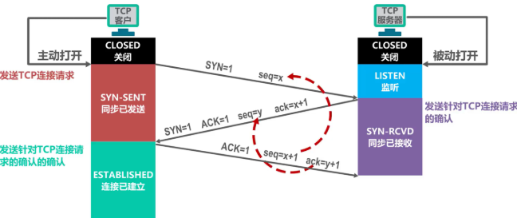

# 一、恶意流量仿真（实验室项目）
- 多维攻击链路模拟：为验证防火墙防御策略并构建用于 AI 模型训练的恶意流量数据集，独立设计并实施了多层级的 DoS/DDoS 攻击模拟。利用 hping3 等工具，针对 ICMP、UDP 及 TCP SYN 协议，构建了从低频试探（3000 pps）到极限泛洪（10万+ pps）的梯度攻击场景。 
- 流量特征控制：深入研究攻击流量的规避特性，通过精细化调控源 IP 伪造（Rand-source）、发包速率微秒级控制、以及报文大小（64/128/256/800/1400 bytes）动态调整，成功绕过基础源 IP 封锁机制，模拟了高度真实的复杂网络攻击环境。 
- 数据发出流量监控：结合 nload 工具进行实时网卡吞吐量分析。

## 1.1 SYN Cookie机制
项目中使用 hping3 构造了从低频试探到 10万+ pps 的梯度攻击。请问在进行 TCP SYN Flood 泛洪时，如果目标防火墙开启了 SYN Cookie 机制，设计的“源 IP 伪造”和“动态报文大小”策略还能有效绕过吗？如果不能，从攻击者或仿真的角度，你有什么针对性的绕过或规避思路？

原先的设计不能绕过。
SYN Cookie机制 -> 服务器收到 SYN 不分配内存，而将连接信息哈希成序列号回给客户端 -> 但随机源 IP 的仿真客户端无法接收服务器返回的 SYN + ACK 报文 -> 无法完成 TCP 三次握手 -> 纯泛洪的伪造流量被丢弃

绕过思路：
1. 不用 rand-source ip，租用真实僵尸网络，用真实 IP 发起完整的 TCP 三次握手。
2. 跳过 SYN 阶段，hping3 构造纯 ACK 恶意泛洪报文。
3. SYN Cookie 防御传输层（L4）半连接攻击。可以先正常三次握手，然后再应用层（L7）发起慢速连接攻击。

三次握手如图：

## 1.2 网卡瓶颈、CPU 单核打满、丢包应对
你提到用 nload 进行实时网卡吞吐量分析。当你在生成 10万+ pps 的极限流量时，是否遇到过本地网卡瓶颈、CPU 单核打满或丢包现象？你是如何调优 Linux 内核参数（如 pps 限制、缓冲区大小）来确保仿真流量准确发出的？

1. 发包率低 -> vmware 采用 NAT 模式 -> 每条恶意报文经宿主机内核的连接跟踪机制来地址转换 -> 改为桥接，虚拟网卡直接通过宿主机物理网卡在二层转发
2. 对不同攻击目标微调：对于UDP Flood，发大包1400bytes，降低pps；对于SYN Flood，发小包64bytes，增加pps；对于ICMP Flood，微调找平衡
3. Linux 内核：`net.core.wmem.max/default`增大网卡发送缓冲区最大/默认值，防止hping3 发包过快让本地缓冲区溢出

## 1.3 网络拓扑结构
为模拟真实 DDos，3台物理主机均 kali 桥接，组成微型僵尸网络，目标服务器前端有防火墙（给三台物理主机白名单，不会封锁ip），受攻击服务器中离线状态下docker部署dvwa作为攻击点，最后导出审计日志和pcap原始报文

## 1.4 ICMP、UDP、TCP SYN三种协议的DDos攻击的危害原理
1. ICMP：Ping Flood，利用ICMP 响应请求报文进行泛洪，传统的 Linux 内核在收到 ICMP 请求时，会由内核协议栈进行 ICMP 回复，ICMP Flood会消耗服务器的CPU算力和网络带宽
2. UDP：服务器收到 UDP 包后，会去应用层检查该端口是否有服务在监听，如果没有，则耗费计算资源回传 ICMP 端口未到达报文。会消耗目标服务器的出口带宽，以及CPU
3. TCP SYN：利用 TCP 三次握手机制。攻击方发送大量`SYN`请求，但故意不回应最后的`ACK`，或伪造源 IP 导致正常的`ACK`无法送达。

## 1.5 在真实的蓝队防御面漆那，动态变化报文大小（64/128/256/800/1400 bytes）的策略，能起到什么关键的规避或对抗作用？
1. 对抗传统蓝队规则防御：传统的防火墙在识别泛洪攻击时候，有名为“包长分布特征”的指标。如果单纯用`hping3`默认的 64bytes 小包，蓝队可以下发“丢弃所有包长为 64bytes 的TCP SYN报文”的ACL规则（访问控制列表）
2. 对抗 AI 流量检测模型：像 BERT 这样的 Transormer 的流量识别模型，它们捕捉恶意流量的核心依据是“报文长度的时序序列”。如果报文大小动态化，相当于在攻击流量中制造“随机噪声”，使得 AI 模型提取到的流量上下文特征接近正常的业务交互，提高漏报率。
3. 探测边界设备的自适应阈值：动态调整可以探测出企业边界防火墙在哪一个特定的包长组合下攻击效果更好。

# 二、个人安全实验室
- OWASP Top 10漏洞审计：针对 DVWA 全难度开展专项研究，复现并分析 SQL 注入、XSS、CSRF、文件上传等 OWASP Top 10 核心漏洞，对比不同安全级别后端代码差异以及防绕过机制。
- 主机侧渗透实战：独立完成 9 个不同架构的 Vulnhub 靶机渗透。熟练运用信息收集、漏洞打点、及 SUID提权技术。
- 知识库建设：运营个人技术博客vnccer.github.io，将所有靶机渗透过程、漏洞修复方案及防护建议系统化输出为技术笔记。

## 2.1 sql注入
1. dvwa的medium难度，后端代码通常加入了什么防御，你当时是怎么手工绕过的？
2. 到了 Impossible（不可能难度），后端代码引入了什么核心的安全技术，从而让任何形式的 SQL 注入绕过彻底失效？请简述该技术的安全原理。

1. 相比于 Low 难度的毫无防备，Medium 难度在后端做出了两点主要防御：
  - 传输方式变更：将原先直观的 GET 传参改为了 POST 传参，并增加了下拉菜单，试图防止攻击者直接在 URL 中修改参数。
  - 后端使用了 `mysqli_real_escape_string()`，对传入的敏感特殊字符（如单引号 `'`、双引号 `"`）进行了自动转义（加上反斜杠 `\'`），从而破坏了攻击者企图通过单引号闭合字符串的闭合点。
  - 绕过：burp suite拦截post请求，参数修改为`id=1 OR 1=1`

2. 两个层次上的修改：
  - 输入层：进行数据类型校验和强制转换，先用`is_numeric`对输入的`$id`进行校验，如果包含字母或特殊字符则拒绝执行，同时在底层进行强类型转换为整型
  - 执行层：PDO预编译语句与参数绑定：代码抛弃了传统字符串拼接sql的方式，引入 PHP PDO 预编译技术`$db->prepare()`。数据库引擎会预先对 SQL 语句的结构（如`SELECT ... WHERE id = xx`）进行编译和语法树解析。随后，后端通过`bindParam()`将用户输入的变量与占位符进行绑定，并显式指定其类型为`PDO::PARAM_INT`（整型）。这样用户传入的字符串，数据库不会把它们当成SQL命令去解析执行，而是当作纯粹的字符串或整数值。

# 三、基于ET-BERT的加密恶意流量检测复现
- 模型链路打通：在 AutoDL 云算力平台（单卡 RTX 4090环境），基于 PyTorch 框架独立完成 ET-BERT 预训练模型在 CSTNET-TLS 1.3 流量数据集上的微调与推理闭环，成功生成流量分类混淆矩阵与预测文件。
- 源码修复：在复现过程中，通过阅读源码排查并修复了原作者由于绝对路径硬编码导致的训练中断 Bug；结合 Screen 会话管理与 Python 无缓冲机制（-u 参数），解决了 Linux 管道符引起的日志假死问题，保障了长周期训练的稳定性。
- 超参调优：利用 nvidia-smi 实时监控发现模型默认配置存在严重资源闲置（显存占用仅 7GB）。通过深入测试，将 Batch Size 由 32 动态上调至 128，并针对性地将 Learning Rate 同步放大至 5e-5，将 GPU 显存利用率提升至 75% 以上（约 25GB），在保证模型收敛泛化能力的同时，提升了训练吞吐效率。

## 3.1 Linux管道符引起的日志假死原理，解决方法，如何发现日志假死，而不是程序卡死？
你在复现 ET-BERT 在 CSTNET-TLS 1.3 数据集上的微调时，提到原作者的代码因为“绝对路径硬编码”导致训练中断，且遇到了“Linux 管道符引起的日志假死”。  作为面试官我很好奇：
1. 这个“Linux 管道符引起的日志假死”，它的底层技术原理是什么？为什么加了 Python 的 -u 参数（无缓冲机制）就能解决？
2. 很多同学跑模型就是简单运行一下，你是怎么敏锐地发现日志“假死”而不是程序真的“卡死”或“崩了”的？（考查排查问题的思考过程）

回答：
1. python 标准输出有三种缓冲模式：**无缓冲**、**行缓冲**和**块缓冲**，直接运行python脚本默认是行缓冲，每次遇到换行符`\\n`会刷新输出，因此日志是实时的。但是这里用到管道符，将输出重定向给其他命令时，linux内核为了提高I/O效率，会将python的标准输出切换为**块缓冲**（通常4kb），导致模型在训练时，`print`的日志攒够4kb才会一次性吐给`tee`。而`-u`参数指定采用无缓冲模式。
2. 我在autodl中利用`nvidia-smi -l 1`监控单卡4090状态，发现GPU显存占用25gb左右，gpu利用率也是75%以上，同时`top`命令中python进程的CPU占用率也是活跃的。

# 四、场景面
## 4.1 日志分析与应急响应
假设你通过了面试，下周正式来我们安服团队实习。周五下午 5 点，某知名客户紧急报修，称其核心 MySQL 数据库服务器遭遇了 SQL 注入攻击，且部分敏感数据可能已经被 SQLmap 自动化工具 拖库（脱裤）了。

作为赶往现场的安服实习生，面对已经被入侵完的现场，你需要配合师兄去分析审计数据库或 Web 服务器的访问日志（如 Nginx access.log）。请问：

1. 如果黑客当时使用的是 SQLmap 默认配置进行的盲注或报错注入，你在日志里会看到哪些非常明显的 SQLmap 流量特征关键字？（提示：User-Agent、特殊 Payload 字符等）
2. 如果对方删除了 Web 日志，你还有什么别的办法去确认数据库到底被读取了哪些内容？