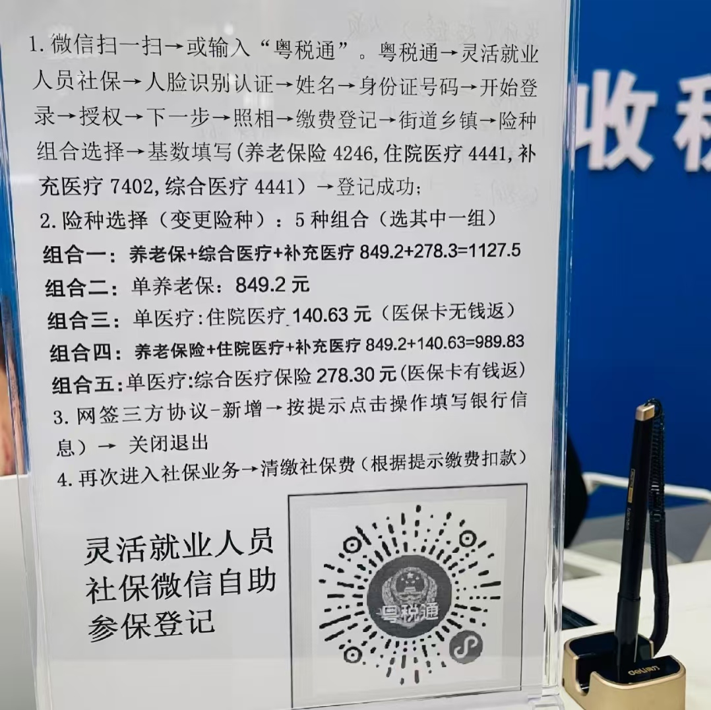
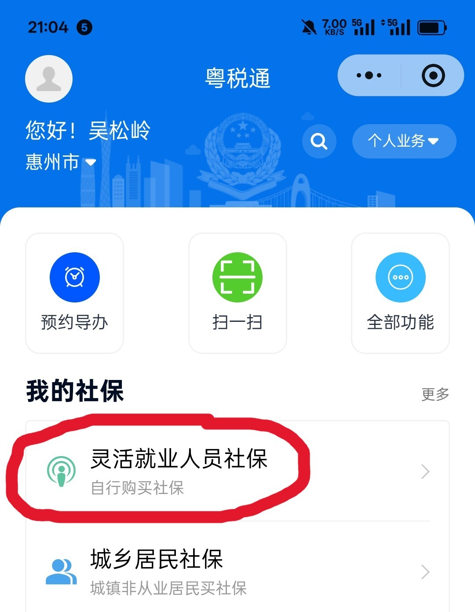
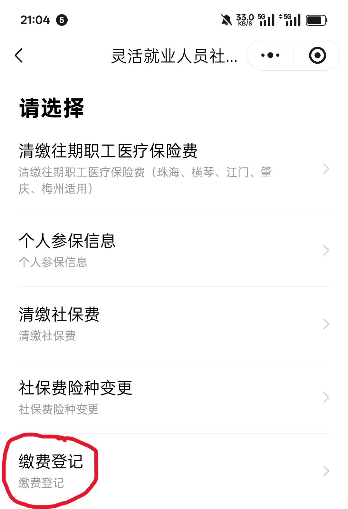
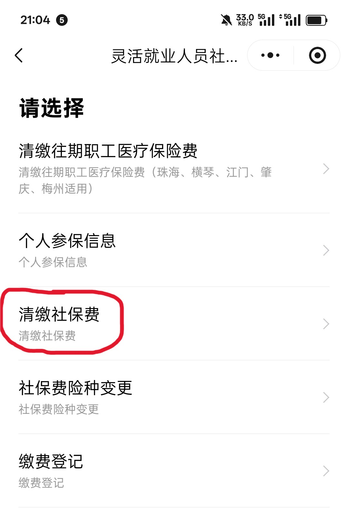
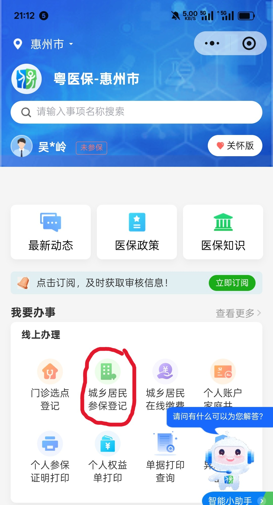
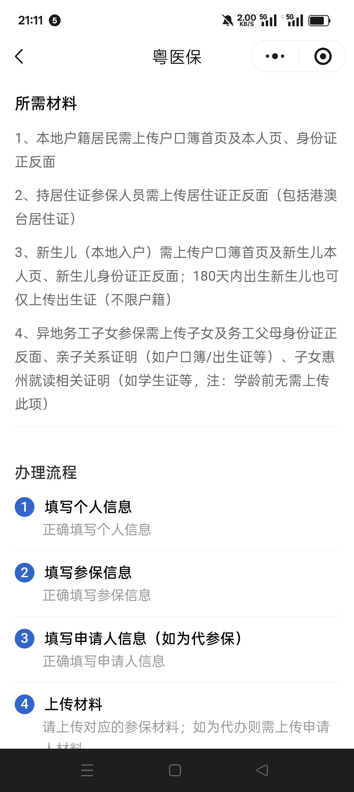

# 一、五险一金概述
## 1.1 类型
五险一金：职工养老保险、职工医疗保险、失业保险、工伤保险、生育保险、住房公积金

## 1.2 缴纳比例
职工养老保险-工资20%（公司12%，个人8%）
医疗保险-工资10%（公司8%，个人2%）
失业保险、工伤保险、生育保险（公司缴纳）

# 二、辞职后暂不工作社保处理
## 2.1 社保选择
离开单位or公司后，只能自己交**养老保险**和**医疗保险**，有**两种社保选择**
1. 第一种，交**职工社保**（包括：职工养老保险、职工医保），和上班族类似，**月月交**
2. 第二种，交**居民社保**（包括：居民养老保险、居民医保），**一年一交**

具体区别如图:

## 2.2 自己交医保操作
### 2.2.1 处理南通的医保
江苏医保云 or 国家医保服务平台，找到异地停保功能（或者拨打南通市社保/医保局电话，远程办理职工医保停保）

### 2.2.2 挑选适合的惠州参保方案
>方案1. 以灵活就业人员身份，缴纳惠州职工医保（月月交15~25号左右，可选绑定有钱的银行卡，省去手动交的麻烦）（但不推荐，**太贵**）

>  1. **粤税通**微信小程序
>  2. 扫脸登录后，【我的社保】->【灵活就业人员社保】
>  3. 选择【缴费登记】-> 自己选择然后填写
>  4. 【缴费登记】结束后 -> 【清缴社保费】

> 方案1备注：**就业证明**可以去**惠城区政务服务中心**办理（电话：0752-8212366），要求：携带身份证原件、复印件1张（正反面）、1张2寸免冠彩照

>方案2. 凭居住证，缴纳【惠州城乡居民医保】（每年10月~次年2月底）

>  1. **粤医保**微信小程序
>  2. 【城乡居民参保登记】
>  3. 上传材料：居住证正反面

 
  

## 2.3 重点缕清
1. 医保不要断交，职工医保（灵活就业）或居民医保二选一，养老可断交
2. **职工医保**和**居民医保**不通用
3. 如果长期不准备上班，不要交职工养老保险，普通百姓消费不起
4. 累计年限区别：居民医保是交一年保一年，不累计年限，灵活就业医保可以积累交费年限（男性25年，女性20年，广东省男性30年，女性25年才享受退休后的终身医保待遇）
5. 目前是5月底，如果参加**城乡居民医保**，2026年正常缴费期已经截止，如果南通职工医保停保时间，举例在惠州申请居民医保时间不超过**3个月**，可以作为“职工转居民”的特殊群体申请中途参保。补交2026全年的保费（400元）后，次月即可享受居民医保报销，没有等待期。

---